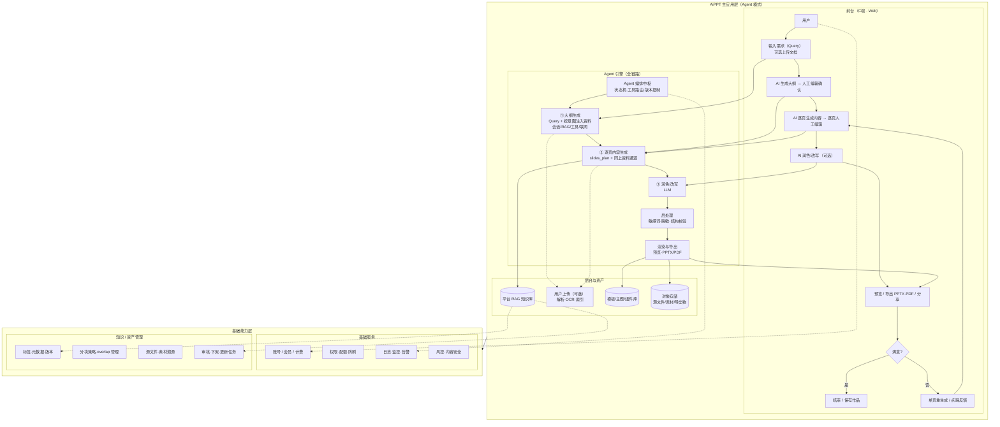
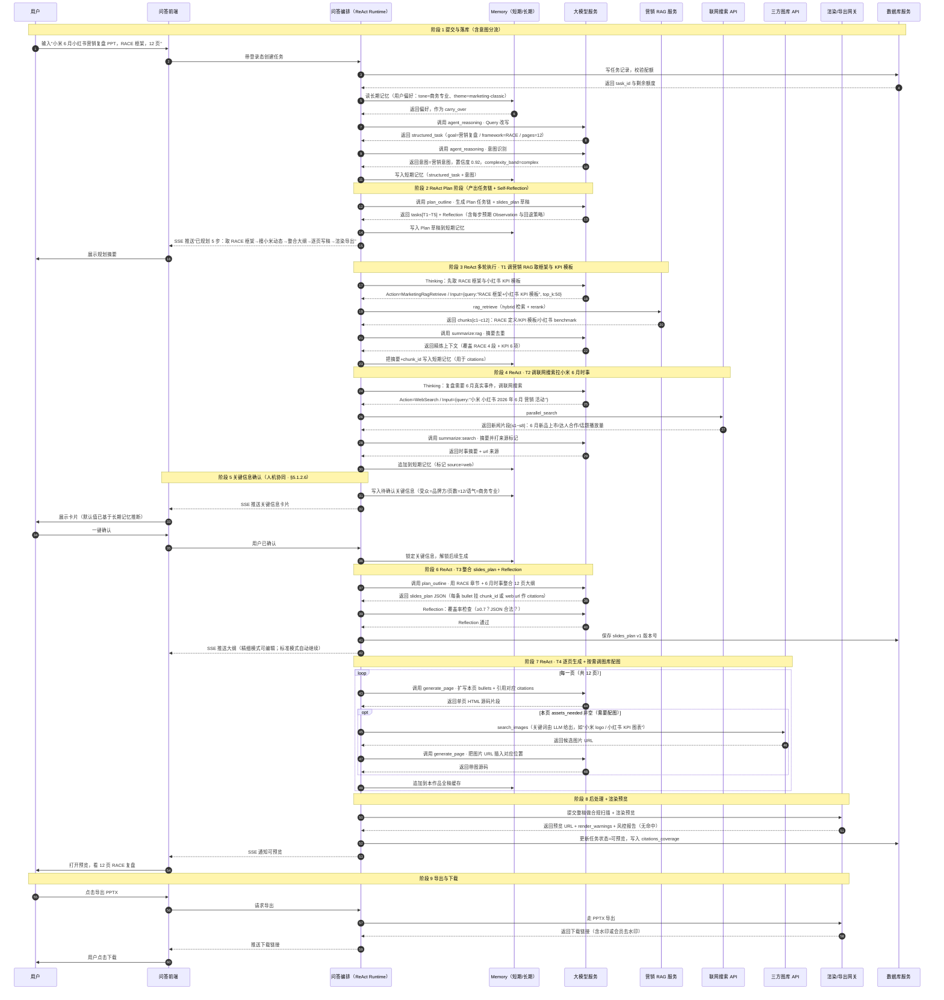
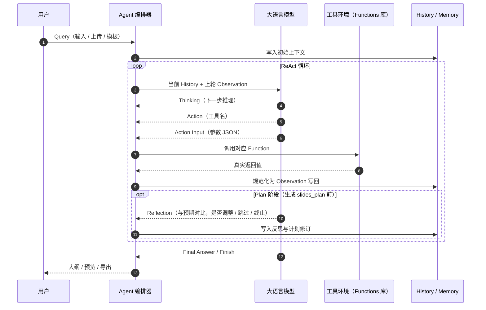

（对外）【PRD】**AiPPT · Agent 模式**（C 端）— 全链路 Agent 生成大纲/逐页内容/润色（生产级）跟

> **命名说明**：**AiPPT** 为产品（产品线）名称；**Agent 模式**是 AiPPT 内的**一种使用模式**——核心体验是：AI 先生成**大纲**，再生成**逐页内容**，最后支持对文案做**润色/改写**，并在每一步提供人工编辑回路。本 PRD 的架构、流程与指标均以该模式为范围；若日后增加其他模式（如插件、桌面端），可另起子 PRD，**核心生成与资产管线应设计为可复用**。

1、开发版本及文档修订记录

版本 | 修订人 | 修订说明 | 批准人 | 修改日期
---|---|---|---|---
1.0.0 |  | 首版PRD（纠偏：由后台 Agent 生成 Marp/Reveal 源码资产） |  | 2026-03-27
1.0.1 |  | 定位纠偏：**C 端产品 AiPPT**；用户/指标/商业化/权限表述对齐消费者场景 |  | 2026-03-28
1.0.2 |  | 增补 **4.2 产品架构**（三列+底座+Mermaid）与 **4.3 系统架构**（Web 网页生成模式、技术数据流+部署视图）；与 `AiPPT_产品架构图.md`、`AiPPT_系统架构图.md` 对齐 |  | 2026-03-28
1.0.3 |  | **详设加厚**：关键链路用自然语言写清「为什么、怎么做」；补充 **置信度/检索/分块/配额/超时/重试** 等可配置默认值；业务流程与独立文档 `AiPPT_业务流程图.md` 对齐说明 |  | 2026-03-28
1.0.4 |  | **命名与范围**：明确 **AiPPT** 为产品名，**网页生成 PPT 模式**为其下一种模式（历史版本，已废弃） |  | 2026-03-28
1.0.5 |  | 新增 **§5.1.8 意图体系**：按课程「六/七维」方法定义闭集意图、层级边界、承接动作、兜底；置信度与澄清见 **§5.1.8.2** |  | 2026-03-28
1.0.6 |  | **意图置信度简化为三档**：**≥0.85** 自动采纳；**0.7～0.85**「我猜你是」；**<0.7** 多轮意图澄清；参数收在 **§5.1.8.2**（与 **§5.1.1 / §5.1.8** 对齐） |  | 2026-03-28
1.0.7 |  | **结构调整**：意图识别与澄清从 §5.4 迁至 **§5.1.8.2**，与意图体系同章；§5.4 重编号为 **5.4.1～5.4.9**（仅非意图参数） |  | 2026-03-28
1.0.8 |  | **意图闭集改版**：§5.1.8 采用产品定义的 **8 类意图**（创建类如「直接生成 / 基于资料生成 / 数据驱动生成」、编辑类如「结构调整 / 局部精修」、以及「整包美化 / 澄清引导 / 合规拒答」）；其中「基于资料生成」明确为 **Session Context 直读（非 RAG）**；全文替换旧枚举引用 |  | 2026-04-06
1.0.9 |  | **意图扁平化**：8 类均为 **一级意图**，§5.1.8 去掉多级/层级表述；§5.1.8.5 改为 **六维详设**，删除各意图表内「意图层级」「置信度与阈值」行（阈值仍以 **§5.1.8.2** 为唯一真源） |  | 2026-04-06
1.0.10 |  | 删除 **§4.3 系统架构**（含 Mermaid、对照表、落点说明）及附录 **B** 中 `AiPPT_系统架构图.md` 条目；§4.2 产品架构说明不再与系统架构对照 |  | 2026-04-06
1.0.11 |  | **§5.1** 仅保留工作台 **Agent 入口/网页生成页/关键信息/代码生成与导出/历史会话** 等交互说明；**ReAct、多轮澄清、Query 改写、意图、槽位、意图体系、slides_plan、模板/预览/导出/兜底** 迁入 **§6.2～§6.9**；原 **§6.2～§6.6** 顺延为 **§6.10～§6.14** |  | 2026-04-06
1.0.12 |  | 在 **§6.2** 新增 **业务流程泳道图**（产品视角）；原 **§6.2～§6.14** 顺延为 **§6.3～§6.15**；意图等小节号同步 +1 |  | 2026-04-06
1.0.13 |  | 消除 **§6.4** 重复编号：**任务元数据** 保持 **§6.4**；**意图体系** 定为 **§6.5**；**slides_plan～评测** 顺延为 **§6.6～§6.15**；全文 **§** 引用与附录术语表对齐 |  | 2026-04-06
1.0.14 |  | **§6.2** 泳道图改为八列：**用户、问答前端、问答编排服务、Memory、大模型服务、RAG服务、数据库服务、API**；总览表与 Mermaid 同步 |  | 2026-04-06
1.0.15 |  | **§6.2** 由泳道 **flowchart** 改为 **UML 风格时序图**（`sequenceDiagram`），参与者顺序与八列一致；小节标题与全文引用同步 |  | 2026-04-06
1.0.16 |  | **§6.2** 时序图：消息改为白话短句；**API** 参与者更名为 **API Gateway**；补阶段划分、附件与「可选人工确认」分支，避免歧义 |  | 2026-04-06
1.0.17 |  | **§2.1** 业务背景重写：C 端痛点增加 **2 条量化假设基线**（须用埋点/问卷替换）；**§4.1 / §4.2.3 / 4.2.4** 与 **§6.5** 意图资料路径对齐；**§6.1** 与第 2 章互指 |  | 2026-04-06
1.0.18 |  | **§6.2** 时序图：附件处理由「请解析或 OCR」改为 **「调用文档解析大模型」**；**API Gateway** 职责表述同步 |  | 2026-04-06
1.0.19 |  | **§6.5.5** 增补 **3 个意图**（「直接生成」/「基于资料生成」/「澄清引导」）**六维详设**正文示例；其余意图仍以 `intent_dictionary.xlsx` 为准 |  | 2026-04-06
1.0.20 |  | **§6.5.7** 扩写：「合规拒答」与「澄清引导」、**§5.4.8** 分工、用户可见差异与埋点 |  | 2026-04-06
1.0.21 |  | 正文统一以 **中文意图名** 表述；**`intent_id` 仅见于 §6.5.4 表下「意图字典」说明框 + 附录 B**；§6.5.3 分组图使用中文名；§6.4.3/§7.1 去掉字段名 `intent_id` |  | 2026-04-06
1.0.22 |  | **§6.4** 子节顺序调整：**Query 改写 → 意图识别 → 槽位抽取 → 多轮澄清**；**§6.4.5** 改为承接 **§6.4.2** |  | 2026-04-06
1.0.23 |  | 删除 **§6.5.3 意图分组总览**（Mermaid）；原 **§6.5.4～§6.5.7**（字典、六维、易混、合规衔接）顺延为 **§6.5.3～§6.5.6**；正文与附录 **§** 引用按现行编号同步 |  | 2026-04-06
1.0.24 |  | 新增 **§6.3.8 Agent 相关提示词**：分节点 System/User 范本（ReAct、改写、意图、槽位、澄清、`slides_plan`、逐页、润色）；**§6.3.4** 互指；附录 B 增可选 `prompt_registry` |  | 2026-04-06
1.0.25 |  | **§6.15 评测与迭代** 按「四要素 + A/B 类任务 + 输入分层 + 随机性控制 + 机评/LLM裁判/人评 + 双保险 + Baseline/GSB + 工程指标 + 1:9 构建」重写；原离线集/合格线并入 **§6.15.11**；bad case 闭环为 **§6.15.12** |  | 2026-04-06
1.0.26 |  | **§6.15 评测与迭代** 改版为 **按节点评估体系**（文档解析、Query 改写、意图与槽位、路由与规划、大模型生成）+ **基础项 B1/B2/B3** 与 **进阶项 A1/A2** 及 **综合分公式**；四要素/题库/GSB/bad case 闭环重排为 **§6.15.9～§6.15.15** |  | 2026-04-15
1.0.27 |  | **§6.3 ReAct 重写**：4 步内核「Thinking → Action → Action Input → Observation」+ Plan 阶段 **Self-Reflection**；**§6.5 意图体系重写**：① 增 **父子 Agent 结构**（一会话多作品的上下文隔离）；② 引入研发约定的 **工具白名单**（`parallel_search`、`search_images`）与 **典型场景 key**（`agent_reasoning` / `plan_outline` / `generate_page` / `summarize:*` / `vision:parse_image` / `discovery:clarify\|materialize`）并与八类意图做映射；**§6.3.8 提示词** 加入 **Reflection JSON 输出范式**，并新增「Plan + tasks（多步任务链）」整体提示词；附录 A 术语表、§7.1 埋点同步对齐 |  | 2026-05-01
1.0.28 |  | **正文与提示词全面中文化**：除 **§6.5.4 意图字典** 与附录 B 字典条目（保留英文编码取值作为研发落库唯一真源）外，全文（含 §1 修订记录、§2.2 / §4.1、§6.3 / §6.3.7 / §6.3.8 提示词、§6.4.2、§6.5.1 / §6.5.2 / §6.5.5 六维详设标题与正文 / §6.5.6 易混矩阵 / §6.5.7 拒答衔接、§6.10 / §6.11 / §6.13、§7.1 埋点说明、附录 A 术语表）一律改用 **中文意图名**（直接生成 / 基于资料生成 / 数据驱动生成 / 整包美化 / 结构调整 / 局部精修 / 澄清引导 / 合规拒答），不再出现英文意图编码 |  | 2026-05-01
1.0.29 |  | **§6.5 意图体系扩展为 9 类（融合「问答模式 / 探索模式」双向导）**：① 原「直接生成（`CREATE_FROM_SCRATCH`）」按研发约定的 **两种问答形态** 拆为「**探索生成（问题树模式 / `CREATE_EXPLORE`）**」与「**问答生成（槽位模式 / `CREATE_QA_FILL`）**」——前者承接「连主题方向都没有」的用户，走 **层级状态机（Level 1～3）** 的渐进引导，仅调用廉价模型做意图收敛、不进主生成；后者承接「目标明确但缺关键字段」的用户，走 **动态槽位提取 + 单轮追问** 后接主生成管线 `skeleton.generic`；② 原「澄清引导（`SYS_FALLBACK`）」窄化为「**日常闲聊 / 问候（`SYS_CHITCHAT`）**」，只承接「你好 / 嘿」类纯闲聊与入口引导，原"多轮澄清"职责下沉到上述两个创建意图内部；③ 原「合规拒答（`OFF_TOPIC_OR_POLICY_REFUSE`）」编码改为 **`OFF_TOPIC_OR_POLICY`**，明确同时覆盖**跑题非业务**（如"今天天气怎么样"）与**合规违规**两种拒答；**§6.3.7** 工具白名单新增 **`discovery:explore_tree` / `discovery:slot_fill`** 两个场景 key（与 `discovery:clarify` / `discovery:materialize` 并存）；**§6.5.1 / §6.5.2.2 / §6.5.3 安全默认 / §6.5.5 / §6.5.6 / §6.5.7 / §6.4.2 / §6.4.4 / §6.11.3 / §7.1 / §8.2、附录 A/B** 同步；正文统一称"九类一级意图" |  | 2026-05-01
1.0.30 |  | **架构纠偏：意图分流 → ReAct 仅承载复杂意图 + 营销意图走向量 RAG + 记忆体系**：① 在 **§6.4.2 / §6.5.1** 加入「**意图分流三档**（简单 / 中等 / 复杂）」概念，**ReAct 不再是所有意图的默认主链路**，仅复杂意图（**创建生成类**：探索生成 / 问答生成 / 基于资料生成 / 营销意图）走 ReAct 多轮规划；中等意图（结构调整 / 局部精修 / 整包美化）走单步工具调用、不调度任务链；简单意图（日常闲聊 / 合规拒答）直接回复或拒答，不进 ReAct； ② 原「数据驱动生成（`CREATE_BY_DATA`）」**改名为「营销意图（`CREATE_MARKETING`）」**，明确走**三方营销知识库（向量库）+ RAG 流程**为核心资料通道，可叠加联网搜索补充时效；与「基于资料生成（Session Context 直读）」严格区分； ③ **§6.3.7 工具白名单收敛为 3 个真实工具**：`parallel_search`（联网搜索 Bocha / Tavily）、`search_images`（三方图库配图）、`rag_retrieve`（营销向量知识库检索），其余 `discovery:*` / `summarize:*` / `vision:*` 退为**内部场景 key（不计费）**，不再混入"工具"概念； ④ **新增 §6.5.8 记忆体系**：明确 **短期记忆**（单作品 ReAct History / Session Context / Observation 缓存）与 **长期记忆**（跨会话用户偏好 / 历史作品摘要 / 风格画像）双层结构，落到 Memory 层做 namespace 隔离； ⑤ **§6.2.2 时序图重写**：从原"通用主链路"改为「**用户要做营销 PPT** → ReAct 规划 → 调 RAG 拿营销框架 → 调联网搜索拿时事数据 → 调图库拿配图 → 逐页生成 → 渲染导出」的**真实复杂意图样例**，参与者由八列调整为符合本案例的列序；**§6.2.1 / §6.2.3 / §6.3 / §6.5.4 / §6.5.5 / §6.5.6 / §6.5.7 / §6.11.3 / §7.1 / 附录 A/B** 同步 |  | 2026-05-01


2、业务背景及目标（必须有）

2.1 业务背景

**产品与公司**：**AiPPT** 是面向 **C 端**的 AI 幻灯片产品；用户在 App 或网站里可能看到多种能力入口。本 PRD 仅覆盖其中 **「Agent 模式」**：系统按 **生成大纲 → 逐页生成内容 → 文案润色/改写** 三段式交付，并在每一步保留人工编辑回路。其他入口若复用同一套生成与资产管线，应在产品地图中标为 **能力复用**，不要求在本 PRD 内展开。

**输入与期望的错位**：用户多用口语描述场合、页数、风格，却希望几分钟内得到「能直接讲/能交」的一版。研发侧必须把 **搭骨架、分页、对齐模板风格** 收进自动化链路，用 **结构化中间产物**（意图、槽位、`slides_plan` 等）约束模型，而不是把整段需求一次性扔进单次补全。

**C 端用户典型场景**（定性）：课程答辩、职场汇报、活动分享、自媒体大纲、读书笔记、竞品/行业速览等；共性是 **要快、要体面、要少动脑**。多数用户不会写 Marp/Reveal，因此 **在线预览 + 一键导出 PPTX/PDF（+ 可选分享）** 是主交付，源码包宜放在「进阶导出」。

**C 端典型痛点**

> **量化表述说明**：下列 **①②** 为 **V0 假设基线（Hypothesis）**，用于对齐目标与埋点设计，**不是已验证结论**。请在 **GA 后 T0+90 天**内，用 **§7 行为数据 + 季度问卷** 覆写数字与样本说明；在此之前评审以 **逻辑链与可观测性** 为准。

- **① 时间成本（假设基线）**：在「无 AiPPT Agent 辅助」的对照语境下，目标用户自报从 **空白稿到敢试讲** 的中位耗时 **约 3.5 h**，**约 42%** 用户报告 **≥6 h**（问卷分档题，样本量与人群定义待填）。其中 **约 55～65%** 的主观精力耗在 **大纲/章节顺序/版式与配图**，而非逐字润色——**比例待用事后访谈编码回填**。
- **② 返工与流失（假设基线）**：纯手工或「仅模板」链路中，**约 45%** 的任务在 **首次导出前**发生 **≥4 次**「结构级编辑」（增删页、整章挪动、更换叙事主线；埋点字段 `edit_structure_major_count` 定义见 §7）；**约 24%** 的任务在 **首次导出后 72 h 内**无二次打开（`task_reopen_72h=false`）。**阈值与口径上线前在数据看板校准一次。**

- **其他痛点（定性补充）**
  - **模板与审美不稳定**：公开模板质量参差，自调版式成本高。
  - **事实与资料对齐**：纯生成易 **幻觉**、与上传 PDF 不一致；需按意图组合 **Session Context / RAG / 平台知识库** 与 **后处理（安全、脱敏、结构校验）**（详见 **§6.5、§6.6、§5.4.8**）。
  - **合规与滥用**：C 端同样要面对风控与内容安全，不能只依赖模型自觉。

2.2 产品目标（业务目标 + 产品目标）
- **业务目标（C端）**
  - **增长与留存**：首屏到「一版」路径极短；生成成功率与满意度驱动次日/7日留存。
  - **商业化**：会员/次数包/导出权益清晰；免费额度与付费转化可解释（不坑、不暗扣）。
  - **成本可控**：高并发下依赖缓存、模板骨架、分层调用，保证毛利（课程：缓存降本提速）。
- **产品目标**

  > **一句话核心目标**：让 C 端用户用「一句话需求 + 几次轻量编辑」在 **3 分钟内**拿到一份**敢直接讲、敢直接交**的、可在线预览且可一键导出的 PPT；同时把生成过程做到**稳定、可解释、可迭代**，而不是一次性的"魔法补全"。

  围绕这一核心，本 Agent 模式承担**三层目标**：

  - **① 用户层目标——「一句话进，一版可交付的 PPT 出」**
    - **输入轻**：支持 **一句话/多轮对话需求** +（可选）参考资料（文件/链接）+ 轻量表单（页数、风格、场景）；不要求用户一次性把需求说完。
    - **过程透**：以「**生成大纲 → 逐页生成内容 → 文案润色/改写**」三段式分步交付，每一步都可**在线预览、就地编辑、回退或重生成**，避免黑盒一把梭。
    - **产物双轨**：
      - **用户主路径**（C 端首选）：可预览的幻灯片 + **一键导出 PPTX / PDF**。
      - **技术真源**（对内可复用）：Marp `slides.md` + `theme.css` + `assets/` + `manifest.json`，或 Reveal `index.html` + CSS + `assets/`，用于进阶导出、调试与版本迭代。

  - **② 链路层目标——「把生成过程做成工程，而不是做成魔法」**
    - **意图驱动而非一刀切**：先识别意图，再按 **意图分流三档**（简单 / 中等 / 复杂）选择不同的生成策略——简单意图直接回复、中等意图单步工具调用、复杂意图才走 **ReAct** 多步规划，不为简单需求付复杂账（详见 **§6.4.2.1**）。
    - **资料通道按意图分流**（详见 **§6.5**）：
      - 「**探索生成 / 问答生成**」：以模型 + 模板骨架为主；前者先经**层级状态机**收敛意图，后者经**单轮槽位补齐**后再进主生成。
      - 「**基于资料生成**」：走 **Session Context 直读**（用户上传资料 → 解析切片 → 直接喂给生成模型），**不进** RAG。
      - 「**营销意图**」：走**三方营销向量知识库 RAG**为主资料通道，可叠加**联网搜索**补时效。
      - 其余意图按需调用 **§6.3.7** 工具白名单三件套（`parallel_search` / `search_images` / `rag_retrieve`）。
    - **结构化中间产物贯穿全链路**：意图 → 槽位 → `slides_plan`（JSON）→ 逐页内容 → 后处理（安全/脱敏/结构校验）→ 渲染预览 → 导出；每一步均**可单独评测、可缓存、可回放**。

  - **③ 运营层目标——「能上线，更要能持续变好」**
    - **可观测**：覆盖端到端埋点（创建 → 生成 → 导出 → 反馈），节点级监控延迟、成功率与成本（详见 **§7**）。
    - **可评测**：建立**分节点评测集**（文档解析 / Query 改写 / 意图与槽位 / 路由与规划 / 大模型生成）与**综合分公式**，对模型版本、提示词、模板替换可量化 A/B（详见 **§6.15**）。
    - **可迭代**：bad case → 评测集 → 提示词 / 规则 / 模板 / 路由 的闭环周期 **≤ 1 周**；高频请求走缓存、按用户配额限流，让体验与成本同时可控。

  - **非目标（本 PRD 不覆盖）**：B 端定制接入、企业级 SSO/审批流、PPT 在线协同编辑、桌面端/插件入口（这些若复用同一套生成与资产管线，应在产品地图中标为**能力复用**，另起子 PRD）。

2.3 关键成功指标（北极星，C端）
- **一次生成可用率**：用户认为「基本能拿去讲/交」的比例 ≥ 70%（V1），≥ 85%（V2/V3）（问卷/点踩/重生成率综合）。
- **核心转化漏斗**：创建任务→生成成功→导出完成率；**付费转化率**、**ARPPU**（按会员策略定义）。
- **平均生成时延**：20页以内，P95 ≤ 180s（V1），P95 ≤ 90s（V2）（C端对等待极敏感）。
- **内容安全**：涉政涉暴涉黄等命中拦截率、误杀率可控（需运营后台调词库）；用户上传资料场景的 **引用可追溯**（有资料时）≥ 90%（V2起，作为质量项而非全员感知指标）。
- **模板美观一致性**：选定风格下「版式不翻车」（溢出/重叠）占比 ≥ 95%（渲染质检）。


3、竞品分析（不一定有）

3.1 竞品/替代方案类型
- 通用“主题生成PPT”：优点是快；缺点是口径不可控、品牌不稳定、事实不可靠、难评测。
- 手工模板 + 复制粘贴：可控但慢、难规模化。
- 直接输出PPTX的生成工具：对“代码审查/版本控制/CI渲染”不友好，工程化弱。
- Marp/Reveal.js 手工编写：可版本化、可工程化；缺点是学习成本与写作成本高。

3.2 我们的差异化（AiPPT · Agent 模式）
- **全链路 Agent（三段式）**：不是「某一步用了 Agent」，而是把生成拆成 **①大纲生成 → ②逐页生成 → ③润色改写**，每一步都可人工编辑回路，最终稳定交付可导出的 Deck。
- **平台知识 + 按意图的资料通道**：逐页生成在 **`slides_plan` 约束下**，按**当前识别出的业务意图（九类之一）**组合 **Session Context（有资料场景）**、**平台 RAG/知识库**、**工具结构化数据** 与可选 **联网**；不是「凡页必 RAG」（与 **§6.5** 一致）。
- **强规则后处理**：敏感词、免责声明（理财/医疗等场景按需）、脱敏与结构校验——**C 端同样要内容安全**，用工程规则兜底而非只靠模型自觉。


4、产品方案

4.1 产品定义（不一定有）

- **产品（AiPPT）**：面向 C 端的 AI 幻灯片产品，可包含多种使用形态与入口。  
- **本 PRD 覆盖的模式：Agent 模式**：用户在 Web 端输入需求（可选上传资料），系统以 **全链路 Agent** 完成三段式交付：  
  ① **AI 生成大纲**（依据：**用户 Query** + **按当前业务意图注入资料**：如「基于资料生成」类意图以 **Session Context** 为主；需要时叠加 **RAG 片段**、**外部工具结构化数据**、**平台知识**；可配置 **联网** 补充时效信息），并支持人工编辑确认；  
  ② **AI 逐页生成内容**（依据：**已定稿的 `slides_plan`** + **与①相同的资料通道**；**非**「凡逐页必走向量 RAG」），并支持逐页人工编辑/单页重生成；  
  ③ **AI 润色/改写**（LLM），用于改口吻、缩写、增强表达一致性。  
  最终经渲染与导出，提供预览、PPTX/PDF 导出与分享。

**与详设单一真源**：资料到底走 Session Context、RAG、工具还是纯模型+骨架，以 **§6.5 意图闭集** 与 **§6.11.3 节点契约** 为准；本节描述用户可感知能力，不重复枚举九种意图。

对运营与市场对外话术，可使用完整称呼：**「AiPPT——Agent 模式」**，强调这是 AiPPT 产品里的**一种模式**。

4.2 产品架构（必须有）

> **说明**：产品架构描述 **用户能感知什么、业务模块如何协作**。完整可导出图见同目录 `AiPPT_产品架构图.md`。

4.2.1 角色与使用场景（C端）
- **普通用户（核心）**：学生、职场新人、博主、教师等；输入需求（+可选资料），要「快、好看、能导出」。
- **会员用户**：更高页数上限、更多模板/风格、优先队列、高清导出、去水印等（具体权益产品定）。
- **游客/新用户**：极低门槛试用（有限次数/有限页数/带品牌水印）。
- **平台运营/产品（后台）**：配置模板主题、场景骨架、敏感词与免责声明策略、活动运营位；**非**企业客户的 IT 管理员角色。
- **客服/风控**：处理投诉、误杀申诉、违规内容处置（轻量流程即可）。

4.2.2 典型流程（用户视角，C 端 · **Agent 模式**主路径）
- 进入 AiPPT 的 Agent 模式生成页 → 输入一句话需求（可选上传资料）→ **AI 生成大纲** → 用户可编辑确认 → **AI 逐页生成内容** → 用户逐页可编辑 / 单页重生成 → **文案润色/改写**（可选）→ **导出 PPTX 或 PDF** → （可选）分享链接 / 保存到我的作品。
- **进阶路径**：查看/下载 Marp 或 Reveal 源码包（面向极客或合作方，可放在「更多导出」）。

4.2.3 产品架构分层（Agent 模式：前台交互 + Agent 引擎 + 资产与治理）
- **前台（C端 · Web）**：用户在一个连续的编辑流里完成「输入需求 → 大纲编辑 → 逐页编辑 → 润色改写 → 预览导出」；**人机协同是主路径**，不是末尾的可选按钮。
- **Agent 引擎（全链路）**：围绕三段式编排：① **大纲**（Query + **按意图路由的资料**：会话直读 / RAG / 工具 / 平台知识，联网可选）→ ② **逐页**（严格跟随 `slides_plan` + 同上资料通道）→ ③ **润色改写**（LLM）；并负责 ReAct/工具路由、版本与状态机、单页重生成与回滚（详 **§6.3～§6.6**）。
- **后台与资产**：平台 RAG 知识库、模板/主题/组件库、对象存储（源文件/素材/导出物）、以及（可选）用户上传文档的解析/OCR/索引能力；为 Agent 引擎提供可控依据与可追溯资产。
- **基础能力层（横切）**
  - **基础服务**：账号/会员/计费、权限与配额防刷、日志监控、风控与内容安全。
  - **知识/资产管理**：元数据与版本、分块与 overlap 策略、源文件与素材溯源、审核下架与更新任务。

4.2.4 产品架构图（Mermaid，Agent 模式）




5、本期需求清单

本章 **§5.1** 只列 **C 端工作台 / 网页 Agent 生成页** 的交互与功能；**ReAct 编排、多轮澄清、Query 改写、意图识别、槽位、意图闭集、slides_plan、模板引擎与兜底策略** 等技术说明见 **§6.3～§6.10**（另 **§6.2** 为业务流程 **时序图** 摘要）。**槽位默认值**见 **§5.4.1**；**检索、分块、生成、超时、缓存、安全、配额**见 **§5.4.2～§5.4.9**。若与详设冲突，**以 §5.1 可见交互为准**。

5.1 功能需求（必须有）

5.1.1 Agent 入口

**入口 1 — 工作台首页**  
（UI 示意图：`[图片]`）

- 工作台首页入口  
  - 点击切换为 **Agent 模式**。  
  - 用户 **输入（含上传文件）** 后点 **提交**，进入 **生成页** 并开始生成流程。

**入口 2 — 工作台左侧菜单**  
（UI 示意图：`[图片]`）

- 左侧菜单入口  
  - 点击进入 **生成页**。

---

5.1.2 Agent 生成页

**5.1.2.1 网页 PPT 生成页 & 无输入进入**  
（UI 示意图：`[图片]`）

1. **上传文档**：点击可上传文档。  
2. **选择模板**：点击可选择模板。  
3. **提交**：点击提交输入，进入生成流程；若提交时 **未登录**，跳转 **注册/登录** 页。  
4. **预置主题**：点击预置主题可快速进入生成流程；未登录时跳转注册/登录。  
5. **案例（2 期）**：点击任意案例可查看生成案例。

**5.1.2.2 网页 PPT 生成页 — 导入文档**  
（UI 示意图：`[图片]`）

1. **上传文档**  
   - 用户上传文档后列表展示；**文件数最多 5 个**，**单个文件最大 100MB**。  
   - 点击右上角 **×** 可删除已上传文件。  

2. **选择模板后**  
   - 用户确认模板后，该区域显示已选模板；**再次点击**可重新选择。

**5.1.2.3 网页 PPT 生成页 — 选择模板**  
（UI 示意图：`[图片]`）

1. **选择模板**  
   - 用户点击 **theme** 弹出模板选择。  
   - 模板素材与 **当前模板组件** 一致；**风格 / 场景 / 颜色** 选项逻辑与线上一致。  
   - 点击 **history** 可查看历史使用过的模板。  
   - 点击模板，**左侧**显示预览。  
   - 点击 **next** 确认模板选择，并在输入栏以 **缩略** 形式展示（同 5.1.2.2）。

**5.1.2.4 生成页 — 解析内容**  
（UI 示意图：`[图片]`）

1. **输入后提交**  
   - 用户输入或上传文档并提交后，**流式**展示对话内容；**working** 始终在最后，直至暂无处理任务。  

2. **查看提取文件**  
   - 点击 **view all** 可查看提取文件详情。  

3. **关键信息**  
   - 流式加载到 **关键信息** 后，页面 **左右分栏**：左侧对话流 + 右侧操作区（见 5.1.2.6）。

**5.1.2.5 生成页 — 提取内容展示**  
（UI 示意图：`[图片]`）

1. **提取文件弹窗**：点击上页 **view all** 弹出。  
2. **提取文件**：展示用户上传或系统提取到的文件。  
3. **提取的图片**：选中文件后，右侧展示从文件中提取的图片；**默认全部勾选**，勾选图片参与后续流程。

**5.1.2.6 生成页 — 关键信息确认**  
（UI 示意图：`[图片]`）

1. **左右分栏**：流式加载到关键信息后，左侧对话流 + 右侧操作界面。  

2. **关键信息字段**  
   - **subject**：基于文档或输入分析得到的主题、结构内容。  
   - **scenario**：使用场景。  
   - **Pages**：用户输入页数或系统推荐页数。  
   - **Language**：用户选择或系统推荐语言。  
   - **Text Volume**：用户选择或系统推荐的文本量。  
   - **Tone**：用户选择或系统分析推荐的语气风格。  
   - **Audience**：用户选择或系统分析推荐的受众。  
   - **Theme**：规则见下。  
   - **Pages、Language、Text Volume** 为 **匹配值**；**tone、audience** 初始为 **系统推荐值**（展示具体值），下拉其他选项为 **固定枚举**，与 **线上一致**。  

3. **Theme 展示规则**  
   - **未选模板且未上传 PPT 文件**：默认系统推荐，**第三项不展示**（对应设计稿「图 4」态）。  
   - **未选模板但上传了 PPT 文件**：展示 **选项 3**（对应「图 3」态）。  
   - **已选模板、未上传 PPT**：展示 **已选模板**（「图 2」态）。  
   - **已选模板且上传 PPT**：仍展示 **已选模板**（「图 2」态）。  

4. **信息确认**  
   - 关键信息加载完后展示 **信息确认** 消息；用户点击 **确认** 后开始 **大纲生成**，底部输入框进入 **大纲生成中** 状态。  

5. **关键信息展开**  
   - 点击关键信息右侧 **>** 展开详情，再次点击收起。

---

5.1.3 代码生成 PPT

**5.1.3.1 确认信息后开始生成 PPT**  
（UI 示意图：`[图片]`）

1. **生成 PPT**  
   - 用户点击确认后，确认按钮消失；对话流式输出 **「OK」**，进入生成 PPT 流程。  
   - 底部输入框切换为 **生成 PPT** 状态；主面板切换为 **PPT 生成** 视图。  

2. **PPT 生成预览**  
   - 展示 PPT 生成视图；**左侧**页码列表，点击页码切换对应页预览。  
   - **滚轮**或 **键盘上下键** 可切换预览页。

**5.1.3.2 代码视图**  
（UI 示意图：`[图片]`）

- 支持在 **代码视图** 与 **预览视图** 间切换。

**5.1.3.3 PPT 制作完成**  
（UI 示意图：`[图片]`）

1. **输入框**：生成完成后，输入框切换为 **完成** 状态。  
2. **演示与下载**：完成后展示 **演示**、**下载** 按钮。

**5.1.3.4 PPT 演示 & 下载**  
（UI 示意图：`[图片]`）

1. **演示**：可选 **从头放映**、**从当前页放映**。  
2. **下载**  
   - 支持 **PPT、PDF、图片、Html** 等格式（以实际实现为准）。  
   - **非会员**点击下载：**toast 提示 + 付费拦截**。  
   - **会员**点击下载：**浮层**显示下载中，完成后提示下载完成。

**5.1.3.5 历史会话**  
（UI 示意图：`[图片]`）

1. **历史会话**：点击图标展开历史会话窗口，再次点击收起。  
2. **会话列表**：列表项标题为 **PPT 标题名**；点击切换到对应会话。  
3. **新建会话**：点击新建会话，重新开始。  
4. **刷新与收起**：刷新会话列表；点击横线收起列表。

---

5.2 非功能需求（建议必须）

**性能**：20 页 Deck 端到端 **P95 ≤ 180s（V1）**；单页重生成 **P95 ≤ 20s（V2 目标，可与 5.4.6 同步调参）**。渲染与导出在工程上应 **流水线并行**（例如后一半页面渲染时前一半已开始导出准备），但产品对外仍展示「总进度条」以免用户误以为卡死。

**稳定性**：任务状态机建议细分为：`created` → `understanding`（含澄清等待）→ `indexing`（仅有附件时）→ `retrieving` → `planning` → `awaiting_outline_confirm`（可选）→ `generating` → `rendering` → `post_processing` → `done` / `failed`。失败任务支持从中间节点恢复（例如仅重跑渲染与导出），减少用户重复花钱跑全链路。

**安全与合规（C端）**：用户资料与向量索引 **默认仅本人可检索**；账号注销时 **7 天内可撤销，期满级联删除对象与索引**（具体天数法务定）。输出必须经过 **5.4.8** 分级处置；未成年人模式（若上线）单独词库与拦截策略。日志留存周期符合隐私政策，且展示给用户的文案要写清「何种数据用于改进模型」（若公司采用用户数据训练，需单独同意，不在本 PRD 默认范围内）。

**可观测**：每个任务记录一条 trace id；关键节点保留 **脱敏后的输入输出摘要**（禁止存用户全文身份证、银行卡等）。告警阈值示例：某模板 `render_warnings` 率突增、某意图澄清率 >40%（说明分类或文案有问题）。

**成本控制**：缓存键与 TTL 见 **5.4.7**；大模型调用按 **5.4.9** 配额硬挡，防止黑产刷接口。可选：高峰期限速时优先保证会员队列（公平性策略产品需公示）。

5.3 第三方系统对接需求（不一定有）
- **C端常见**
  - 手机号/微信/Apple 等登录（以公司实际为准）
  - 支付（微信/支付宝/IAP 等）
  - 对象存储/CDN（预览图、导出文件）
  - 可选：正版图片/图标 API（版权合规）
- **未来 ToB 延伸（非本期必做）**：企业空间、SSO、企业知识库接入——可在路线图单独立项


5.4 可配置参数与默认阈值（给研发/算法/运营的「一张表」）

下面数值为 **V1 生产默认建议**：可在配置中心按环境（dev/staging/prod）与 A/B 实验覆盖。**意图识别、置信度三档、意图/槽位澄清轮次**等已全部收在 **§6.5.3**，本章 **§5.4** 仅保留检索、分块、生成、超时、缓存、安全、配额等非意图专项参数。产品文档写清默认值，是为了评审可对表；**所有阈值都要可观测**。

**5.4.1 槽位与合规**

| 参数 | 默认值（V1） | 说明 |
|------|----------------|------|
| `strict_missing_slots` | 严格模式：`audience`、`target_slides`、`locale` 任一 `unknown` 必澄清 | 普通模式：仅 `compliance_flags` 相关槽位缺失必澄清 |
| `inferred_slot_banner` | 开 | 凡 `inferred` 槽位必须在结果页顶部展示「已假设：…」并可一键修改 |

**5.4.2 检索（RAG）与重排**

| 参数 | 默认值（V1） | 说明 |
|------|----------------|------|
| `hybrid_top_k` | **50** | 向量+关键词混合检索返回候选池大小（每用户库独立）。 |
| `rerank_top_n` | **12** | Cross-encoder 或 Rerank 模型重排后保留条数。 |
| `context_chunks_for_plan` | **8–10** | 进入「规划」模型的 chunk 数；**精细**策略取 10，**快速**取 6。 |
| `vector_min_score` | **0.35**（归一化相似度，量纲与所选向量库一致时需校准） | 低于该分数的 chunk **不进入生成上下文**，改为在规划里插入「资料不足/待核实」提示页（若任务带附件）。 |
| `max_chunk_chars` | **800** 汉字或等价 token | 单条 chunk 上限；超出截断并保留 `…` 与 offset。 |
| `chunk_overlap_ratio` | **0.12** | 约 **10%–15% overlap**；与分块服务配置一致。 |
| `dedup_sim_threshold` | **0.92** | 检索结果去重：embedding 余弦相似度高于该值的片段只保留一条。 |

**5.4.3 分块与嵌入（资料入库）**

| 参数 | 默认值（V1） | 说明 |
|------|----------------|------|
| `chunk_target_tokens` | **512**（中文约 350–450 字视分词） | 与 `max_chunk_chars` 二选一为主；产品对外只描述「中等粒度」即可。 |
| `ocr_trigger` | 扫描件 PDF、图片型附件 | 可编辑 PDF/Office **走版式解析**；触发 OCR 时任务状态展示「正在识别文字」。 |
| `embedding_model_version` | 与向量库索引版本绑定 | 升级模型需 **重建索引** 或异步双写，禁止静默混用不同维度。 |

**5.4.4 规划与生成（Token 与页数）**

| 参数 | 默认值（V1） | 说明 |
|------|----------------|------|
| `max_slides` | **40** | 超出拒绝创建或强制裁剪并告警。 |
| `max_bullets_per_slide` | **7** | 后处理硬截断 + 告警。 |
| `plan_max_output_tokens` | **4096** | 规划 JSON；超出用流式 tool call 或拆「先骨架后补页」。 |
| `gen_per_slide_max_tokens` | **1200** | 单页 Marp/Reveal 生成上限；防止一页一卷书。 |
| `outline_confirm_required` | **精细**默认开；**快速**默认关 | 用户确认 `slides_plan` 后再生成，降低返工；开关与会员策略可挂钩。 |

**5.4.5 引用覆盖率（有资料任务）**

| 参数 | 默认值（V2 目标，V1 可先监控不拦截） | 说明 |
|------|----------------|------|
| `min_citation_coverage` | **0.7** | 带附件任务中，至少 70% 的「事实性 bullet」需挂 `citations`；不足则 **规划节点重试 1 次**，仍不足则插入固定「重要结论待核对」页。 |
| `uncited_fact_heuristic` | 含数字、同比、金额、法条、结论性判断的 bullet | 由规则或轻量分类器打标，用于统计覆盖率。 |

**5.4.6 超时、重试与并发**

| 环节 | 建议超时 | 重试 | 说明 |
|------|-----------|------|------|
| 意图+改写+槽位（同步） | **25s** | 1 次 | 对用户阻塞；超时报「理解超时」并可重试任务。 |
| RAG 检索 | **8s** | 1 次 | 超时降级为「无检索直出」并记 `rag_degraded`。 |
| 规划 JSON | **45s** | 1 次 | 第二次带解析错误信息；再失败走规则骨架。 |
| 全 Deck 生成 | **180s**（20 页内 P95 目标对齐） | 节点级 2 次指数退避 | 与 2.3、5.2 一致。 |
| 单页重生成 | **20s**（P95 目标） | 2 次 | 单次超时仅失败该页，不影响整包。 |
| 渲染单页快照 | **5s** | 1 次 | 失败用占位图 + `render_warnings`。 |
| 导出 PPTX | **120s** | 1 次 | 大文件走异步 + 通知。 |
| `max_concurrent_tasks_per_user` | **2**（免费） / **4**（会员） | — | 防刷与公平性。 |

**5.4.7 缓存与去重（降本）**

| 参数 | 默认值 | 说明 |
|------|--------|------|
| `cache_ttl_hot_skeleton` | **24h** | 热门意图+主题骨架缓存。 |
| `fingerprint_fields` | `normalize(user_query)` + `attachment_hash` + `theme_id` + `framework` | 任一变更则 miss；避免「换了资料仍吃旧缓存」。 |
| `semantic_cache_sim` | **0.96** | 可选语义缓存：embedding 相似度高于该值且附件集合相同则复用 slides_plan（谨慎开，需防隐私串档）。 |

**5.4.8 后处理与内容安全**

| 参数 | 默认值 | 说明 |
|------|--------|------|
| `risk_level_block` | 涉政涉暴涉黄等一级词库 | 命中 **拦截生成** 或整页替换为安全提示（策略由法务定）。 |
| `risk_level_replace` | 二级词库 | 替换为 `***` 或运营配置话术。 |
| `risk_level_flag` | 三级 | 仅打标，结果页展示「可能存在合规风险」。 |
| `desensitize_patterns` | 手机/身份证/银行卡/地址等正则集 | 导出前必须跑一遍；命中写 `desensitize_report`。 |

**5.4.9 配额与计费（C 端示例，可随商业调整）**

| 用户类型 | 日生成次数 | 单任务页数上限 | 导出 |
|----------|------------|----------------|------|
| 游客/试用 | **3** | **12** | 带水印 / 限次 |
| 免费注册 | **8** | **20** | 标清；PPTX 每日 **2** 次（示例） |
| 会员 | 按套餐 **50–200/日** | **40** | 高清、优先队列、去水印 |

上表为产品给运营的「谈判起点」，实现上必须 **服务端硬校验**，前端仅提示。


6、产品详设（必须有）

详设章节面向 **把需求拆成可开发任务包** 的同事：**§6.2** 为业务流程 **时序图**（产品视角，八参与者）；**§6.3～§6.10** 写清 Agent（ReAct）、澄清、改写、意图闭集、`slides_plan` 与模板/导出/兜底；**§6.11～§6.15** 写端到端流程、通用交互补充、生成策略、权限与评测。**§5.1** 为 C 端可见功能真源。若冲突：以 **§5.1** 交互为准，技术以 **§6.5.3**（意图阈值）、**§5.4**（非意图参数）、**§6.11.3**（节点契约）为解释优先。

6.1 业务背景概述

本章详设承接 **§2.1**：C 端「**说得含糊、要得具体**」与 **§2.1 中两条量化假设基线**（耗时与结构返工）共同说明——必须用 **意图 + 槽位 + `slides_plan`** 把需求钉死，再让模型分段发挥。若跳过理解链，直接把原话扔进单次生成，会出现结构漂移、事实幻觉、与上传 PDF 不对齐，进而转化为差评与退款。

工程折中是：**前半段结构化（澄清、路由、资料通道）** → **中段受 `slides_plan` 约束的逐页生成** → **后段敏感词、脱敏、渲染质检**。资料侧 **按意图** 选择 Session Context 直读、RAG、工具 JSON 或纯模型+骨架（**§6.5**），而非「凡页必 RAG」。配合缓存、配额与 **§6.15** 评测闭环，才称得上生产级。

6.2 业务流程（时序图 · 营销 PPT 复杂意图样例）

> **说明（V1.0.30 重写）**：本节时序图**不再画"通用主链路"**，而是以**研发可直接对照实现**的真实复杂意图为例：**用户要做一份"小米品牌 6 月小红书营销复盘 PPT"** → 命中「**营销意图**」（`intent_complexity_band=complex`）→ 走 **§6.3 ReAct Runtime** → ReAct **Plan** 出多步任务链 → 调 **`rag_retrieve`（三方营销向量知识库）** + **`parallel_search`（联网搜索拉时事）** + **`search_images`（三方图库配图）**——这正是 **§6.3.7 V1 三件套真实工具的全部出场**。  
> **读法同电商下单类 UML 时序图**：**自上而下是时间**；**实线** 多为请求，**虚线** 多为应答。参与者从左到右按本案例的真实交互顺序：**用户 → 问答前端 → 问答编排服务（含 ReAct Runtime） → Memory（短期 / 长期记忆，§6.5.8） → 大模型服务 → 营销 RAG 服务（向量库） → 联网搜索 API → 三方图库 API → 渲染 / 导出网关 → 数据库服务**。简单 / 中等意图（闲聊 / 拒答 / 改一页 / 换主题）**不**走本图，详见 §6.4.2.1 分流。

**6.2.1 参与者总览**

| 参与者 | 职责（营销意图样例） |
|--------|----------------------|
| **用户（U）** | 输入营销 PPT 需求（"做一份小米 6 月小红书营销复盘 PPT，按 RACE 框架，12 页"）、查看 ReAct 规划摘要、确认关键信息、看预览、点下载。 |
| **问答前端（FE）** | C 端 Web 生成页：鉴权与 Token、需求表单、**SSE 流式展示**「ReAct 在干什么」、关键信息卡片回显、模板/主题选择、预览与下载入口。 |
| **问答编排服务（ORCH，含 ReAct Runtime）** | 状态机、配额校验、**意图识别 + 复杂度分流**（命中`营销意图 / complex`后启动本图）、**ReAct 4 步循环 + Plan 阶段 Reflection**、解析模型 Action 并路由到 RAG / 联网 / 图库三件套、收口产出 `slides_plan` 与逐页源码。 |
| **Memory（MEM）** | 双层记忆（**§6.5.8**）：**短期记忆**（本作品 ReAct History、Observation 缓存、营销 RAG chunks 摘要、待确认关键信息）+ **长期记忆**（用户偏好——常用模板 / 语气 / 受众默认值；本案例直接 carry over `tone=商务专业`、`theme_id=marketing-classic`）。 |
| **大模型服务（LLM）** | 推理引擎：Query 改写、意图识别、ReAct Thinking / Action / Action Input、Plan 阶段产出 `slides_plan` JSON + Reflection、逐页 HTML 生成；**不**写 Observation。 |
| **营销 RAG 服务（RAG）** | **三方营销向量知识库**（4P / AIDA / RACE / SWOT 等框架、KPI 模板、行业 benchmark、品牌案例库）；接收 `rag_retrieve` 调用，返回 `chunks[]` + 分数 + 来源标记。 |
| **联网搜索 API（WEB）** | `parallel_search`（Bocha / Tavily）；接收"小米 + 小红书 + 6 月"等关键词，返回最新动态 / 行业新闻摘要。 |
| **三方图库 API（IMG）** | `search_images`（Elasticsearch 图片检索 / 三方授权图库）；按 `slides_plan` 标记的 `assets_needed[]` 取品牌物料 / 数据可视化 / 封面图。 |
| **渲染 / 导出网关（GW）** | 把整合后的 HTML 源码渲染为预览缩略图 / PPTX / PDF；含主题 CSS、字体回退、溢出与对比度扫描。 |
| **数据库服务（DB）** | 存任务表、配额、`slides_plan` 版本号、审计；**不**存大文件正文（在对象存储或 Memory 短期缓存）。 |

**6.2.2 营销意图主链路时序图（Mermaid · 复杂意图 ReAct 真实样例）**

> **场景**：用户在生成页输入「**帮我做一份小米品牌 6 月小红书营销复盘 PPT，按 RACE 框架，12 页**」并提交。  
> **意图分流**：B 节点意图识别 → **「营销意图（CREATE_MARKETING）」**，`intent_complexity_band=complex` → 进入 ReAct Runtime（**§6.3**）。  
> **任务链（Plan 节点产出）**：T1 RAG 拿 RACE 框架 + KPI 模板 → T2 联网搜小米 6 月小红书新闻 → T3 整合产出 `slides_plan` → T4 逐页生成 + 按页配图 → T5 渲染导出。



**6.2.3 人机协同节点（与本案例的"人工核对"对应）**

- **关键信息确认（§5.1.2.6）**：阶段 5 中"受众 / 页数 / 语气"等默认值由 **长期记忆**（**§6.5.8**）推断，用户**一键确认**即可推进；改某项后回写**短期记忆**而非污染长期。  
- **大纲可选编辑**：阶段 6 推送大纲时，**精细策略**（**§5.4.4**）开启则用户可改大纲后再继续；本案例标准策略下自动继续。  
- **预览与单页重生成**：阶段 8 后用户若点踩单页 → 走 §6.4.2.1 中等意图分支（局部精修，不再重跑整个 ReAct，仅调 `generate_page` + 可选 `search_images`）。

**6.2.4 与独立文档 / 与本案例的边界**

- 本节时序图**只画营销意图（complex）**这一种典型路径；其他复杂意图（探索生成 / 问答生成 / 基于资料生成）的节点形态相同，**仅 RAG 通道差异**——基于资料生成走 Memory 直读 Session Context，探索 / 问答生成在 Plan 前还会插入 `discovery:explore_tree` / `discovery:slot_fill` 引导节点。  
- 简单意图（闲聊 / 拒答）与中等意图（结构调整 / 局部精修 / 整包美化）**不进入本图**，由 §6.4.2.1 分流到对应单步路径。  
- 更细的 **跨系统时序**（含失败重试、`rag_retrieve` 命中过低降级、单页重生成、合规拒答分支等）维护在 **`AiPPT_业务流程图.md`**；本节 Mermaid 侧重**主链路评审对齐**，消息命名以本节与 **§5.1 / §6.3.7** 为准。

---

6.3 Agent 模式与 ReAct 编排（必须有）

> **定位（本次纠偏，与 §6.4.2.1 意图分流三档一致）**：ReAct **不是所有意图的默认主链路**，而是**意图分流后专门承接「复杂意图」**的执行内核——只有 **创建生成类意图**（探索生成 / 问答生成 / 基于资料生成 / **营销意图**）会进入本节描述的 ReAct Runtime；**中等意图**（结构调整 / 局部精修 / 整包美化）走单步工具调用即可，**简单意图**（日常闲聊 / 合规拒答）由回复 / 拒答组件直接闭环，二者均**不调度** Plan 任务链或 Reflection 循环。这样既贴合"复杂任务才需要边想边干"的方法论，又能避免给"换图 / 改一页 / 调主题"这种已知动作上一套重型规划器。

> **与 CoT 的差异**：传统 **Chain-of-Thought** 在**单次补全**里把步骤一次性列完，**无法根据真实反馈改道**。**ReAct（Reasoning + Acting）** 是「**思考-行动循环**（Think-Act Loop）」内核，每一步 **Action** 都由**系统/工具环境**真实执行后写回 **Observation**，模型再据此推进下一轮 **Thinking**，适合 AiPPT「**复杂创建意图**」下「解析 → 理解 → 检索/上下文 → 规划 → 逐页生成」**交替式** 链路。本节范式与研发对齐为 **「4 步走内核引擎」**（Thinking / Action / Action Input / Observation），**Plan 阶段** 额外叠加 **Self-Reflection（自我反思）**（**§6.3.5**），以便在产出 `slides_plan` 前判断「下一步是否仍合理」。

**6.3.0 何时进入 ReAct（与 §6.4.2.1 分流的衔接）**

| `intent_complexity_band` | 是否进入本节 ReAct Runtime | 实际执行路径 |
|---------------------------|-----------------------------|---------------|
| `simple`（闲聊 / 拒答） | 否 | 直接调用闲聊回复模板或 §5.4.8 拒答话术；**不**经过 §6.3 任何小节 |
| `medium`（结构调整 / 局部精修 / 整包美化） | 否 | 编排器拿到槽位 / 节点 ID → 调用**单一**工具或服务（patch JSON、`search_images` 换图、改 `theme_id`）→ 直接回写；**不**走 Plan、不写 Reflection |
| `complex`（探索生成 / 问答生成 / 基于资料生成 / 营销意图） | **是** | 进入 **§6.3.1～§6.3.8** 全部小节：先 Plan 出任务链 → 多轮 Thinking / Action / Observation 循环 → Plan 阶段 Reflection → 收口产出 `slides_plan` 与逐页内容 |

> 含义：**§6.3 后续所有内容默认在「complex」分支内成立**；中等 / 简单意图在 §6.11.3 节点 C 已被分流走，**不要把它们硬塞进 ReAct 循环来"对齐"**。

**6.3.1 4 步走内核循环（对齐研发口径）**

| 环节 | 含义（AiPPT 落地） |
|------|--------------------|
| **Thinking（思考）** | 基于 **用户 Query、History、上一轮 Observation**，分析「现在缺什么、为什么缺、下一步该走澄清还是检索还是规划」。**核心职责 = 理解现状 + 拆解 Query → 产出下一步具体执行动作**。 |
| **Action（行动）** | 从 **Functions 库**（**§6.3.7** 工具白名单 + 场景 key）中**选择**一个工具名；**不得**由模型伪造执行结果。 |
| **Action Input（参数）** | 给出该工具调用的**结构化参数**（JSON），与编排器约定的 Schema 一致；参数缺字段或非法时由编排器拒绝并回写错误 Observation。 |
| **Observation（观察）** | **仅系统**执行工具/API/规则后写入：解析结果、意图与置信度、槽位 JSON、检索片段、错误码等；脱敏截断后回灌进上下文，进入下一轮 Thinking。 |

**6.3.2 关键组件（与图示一一对应）**

| 组件 | 作用（AiPPT） |
|------|----------------|
| **Query** | 用户输入的任务（自然语言 + 可选附件、模板、策略）。 |
| **LLM** | 大语言模型作为**推理引擎**，只产出 Thinking / Action / Action Input；不写 Observation。 |
| **Functions 库** | **V1 仅 3 个真实工具**（**§6.3.7**）：`parallel_search`（联网搜索）、`search_images`（三方图库配图）、`rag_retrieve`（营销向量知识库）；其余 `plan_outline` / `generate_page` / `summarize:*` / `vision:parse_image` / `discovery:*` 是**内部场景 key**，用于打点与成本估值，不计入"外部工具调用"。 |
| **History** | 历史记录存储，支持多轮对话与跨轮 Observation 复用；由 **Memory** 持久化（与 **§6.2 时序图** 中 `MEM` 一致）。 |
| **Final Answer** | 最终交付：在 AiPPT 里通常不是单条文本，而是 **`slides_plan` + 逐页 HTML/Marp 源码 + 预览/导出** 复合产物。 |

**工作流程**：用户提出 Query → LLM 推理（Thinking）→ 选择工具并执行（Action + Action Input）→ 系统观察结果（Observation）→ 更新 History → 循环直到给出 Final Answer。

**6.3.3 编排器职责**

- **Agent Runtime**：会话/任务状态机、鉴权配额、把模型的 Action 路由到后端服务、把工具返回值**规范化**为 Observation、设定终止条件（完成 / 超时 / 拒答 / 轮次上限）。  
- **大模型**：单次生成在约定 **stop**（见 **§6.3.6**）处暂停，只产出到 **Action Input** 边界。  
- **与用户界面**：§5.1 中「解析流式 / working / 关键信息确认 / 大纲生成中」等状态，对应 ReAct 多步的 Observation 摘要或状态机节点。

**6.3.4 时序图（概念，4 步循环 + 反思）**



**6.3.5 Plan 阶段的 Self-Reflection（自我反思）**

ReAct 在「跨多轮、跨工具」的链路里容易**走偏不自知**——常见失败：检索结果与意图不符仍硬出大纲；解析失败仍假装「依据资料」；外部数据 API 报空仍编造数字。**只在 Plan 阶段（节点 E `slides_plan` 产出前）** 强制做一次 **Self-Reflection**，把「思考 → 行动 → 观察」扩成「**Thought → Action → Observation → Reflection**」四段，并以 **JSON** 落库（**§6.3.8.7** 给出 Plan + tasks 提示词范式）。

- **触发位置**：节点 E（**§6.11.3**）产出 `slides_plan` 之前；**逐页生成（节点 F）不强制反思**，避免 token 爆炸。  
- **反思字段（建议）**：`reflection`（自然语言，写明「若 Observation 与预期不符，下一步应跳过 / 终止 / 回退到哪一步」）；可选 `revised_action`、`abort_reason`。  
- **降级**：若反思为空或非 JSON，按 **`plan_degraded=true`** 走规则最小大纲（**§6.6**）。

**6.3.6 停止词与防幻觉 Observation**

- 调用 LLM 时配置 **stop**（例如 `"\nObservation:"`、`"\nFinal Answer:"`），让模型只输出到 **Action Input** 边界。  
- **Observation 只能来自真实工具返回值**（经脱敏、截断），再编码为文本或 JSON 块写回；**禁止模型自行生成 Observation 行**（与 **§6.3.8.1** 全局约束一致）。

**6.3.7 Functions 库（典型工具与场景 key）**

> **本次纠偏（与研发口径对齐）**：当前 AiPPT「Agent 模式」**真实可调用的外部工具只有 3 个**——**联网搜索、三方图库配图、营销向量知识库 RAG**；其余历史出现过的 `discovery:*` / `summarize:*` / `vision:*` 都退化为**内部场景 key**（用于成本估值与可观测打点），**不再混入"工具白名单"**。文档解析、渲染、导出、对象存储等属基础设施，按 **§6.2 / §5.4** 编排，不计入 Functions 库。

**研发侧 当前真实工具白名单（V1 仅此 3 个，均计费）**：

| `tool_id` | 说明 | 主要使用意图（中文名见 **§6.5.4**） |
|-----------|------|--------------------------------------|
| `parallel_search` | **联网搜索**（Bocha / Tavily API） | 「问答生成」「**营销意图**」（联网补充时效新闻 / 行业事件 / 品牌动态）；「探索生成」收敛阶段不调用 |
| `search_images` | **三方图库 / Elasticsearch 图片检索**（封面、版式素材、产品图、品牌物料） | 所有创建类意图（探索生成 / 问答生成 / 基于资料生成 / **营销意图**）配图；「局部精修」（换图） |
| `rag_retrieve` | **三方营销向量知识库检索**（营销框架、KPI 模板、行业洞察、案例库；按 §5.4.2 配置 hybrid_top_k / rerank_top_n） | **「营销意图」核心资料通道**（必走）；其他创建类意图按需选用平台知识库 |

> **「基于资料生成」走 Session Context 直读，不调用 `rag_retrieve`**——这是**用户上传文件**的语义直读路径，与本表"营销向量库 RAG"是两条并列的资料通道，详见 **§6.5.4 / §6.11.3 节点 D**。

**典型场景 key**（**内部用途**：成本估值与可观测，与 LLM 调用一一打点；模型版本写在 `@<model>`；**不**在 Functions 库枚举里出现）：

| 场景 key | 用途（AiPPT） |
|----------|---------------|
| `agent_reasoning` | **ReAct 主推理循环**（Thinking + Action + Action Input）。 |
| `plan_outline` | 大纲规划，产出 `slides_plan(JSON)`，含 **Reflection**（**§6.3.5**）。 |
| `generate_page` | **单页 HTML 生成**（逐页内容生成节点 F）。 |
| `summarize:search@<model>` | 对 `parallel_search` 返回结果做摘要。 |
| `summarize:rag@<model>` | 对 `rag_retrieve` 返回的营销知识 chunks 做摘要 / 去重。 |
| `summarize:document@<model>` | 文档解析后的正文摘要（写入 Session Context 前）。 |
| `summarize:context_compress@<model>` | 上下文压缩，控制 History token 规模。 |
| `vision:parse_image@<model>` | 多模态图片解析（封面识别、版式参考、上传 PPT 中的图）。 |
| `discovery:explore_tree@<cheap_model>` | **「探索生成」专用**：层级状态机式问题树（Level 1～3 渐进引导，例如"想做哪类 PPT → 给谁看 → 是否有资料"），**调用廉价模型做意图收敛**，**不调主生成大模型**；收敛达到阈值后切到 `discovery:slot_fill` 或直接落到「问答生成」管线。 |
| `discovery:slot_fill@<cheap_model>` | **「问答生成」专用**：动态槽位提取，定位缺失要素后做**单轮追问**（扁平问卷形态，对应 **§5.1.2.6** 关键信息卡片）；阈值满足后进入 `plan_outline`。 |
| `discovery:clarify@<model>` | 通用澄清向导：发问、给候选选项（**§6.4.4 / §6.5.3**）；现仍服务于「我猜你是」中段 (0.7～0.85) 与槽位强约束兜底，不再承担"无主题方向"场景（已下沉到 `discovery:explore_tree`）。 |
| `discovery:materialize@<model>` | 需求**具象化**：把探索 / 问答阶段的多轮答复折叠为 `structured_task`，供 `plan_outline` 直接消费。 |

**Action 枚举（与场景 key / `tool_id` 对照）**：

| 类型 | Action 名称（模型可写） | 路由到的能力 |
|------|--------------------------|--------------|
| 理解 | `RewriteUserQuery` / `ClassifyIntent` / `ExtractSlots` / `ClarifyAsk` / `ExploreTreeStep` / `SlotFillAsk` | `discovery:clarify` / `discovery:materialize` / `discovery:explore_tree`（探索生成专用） / `discovery:slot_fill`（问答生成专用） |
| 资料 | `ParseUploadedFiles` / `BuildSessionContext` / `ListImagesForUserPick` | 文档解析大模型、`vision:parse_image`、`summarize:document` |
| 检索 | `WebSearch` / `ImageSearch` / **`MarketingRagRetrieve`** | **`parallel_search`（联网） / `search_images`（图库） / `rag_retrieve`（营销向量库）—— V1 真实工具 3 件套** |
| 规划 | `GenerateSlidesPlan` | `plan_outline`（含 Reflection） |
| 生成 | `GenerateSlidePage` | `generate_page` |
| 交付 | `RenderPreview` / `ExportPPTX` / `ExportPDF` | 渲染与导出网关 |
| 结束 | `Finish` | — |

**6.3.7.1 Function Calling 与收尾**

- Action ≠ `Finish` 时，编排器把 (Action + Action Input) 解析为 **function calling**（或内部路由表），调用 HTTP/RPC；返回体写入 Observation。  
- 循环直至 **Finish** 或达到轮次/超时上限；对用户展示最终答复或 §5.1 对应 UI 状态。

**6.3.7.2 Few-Shot 与 Prompt 落库**

- 模板结构：**Question → Thinking → Action → Action Input →（Observation 由系统追加）→ Reflection（仅 Plan 阶段）**；业务侧将 Action 与**真实 `tool_id` / Schema** 对齐。  
- **Few-Shot**：提供 4～5 条本领域示例链（如：上传 PDF → 解析 → 意图「基于资料生成」→ 关键信息卡片 → `slides_plan` → 逐页）。  
- **分节点可落库范本**（改写 / 意图 / 槽位 / 澄清 / 规划 / 逐页 / 润色）：见 **§6.3.8**；与 **§6.11.3** 节点 A～F 一一对应，便于研发拆 **Prompt 版本号** 与离线评测。

**6.3.8 Agent 相关提示词（分节点范本 · 研发可落库）**

以下为 **V1 文案骨架**：占位统一用 `{{变量名}}`；实现时可拆成 **System / User** 或多段消息。**硬约束**与 **§6.3.6** 一致：**不得**让模型输出伪造的 `Observation:` 或工具返回 JSON；工具结果仅由编排器注入。各节点建议单独登记 **`prompt_id` + `prompt_version`** 并与 **场景 key**（**§6.3.7**）绑定：`agent_reasoning` / `plan_outline` / `generate_page` / `summarize:*` / `vision:parse_image` / `discovery:explore_tree` / `discovery:slot_fill` / `discovery:clarify|materialize`，便于按场景做成本估值与 A/B（与 **§7.1** 实验、回滚对齐）。

**6.3.8.1 全局约束（建议 prepend 到各节点 System）**

```text
你是 AiPPT「Agent 模式」内的语言模型节点，只完成当前节点职责；不要编造用户未提供的文件内容、数据或引用。若输入命中平台合规红线，输出须让上游能路由到拒答流程（即「合规拒答」意图，不允许进入主生成路径），不要换题诱导用户。
输出必须严格遵守本节点要求的格式（如仅 JSON、或仅 Thinking / Action / Action Input 三段）；不要输出 Markdown 代码围栏包裹整块结果，除非本节点明确要求。
禁止自行写出 "Observation:" 或工具返回内容——Observation 只由系统注入。
用户界面语言偏好：{{locale}}（如 zh-CN）。专业名词可与用户原文语种混用，但问句与按钮文案面向该 locale。
当前作品上下文（由主 Agent 注入子 Agent，参见 §6.5.2）:
{{work_context_brief}}
```

**6.3.8.2 ReAct 编排轮（场景 key `agent_reasoning`，对齐 §6.3.1 / §6.3.4）**

*System 示例：*

```text
你在 ReAct 循环中只推进「下一步」。输出严格按下面三段（缺一不可），不要混入其他文本：
Thinking: <一段简短中文，说明现在缺什么、下一步要做什么；不超过 120 字>
Action: <从 Functions 库选一个工具名；必须出现在白名单中：{{allowed_tools_with_schema_summary}}>
Action Input: <一行紧凑 JSON，字段与该工具 Schema 一致；缺字段或非法时由编排器拒绝>

约束：
1) 不得输出 Observation: 行；不得假装已调用工具。
2) 同一轮只产出一个 Action；若用户已可见交付结果且无需再调工具，输出 Action: Finish, Action Input: {"summary":"一句话状态"}。
3) 若已进入 Plan 阶段（即将产出 slides_plan），改用 §6.3.8.7 的 Plan + tasks JSON 范式输出；不要混用本范式。
```

*User 示例：*

```text
【会话与任务元数据】{{task_meta_json}}
【本轮用户输入】{{user_query}}
【History 摘要 / 上一轮 Observation】{{react_trace_compressed}}
当前应先做哪一步？严格按 Thinking / Action / Action Input 三段输出。
```

**6.3.8.3 节点 A · Query 改写（structured_task，对齐 §6.4.1）**

> **本节范式**：参考"银行客服 Query 重写模块"的 **Few-shot 推理链模板**，按 **# 角色与背景 / # 任务目标 / # 改写规则 / # 思考步骤（CoT）/ # 输出格式 / # 示例 / # 当前任务** 七段式重写。**关键差异**：银行场景的产物是"一句话完整问句"，本节产物是 **`structured_task`（JSON 简报对象）**——以匹配 §6.4.1 / §6.11.3 节点 A 契约（`structured_task` + `missing_slots[]` + `inference_confidence`）。失败兜底按 §6.11.3：重试 1 次，仍失败则 `rewrite_fallback=true`，下游用原始 query。

```text
System:
# 角色与背景
你是 AiPPT「Agent 模式」中的 **Query 改写模块**。C 端用户常通过**多轮对话**逐句吐露 PPT 需求（主题、受众、页数、风格、时间范围、领域、必含 / 必避点等），当前输入往往存在 **指代、省略、口语跳跃、与历史矛盾覆盖** 等不完整情况——若直接把原句喂给下游意图识别与规划模型，会丢字段、漏指代、错主题。

# 任务目标
你的任务分三步：
1. **完整性分析**：结合对话历史，分析当前 user_query 是否信息不完整（指代未消解、关键字段缺失、与历史矛盾），并补全可推断的字段。
2. **推理链思考**：用推理链一步一步拆解多轮诉求里"已经明确"和"仍然缺失"的关键信息（`goal` / `audience` / `slide_count_hint` / `must_cover` / `must_avoid` / `style_keywords` / `time_scope` / `domain`）。
3. **重写为可执行简报**：把当前 Query 重写为一个**语义完整、明确、可直接喂给意图识别与规划模型**的 **structured_task（JSON）**——**输出不是一句话，而是一个结构化简报对象**，这是本模块与一般客服重写最大的区别。

# 改写规则（请先牢记以下规则再开始判断）
1. **指代消解**：把"那份""上次的""他们家""这一段"等指代词，替换回对话历史中**最近一次明确指向**的实体；找不到唯一锚点 → **不要瞎猜**，留空并写入 `missing_slots`。
2. **最新覆盖旧**：用户**最新一次表达**优先于历史中相互矛盾的表述（例如先说"10 页"后改"15 页"，以最新为准），并把被覆盖的旧值从简报里清掉。
3. **不发明事实**：历史里没出现过的具体数字、品牌、人名、KPI **严禁编造**；可以合理推断的字段（如风格→"商务"、受众→"管理层"）允许填入并由整体 `inference_confidence` 反映把握度。
4. **保留原意**：重写后的 `goal` 必须忠于用户**最终目的**而非字面词；不要把"做一份小红书营销复盘 PPT"改成"分析小红书数据"——目的是**产出 PPT**，不是出报告。
5. **缺失即声明**：把无法补全的关键字段写入 `missing_slots[]`，并对整体信息完整度给一个 `inference_confidence`（`high` / `medium` / `low`），由系统侧根据 **§6.4.4** 决定是否进澄清。
6. **失败兜底**：若对话历史与当前 Query 完全无关或彻底无法解析，**仍按下文 JSON Schema 尽力输出**（缺省字段用 `""` 或 `[]`、`0`），并把 `inference_confidence` 设为 `low`；**不要**返回错误码、解释文字或 Markdown 围栏。

# 思考步骤（CoT 推理链 —— 内部思考，不要写进最终 JSON）
为了完成上述目标，请按以下顺序一步步推理：
1. 通读 `conversation_history`，把每轮里"已明确"的关键字段（主题 / 受众 / 页数 / 风格 / 时间 / 领域 / 必含 / 必避）登记到候选简报。
2. 解析当前 `user_query`，判断它是 **延续历史**（补充新字段或修正旧字段）还是 **开启新作品**（与历史关联弱）。
3. 做**指代消解**：所有"那个 / 这份 / 上次的 / 他们家"统统替换为最近一次明确指向的实体；找不到锚点的留空并入 `missing_slots`。
4. 用**最新优先**原则解决矛盾：若页数 / 风格 / 受众等被多次覆盖，以用户最新一次表达为准。
5. 列出仍未确定的关键字段，写入 `missing_slots[]`。
6. 给整体 `inference_confidence`：信息齐全且无矛盾 → `high`；主要字段在但有 1～2 个推断 → `medium`；多个关键字段缺失或矛盾未解 → `low`。

# 输出格式（仅输出一个 JSON 对象，禁止任何额外文本 / 思考链 / Markdown 围栏）
{
  "goal": "<一句话凝练的最终目的，例：'生成一份 12 页的小米品牌 6 月小红书营销复盘 PPT'>",
  "audience": "<受众，例：'品牌组与运营团队'；缺省 ''>",
  "slide_count_hint": <整数，例 12；缺省 0>,
  "must_cover": ["...必含要点..."],
  "must_avoid": ["...必避词或主题..."],
  "style_keywords": ["...风格关键词，例 '商务' '极简' '红黑'..."],
  "time_scope": "<时间范围，例 '2026-06'；缺省 ''>",
  "domain": "<领域，例 '美妆 / 教育 / 金融 / 行业研究'；缺省 ''>",
  "missing_slots": ["...仍缺失的关键字段名..."],
  "inference_confidence": "high | medium | low"
}

# 示例 1（信息基本齐全 · 多轮覆盖）

对话历史：
1. 用户：帮我做个 PPT
2. 用户：是给品牌组开周会用的，主题是 6 月小红书营销复盘
3. 用户：要看到关键 KPI、爆款笔记、成本明细
4. 用户：风格商务一点，红黑配色，别太花哨
5. 用户：先按 12 页做吧

当前 Query：小米品牌的就行

思维链：
- 历史第 2 轮已把"PPT"具象为"小红书营销复盘"，本轮"小米品牌"是为主题加**品牌限定词**，不是新诉求。
- 第 3 轮"关键 KPI、爆款笔记、成本明细"→ `must_cover`；"别太花哨"→ `must_avoid` 关键词"花哨 / 浮夸"。
- 第 4 轮锁定 `style_keywords`：商务、极简、红黑配色（"别太花哨"反向推出"极简"）。
- 第 5 轮覆盖 `slide_count_hint=12`。
- `audience`=品牌组（周会场景）；`time_scope='2026-06'`；`domain='美妆 / 小红书营销'`。
- 关键字段无缺失 → `inference_confidence=high`。

重写后 structured_task：
{
  "goal": "生成一份 12 页的小米品牌 6 月小红书营销复盘 PPT，用于品牌组周会汇报",
  "audience": "品牌组与运营团队（周会汇报）",
  "slide_count_hint": 12,
  "must_cover": ["关键 KPI", "爆款笔记复盘", "成本明细"],
  "must_avoid": ["过于花哨的视觉", "浮夸表述"],
  "style_keywords": ["商务", "极简", "红黑配色"],
  "time_scope": "2026-06",
  "domain": "美妆 / 小红书营销",
  "missing_slots": [],
  "inference_confidence": "high"
}

# 示例 2（指代未消解 + 关键字段缺失）

对话历史：
1. 用户：上次给我做的那份还行
2. 用户：但客户说太长了
3. 用户：风格也想换换

当前 Query：帮我再来一份吧

思维链：
- "上次那份"指代历史会话里某份已交付的 deck，但**当前对话没有显式锚点**（缺品牌 / 主题 / 时间 / 原页数）→ 不要编造，留空并把 `last_deck_ref` 写入 `missing_slots`。
- "太长了"暗示要**减页**，但具体目标页数缺失 → `slide_count_hint=0`，并入 `missing_slots`。
- "风格换换"只表达了"非旧风格"，没指定新风格 → `style_keywords=[]`，并入 `missing_slots`；旧风格虽未明示但语义上要避开，写入 `must_avoid`。
- "再来一份"句式上是 goal，但主体仍依赖"那份"的具象，无法补全 → `goal` 显式声明依赖项未确定，避免下游误解。
- 多个关键字段缺失 → `inference_confidence=low`，由系统侧走澄清（**§6.4.4**）。

重写后 structured_task：
{
  "goal": "基于上次交付的 PPT 重做一份更短、风格更换的版本（原 deck 主题与受众待确认）",
  "audience": "",
  "slide_count_hint": 0,
  "must_cover": [],
  "must_avoid": ["原版本风格"],
  "style_keywords": [],
  "time_scope": "",
  "domain": "",
  "missing_slots": ["last_deck_ref", "audience", "slide_count_hint", "style_keywords"],
  "inference_confidence": "low"
}

User:
现在请你执行 Query 改写任务。

【对话历史】（摘要或原文，按时间顺序）：
{{conversation_history}}

【当前 Query】：
{{user_query}}

【session_stage】：{{session_stage}}（取值：new_session | drafting | post_export | editing_existing_deck）
【attachments_state】：{{attachments_state}}（取值：none | pdf_uploaded | url_provided | long_text_pasted）

请按上述 # 思考步骤 进行推理（思维链**不要**写进 JSON），最终**仅输出一个 structured_task JSON 对象**。
```

**6.3.8.4 节点 B · 意图识别（场景 key `agent_reasoning`，对齐 §6.4.2、§6.5.4）**

> **本节范式**：参考"银行客服 7 类意图识别"模板，按 **# 角色 / # 任务目标 / # 意图分类列表 / # 识别准则 / # 思考步骤 / # 输出格式** 六段式重写，便于研发分块灰度与 Prompt 版本管理；输出契约（中文 `intent` + `confidence` + 至多 2 个 `candidates` + `intent_taxonomy_version`）保持稳定，与 **§6.5.4 意图字典**、**§6.5.3 阈值** 单一真源对齐。

```text
System:
# 角色
你是 AiPPT「Agent 模式」的「用户意图识别器」，请协助完成"用户意图识别"任务。

# 任务目标
根据用户的自然语言诉求（含可选的对话历史、附件状态、session_stage），从下列**九类一级意图**中识别其**最核心**的真实意图，并输出意图类别、置信度与至多 2 个候选意图。**仅输出一个 JSON 对象，不要输出任何思考过程或额外文字**。

# 意图分类列表（共 9 类一级意图，按"复杂度档"分组列出）
A. **创建作品类**（complex —— 由编排器走 ReAct 多步规划）
  1. **探索生成**：用户**连主题方向都没有**，表达极度模糊（"做个 PPT"、"老板让我搞个方案，不知道怎么弄"），需要系统通过层级状态机渐进引导。
  2. **问答生成**：用户已有**明确主题 / 受众 / 产出形态**，仅缺关键字段（页数、语言、风格、时长等），单轮槽位补齐后即可生成。
  3. **基于资料生成**：用户**已上传或粘贴参考资料**（PDF / Word / 链接 / 长文本），并要求基于这份资料生成 PPT，走 Session Context 直读。
  4. **营销意图**：用户诉求涉及**营销 / 品牌 / 投放 / 推广 / 复盘 / 营销框架（4P、AIDA、RACE、SWOT 等）/ 行业洞察**，需调用三方营销向量知识库 RAG，可叠加联网搜索补时效。
B. **编辑已有 Deck 类**（medium —— 单步工具调用，不走 ReAct 任务链）
  5. **整包美化**：用户对**已有 PPT** 提整体风格 / 配色 / 版式调整，但**不改文本叙事**（"换个商务风""调一下排版"）。
  6. **结构调整**：用户对**已有 PPT** 提增删页、章节顺序、整章替换等**结构级**修改（"第 3 页和第 5 页换一下""删掉预算那页"）。
  7. **局部精修**：用户对**已有 PPT** 提单页 / 单段文案润色、改写、配图（"这段话专业点""这页配个图"）。
C. **闲聊与拦截类**（simple —— 直接回复或拒答，不进 ReAct）
  8. **日常闲聊**：纯问候、闲聊、入口探询（"你好""嘿""在吗""你能干啥"）。
  9. **合规拒答**：涉政、涉黄、涉暴等违规内容，**或**明显与 PPT 业务无关的跑题（"今天天气怎么样""帮我写情书"）。

# 识别准则（请先牢记以下规则再开始判断）
1. **优先理解用户"最终目的"**而非关键词字面含义——例如"营销"二字不必然是「营销意图」，要看用户是要**做一份营销 PPT**，还是只是话题里顺嘴提到营销。
2. **先做"创建类 vs 编辑类"二分**：若 `session_stage` 指向**已有 deck** 且用户在改这份 deck → 优先在 5 / 6 / 7 中选；若是**全新会话**或用户明显在描述新作品 → 优先在 1 / 2 / 3 / 4 中选。**stage 与语义明显冲突时，倾向降低 confidence 让系统侧走澄清，而非强行归类**。
3. **创建类四选一**（按优先级，命中即停）：
   ① 用户**已上传 / 粘贴资料**且语义指向"基于这份资料 / 按附件 / 帮我总结这篇" → **基于资料生成**。
   ② 用户主题涉及**品牌 / 营销 / 投放 / 推广 / 复盘 / 营销框架**关键词，且目的是**产出营销类 PPT** → **营销意图**。
   ③ 用户已有**明确主题 + 受众 + 产出形态**，仅缺页数 / 语言 / 风格 / 时长等字段 → **问答生成**。
   ④ 用户**连主题方向都说不清楚**，或仅给出"做个 PPT""帮我搞点东西"等模糊表达 → **探索生成**。
4. **编辑类三选一**：仅改风格 / 配色 / 版式不动文本 → **整包美化**；涉及增删页 / 章节挪动 / 改叙事主线 → **结构调整**；仅改单页 / 单段文字 / 单图 → **局部精修**。
5. 如一句话**同时涉及多个意图**，**只输出最核心的那一个** Top1，其它放进 candidates，**不要返回多个 Top1**。
6. 仅是问候 / 闲聊（"你好""嘿"）→ **日常闲聊**；涉政 / 涉黄 / 涉暴 / 违规 / 业务无关的跑题（"今天天气怎么样"）→ **合规拒答**。
7. **不要编造意图**：九类闭集之外**严禁新增**；语义不足或冲突时**主动压低 confidence**，由系统侧根据 **§6.5.3 阈值（≥0.85 自动采纳 / 0.7～0.85"我猜你是" / <0.7 多轮意图澄清）** 决定下一步动作，本提示词只负责给出 Top1 + candidates + confidence。

# 思考步骤（CoT 思维链 —— 逐步思考，但不要写进最终 JSON）
为了完成上述目标，请按以下过程一步一步思考后再输出：
  1. 先理解用户的**表达内容**与**上下文线索**：原始 query、对话历史摘要、附件状态、session_stage。
  2. 做一次「**创建类 vs 编辑类 vs 闲聊/拦截类**」的三分大类判断（参见识别准则第 2 条）。
  3. 在选定的大类下，按识别准则第 3 / 4 条的**优先级逐一排除**不符合的意图。
  4. 推理用户背后**最核心**的目的——警惕字面关键词（如"营销""数据""总结"）与真实意图的偏差。
  5. 选择最匹配的意图（中文名）作为 Top1；若 Top2 / Top3 也比较接近，写入 candidates（最多 2 个）。
  6. 给出对 Top1 的整体 confidence（0～1）；信息不足或语义冲突时压低 confidence。

# 输出格式（仅输出一个 JSON 对象，禁止任何额外文本 / 思考链 / Markdown 围栏）
{
  "intent": "<中文意图名 · 必须是上述九类之一>",
  "confidence": 0.xx,
  "candidates": [
    {"intent": "<中文意图名>", "p": 0.xx},
    {"intent": "<中文意图名>", "p": 0.xx}
  ],
  "intent_taxonomy_version": "{{intent_taxonomy_version}}"
}

> 备注：研发侧落库时按 **§6.5.4 意图字典** 将中文意图名映射为 `intent_id` 英文编码（如「营销意图」→ `CREATE_MARKETING`），本提示词**不直接吐英文编码**。

User:
session_stage：{{session_stage}}（取值：new_session | drafting | post_export | editing_existing_deck）
attachments_state：{{attachments_state}}（取值：none | pdf_uploaded | url_provided | long_text_pasted）
对话历史摘要：{{conversation_history}}
structured_task 或原始需求：
{{structured_task_or_query}}
```

**6.3.8.5 节点 B′ · 槽位抽取（可与 B 同轮合并为一次 JSON，对齐 §6.4.3）**

```text
在 **同一 JSON** 中增加 "slots" 对象，键可包含：industry, product_name, client_name, time_range, metric_definition, language, compliance_flags, target_slides, locale 等；每个槽位值为 {"value":"...","source":"user_explicit|inferred|unknown"}。不要为 unknown 编造事实。
```

**6.3.8.6 澄清问句生成（场景 key `discovery:clarify@<model>`，对齐 §6.4.4、§6.5.3）**

```text
System:
根据给定原因生成 **1～2 个**简短中文问句（或 locale 对应语言），用于 Web 澄清卡片；语气友好、不审问。不要重复用户已说过的信息；选项型澄清给出 2～4 个可点选项标签（短句）。

User:
澄清原因：{{needs_clarify_reason}}
Top1 意图：{{top1_intent}}（p={{top1_p}}）
候选意图：{{candidates_json}}
缺失槽位：{{missing_slots}}
用户原话摘要：{{user_query_summary}}
输出 JSON：{"questions":["..."], "choices":[{"id":"...","label":"..."}]}
```

**6.3.8.7 节点 E · Slide 规划 `slides_plan` + Self-Reflection（场景 key `plan_outline`，对齐 §6.3.5、§6.6）**

> **本节点是 Plan 阶段**——必须把 ReAct 的 **Thought → Action → Observation** 扩成 **Thought → Action → Observation → Reflection** 四段，并以 **统一 JSON** 输出（参考研发示例）。生成 `slides_plan` 之前的多步任务链全部落在 `tasks[]` 里；`reflection` 用来在 Observation 与预期不符时显式声明「跳过 / 终止 / 回退到哪一步」。

*System 示例（任务规划器 / Planner）：*

```text
你是 AiPPT「Agent 模式」的「任务规划器（Planner）」，采用「边思考边行动」的方式规划任务链。
每个任务节点必须经过 Thought（思考）→ Action（计划执行）→ Observation（预期观察结果）→ Reflection（反思调整）的过程，并在 JSON 中体现。

你必须：
1) 检查槽位是否齐全 → 生成任务链 → 给出缺失槽位的澄清问题（如有）。
2) 任务链中每个任务包含以下字段：
   - thought：为什么需要做这一步（依据上一步结果的推理）
   - action：要调用的工具及目的（tool / inputs / outputs）
   - observation：执行后要验证的关键输出（预期，而非真实结果）
   - reflection：如果观察结果与预期不符，要如何调整计划（如跳过、终止、回退一步）
3) 最终输出完整任务链 + slides_plan JSON，不输出思考过程以外的文字。

##约束
语言：{{locale}}（如 zh-CN）。
只输出 JSON，不得包含额外文字。
不调用工具，只做规划。
若信息不足，不要臆测；给出澄清问题与降级方案。
```

*User 示例：*

```text
structured_task：{{structured_task_json}}
意图（中文名，取值见 §6.5.4）：{{intent}}
槽位（含 source 标记）：{{slots_json}}
资料块（Session Context / RAG chunks / 工具 JSON 的压缩摘要）：{{context_for_planning}}
骨架提示：skeleton_template_id = {{skeleton_template_id}}
目标页数区间：{{slide_count_hint}}
合规等级：{{compliance_level}}
```

*输出格式（仅输出 JSON）：*

```json
{
  "plan_version": "1.0",
  "intent": "{{intent}}",
  "slots": {
    "audience": "...",
    "target_slides": 12,
    "language": "zh-CN",
    "compliance_flags": []
  },
  "tasks": [
    {
      "id": "T1",
      "thought": "需要先把上传的 PDF 解析成结构化正文，否则后续无法依据资料",
      "action": {
        "tool": "ParseUploadedFiles",
        "inputs": {"attachment_ids": ["<id>"]},
        "outputs": {"context_blocks": []}
      },
      "observation": "返回的正文非空、章节层级与 PDF 一致",
      "reflection": "若解析失败 → 触发澄清『是否改为不依据资料生成』，并跳过 T2"
    },
    {
      "id": "T2",
      "thought": "用户要求引用必须可追溯，需为每个事实性 bullet 挂 chunk id",
      "action": {
        "tool": "BuildSessionContext",
        "inputs": {"strategy": "direct_read"},
        "outputs": {"session_context_id": ""}
      },
      "observation": "Session Context 覆盖率 ≥ 0.7（§5.4.5）",
      "reflection": "若覆盖率不足 → 在大纲中插入『资料不足说明』页，而非编造引用"
    },
    {
      "id": "T3",
      "thought": "要给读者一条可讲的叙事线",
      "action": {
        "tool": "GenerateSlidesPlan",
        "inputs": {"skeleton_template_id": "{{skeleton_template_id}}"},
        "outputs": {"slides_plan": {}}
      },
      "observation": "JSON 通过 Schema 校验；slides 数量在 [{{slide_count_hint}}] 区间",
      "reflection": "若 JSON 非法 → 重试 1 次；仍失败回退规则最小大纲 plan_degraded=true"
    }
  ],
  "complete_when": ["slides_plan 通过 Schema 校验", "citations 覆盖率达标"],
  "follow_up_questions": [],
  "slides_plan": {
    "deck": {
      "title": "...",
      "audience": "...",
      "tone": "...",
      "framework": "html",
      "theme_id": "{{theme_id}}"
    },
    "slides": [
      {
        "title": "...",
        "bullets": ["...", "..."],
        "speaker_notes": "...",
        "layout_hint": "title-and-bullets",
        "assets_needed": [],
        "citations": []
      }
    ]
  }
}
```

> **格式硬约束**：仅合法 JSON；缺字段重试 1 次；再失败按 **§6.6** 走规则最小大纲并写 `plan_degraded=true`。`tasks[].reflection` 不允许为空字符串。

**6.3.8.8 节点 F · 单页 HTML 生成（场景 key `generate_page`，对齐 §6.7）**

```text
System:
你是 AiPPT 单页 HTML 生成器。只生成 **当前页** 的 {{framework}} 源码片段（默认 framework=html，等价路径可走 marp/reveal）；不要输出整 deck，不要输出讲解文字。
严格遵守本页 slide_page 的 layout_hint，把 bullets 扩写为可读正文；speaker_notes 保持口语可讲。
引用仅可使用本页 citations 与注入资料中已出现的来源标记；无来源则弱化断言或写「待核实」，禁止编造数字 / 法条 / 财务结论。
版式约束：标题层级、列表深度、字号上限按 theme 给出的 token 体现，避免渲染溢出。

User:
slides_plan 中当前页 JSON：{{slide_page_json}}
全 deck 上下文摘要（前后页标题即可）：{{deck_neighbor_titles}}
注入资料片段：{{page_level_context}}
主题样式 token：{{theme_tokens}}
```

**6.3.8.9 润色 / 单页改写（场景 key `generate_page` 复用，对应「局部精修」意图，对齐 §5.1 / §6.8）**

```text
System:
在 **不改变事实与引用关系** 的前提下，按用户指令改写指定页文案；保留 HTML/Marp/Reveal 结构与必要 front matter；若指令与合规冲突，拒绝改写并返回 {"error":"policy","message":"..."} JSON。

User:
用户改写指令：{{refine_instruction}}
当前页源码：{{slide_source}}
```

**6.3.8.10 主 Agent → 子 Agent 任务交接（同会话切作品时使用，对齐 §6.5.2）**

> **使用时机**：同一会话里用户切到「新作品」（如生成完第一份 PPT 后说「再帮我做一份关于 X 的」）。**主 Agent** 需要把**这份新作品所必需**的上下文凝练后注入**新建子 Agent**，避免把上一份作品的资料、模板、修改记录全部串档进来。

```text
System（主 Agent 用）：
你是 AiPPT 主控 Agent。当用户在同一会话内发起新作品时，输出一段 **handoff JSON**，用于新建子 Agent。原则：
1) 只携带「新作品确实需要」的字段；与新作品无关的资料、上一份 deck 的具体页面、上一份 slides_plan，都不要带过去。
2) 用户偏好（语言、语气、常用模板）可以延续，但要明确标注 source=session_pref 而非 source=last_work。
3) 若用户说「跟上一份风格保持一致」，只携带 theme_id 与 style_keywords，不要把上一份正文塞过去。

User:
最近 N 轮对话摘要：{{recent_dialog_summary}}
上一份作品的元数据（仅供参考，不必整体携带）：{{last_work_meta}}
本次新作品的用户原话：{{new_user_query}}
```

*Handoff JSON（输出格式）：*

```json
{
  "handoff_version": "1.0",
  "parent_session_id": "{{session_id}}",
  "child_agent_init": {
    "user_query": "{{new_user_query}}",
    "carry_over": {
      "locale": "zh-CN",
      "tone": "...",
      "audience_default": "...",
      "theme_id": "{{theme_id_optional}}",
      "style_keywords": ["..."]
    },
    "isolated_from_last_work": {
      "attachments": true,
      "slides_plan": true,
      "session_context_blocks": true,
      "page_sources": true
    },
    "notes_to_child": "继承用户偏好，但本次不复用上一份作品的资料与正文；如用户重新上传文件再走解析。"
  }
}
```

**6.3.8.11 Few-Shot 与版本管理**

- 在 **§6.3.7.2** 所述 4～5 条链上，为每条链保留「用户侧原文 + 期望 Action / Action Input + 期望 JSON」；上线前跑 **§6.15.5** 离线集对比 **结构合法率 / 引用命中率 / B 类准确率**（择适用指标）。  
- **建议另附**：`prompt_registry.yaml`（或 DB 表）字段：`prompt_id`、`node`（A～H / ReAct / handoff）、**场景 key（§6.3.7）**、`version`、`model_profile`、`temperature`、`stop_tokens`、`owner`、`effective_from`。

---

6.4 任务元数据、Query 改写、意图识别、槽位抽取与多轮澄清

用户从「创建任务」开始，系统需保留**可追溯元数据**（计费、排错、评测）。建议任务主表字段与 **§5.1 生成页**展示的关键信息、模板选择、上传列表对齐；若用户未填，由 Agent 在理解阶段推断或通过 **§5.1.2.6 关键信息面板** / 澄清交互补齐，而非静默瞎填。

**理解链建议顺序（与下文小节一致）**：**Query 改写（6.4.1）→ 意图识别（6.4.2）→ 槽位抽取（6.4.3）→ 多轮澄清（6.4.4）**；澄清依赖前两步的置信度与槽位是否缺失，故放在槽位之后。

**任务主表建议字段（产品可裁剪，研发按此拆表）**

| 字段 | 说明 | 约束示例（V1） |
|------|------|----------------|
| `task_title` | 展示用名称 | 默认取用户首句需求摘要，最长 80 字 |
| `folder_id` | 个人作品夹 | 可选；默认「未分类」 |
| `framework` | Marp / Reveal | 默认 Marp；非法回退 |
| `template_id` / `theme_id` | 模板与主题 | 与 §5.1.2.3 选择一致；非法 ID 回退默认并告警 |
| `strategy` | 标准 / 快速 / 精细 | 影响检索深度、是否强制大纲确认（**5.4.2、5.4.4**） |
| `user_query` | 自然语言需求 | 必填；建议最长 4000 字 |
| `target_slides` | 期望页数 | 可选；与 **Pages** 对齐 |
| `audience` / `tone` / `locale` | 受众、语气、语言 | 与关键信息面板一致 |
| `compliance_level` | 普通 / 严格 | 严格：缺失关键槽位必澄清 |
| `attachments` | 上传引用 | 与 §5.1.2.2（≤5 个、单文件 ≤100MB）一致 |
| `link_urls` | 外链 | 白名单/长度校验 |

**6.4.1 Query 改写（必须）**

输入：多轮 `conversation_history` + 当前 `user_query`。  
输出：结构化任务描述（建议 JSON），至少含 `goal`、`audience`、`slide_count_hint`、`must_cover[]`、`must_avoid[]`、`style_keywords[]`、`time_scope`、`domain`。  
失败：**重试 1 次**；仍失败则 `rewrite_fallback=true`，下游用原始 query。

**6.4.2 意图识别（必须）**

输出：**意图（中文名）**（九类固定取值，见 **§6.5.4**「意图名称」列）、`confidence`、`candidates[]`、**意图分类表版本** `intent_taxonomy_version`、**`intent_complexity_band`**（`simple` / `medium` / `complex`，见下文「意图分流三档」）。  
规则：**仅 §6.5.3** 三档（**置信度三档**，与意图分流三档不冲突——前者决定"要不要追问"、后者决定"用哪种执行路径"）；易混规则加权见 **§6.5.6**；服务端注入 `session_stage`，防止新建页误命中「编辑类意图」（结构调整 / 局部精修）或「整包美化」。**创建型双形态判定**（与 **§6.5.4** 中「探索生成 / 问答生成」对齐）：① 用户**已有明确目标**（主题、受众、产出形态可识别），仅缺关键字段（页数、语言、风格等）→ 归入「问答生成」，由 `discovery:slot_fill` 单轮补齐；② 用户**无主题方向**或表达极度模糊（如"做个 PPT""老板让我搞个方案"）→ 归入「探索生成」，由 `discovery:explore_tree` 走层级状态机（Level 1～3）渐进收敛；③ 仅是问候/闲聊（"你好"）→ 归入「日常闲聊」，给亲切回复并主动抛出入口；④ 跑题非业务（如"今天天气怎么样"）→ 归入「合规拒答」（与涉政涉黄等违规走同一拒答分支，不计费、不进主路径）。

与研发对接时：模型层返回 **中文意图名**，研发落库时再按 **`intent_dictionary.xlsx`** 字典将中文名映射为 `intent_id` 英文编码；PRD 正文与提示词一律写 **中文意图名**，字典与库表的英文编码列只在 **§6.5.4** 与附录 B 出现。

**6.4.2.1 意图分流三档（决定执行路径，本次新增）**

> **背景**：意图识别完成后，编排器还需要决定 **用哪种执行路径**——能不能一步到位、要不要走 ReAct 的多轮规划。课程方法论里把所有意图按 **复杂度** 分到三档；AiPPT 与该方法论对齐，把 **ReAct 仅用于复杂意图**，而不是所有意图都跑 ReAct 循环（避免给"换个标题色"这种小事也走 Plan + Reflection，浪费 token、拖慢交付）。

| 档位 | 触发意图（中文名，对应 §6.5.4） | 执行路径（核心差异） | 是否走 ReAct（**§6.3**） | 典型耗时与计费 |
|------|----------------------------------|----------------------|---------------------------|-----------------|
| **简单意图（simple）** | 日常闲聊、合规拒答 | **直接回复 / 拒答组件**：调用闲聊话术或风控拒答模板，**不进规划、不调主生成、不做工具调用** | **否** | 秒级；不计核心 Token |
| **中等意图（medium）** | 结构调整、局部精修、整包美化 | **单步工具/API 调用**：仅做槽位收集 → 带参数调一个明确工具（如改 `slides_plan` JSON、调 `search_images` 换图、改 `theme_id`）→ 回写结果；**无需 Plan 任务链、无需 Reflection** | **否（单步执行）** | 数秒至十秒级；按调用计费 |
| **复杂意图（complex）** | 探索生成、问答生成、基于资料生成、**营销意图** | **走 ReAct（Plan + 多步任务链）**：模型先 **Plan** 出任务序列（含 RAG / 联网 / 配图等多工具组合），再 **Thinking → Action → Observation → Reflection** 循环，**单步执行 + 工具调用 + 自评判断任务是否完成**；最终统一收口产出 `slides_plan` 与逐页内容 | **是** | 数十秒至分钟级；按场景 key 与工具计费 |

**判定规则**：

1. **意图识别节点输出**结构化结果时，**同时**写出 `intent_complexity_band` 字段（取值 `simple` / `medium` / `complex`），由意图字典 **§6.5.4** 统一维护映射表（**字典字段建议名**：`complexity_band`），**禁止**模型自行判断分档。
2. 编排器在节点 **C 路由**（**§6.11.3**）按本字段分流：  
   - `simple` → 短路到回复组件 / 拒答组件，**跳过节点 D～F**；  
   - `medium` → 进入 **单步工具调用分支**（如 `EDIT_RESTRUCTURE` 直接 patch `slides_plan` 数组、`EDIT_REFINEMENT` 单页重生成、`REFINE_DECK` 调整 `theme_id`）；  
   - `complex` → 进入 **ReAct Runtime**（**§6.3**），由模型 Plan 出任务链。
3. **「探索生成」与「问答生成」**两类创建意图虽然在意图收敛阶段调用的是廉价模型（`discovery:explore_tree` / `discovery:slot_fill`），但**收敛达到阈值后切到主生成管线时仍归入「complex」**，由 ReAct 接管 `slides_plan` 规划与逐页生成。
4. 与 **§6.5.3 置信度三档** 的关系：**置信度** 决定"要不要先澄清/追问"，**复杂度** 决定"通过澄清后用哪种执行路径"——二者**正交独立**，可同时生效（例：置信度 0.6 且复杂度 `complex` → 先 `discovery:*` 收敛 → 再进 ReAct）。

**6.4.3 槽位抽取（必须）**

输出槽位建议含：`industry`、`product_name`、`client_name`、`time_range`、`metric_definition`、`language`、`compliance_flags` 等；来源标记 `user_explicit` / `inferred` / `unknown`。仅 `unknown` 且命中必填策略时，交由 **§6.4.4** 澄清 UI 处理；`inferred` 须在结果页可一键修改。

**6.4.4 需求多轮澄清（必须实现）**

承接 **§6.4.2**（意图置信度）与 **§6.4.3**（槽位是否缺失）：在此之后统一决定 **是否打断用户**。打断原因主要为 **意图未认准**、**用户无主题方向（探索）** 或 **关键槽位无法满足合规 / 结构（问答）**。意图侧 **Top1 置信度三档**（真源 **§6.5.3**）：

1. **≥0.85**：自动采纳 **Top1 意图（中文名）**，不展示「我猜你是」。  
2. **0.7～0.85**：Web 展示「我猜你是」+ 1～2 个次优候选，用户确认后锁定（仍由通用 `discovery:clarify` 承接）。  
3. **<0.7**：**根据语义形态走两条不同的兜底路径**——**禁止**直接进入主规划与主生成流水线：  
   - **极短无目标 / 无主题方向**（"做个 PPT""老板让我搞个方案"）→ **归入「探索生成」**，调用 `discovery:explore_tree` 走 **层级状态机（Level 1～3）渐进引导**，每轮一个小问题（如「想做哪类 PPT」→「给谁看」→「是否有资料」），仅调用廉价模型做意图收敛，**不调主生成大模型**；收敛达到阈值后切到「问答生成」管线，或在槽位已经齐全时直接进入主生成。  
   - **目标明确但缺关键字段**（已知主题 / 受众 / 产出形态，缺页数 / 语言 / 风格等）→ **归入「问答生成」**，调用 `discovery:slot_fill` 做 **动态槽位提取 + 单轮追问**（扁平问卷形态，对应 **§5.1.2.6** 关键信息卡片）；阈值满足后走主生成。  
   - **纯问候 / 闲聊**（"你好""嘿""在吗"）→ **归入「日常闲聊」**，亲切回复并主动抛出入口（"我是 PPT 助手，你想直接写方案，还是我引导你构思？"），不扣核心 Token。  

**关键槽位缺失**：可与意图分档同屏或先后出现；严格模式必问；普通模式可推断并在结果页提示「已假设」。  
**轮次上限**：探索生成层级状态机建议 ≤5 轮（合计 Level 1～3 轮次）；问答生成单轮追问，必要时 ≤3 轮；合计 >6 轮走安全默认并明示（与 **§6.5.3** 参数一致）。

**6.4.5 意图识别输出 JSON 补充字段（建议）**

在 **§6.4.2 意图识别** 输出基础上可增加：`session_stage`、`intent_confidence_band`（`auto` / `guess` / `clarify`）、`needs_clarify_reason`（`intent_low_confidence` / `missing_slot` / `ambiguous_attachment` / `stage_mismatch`），供 **§7.1** 埋点。

---

6.5 意图体系（闭集 · 一级意图 · 九类）

**6.5.1 设计原则**

1. **闭集 + 版本号**：**九类意图（中文名见 §6.5.4）**由产品维护；变更走 **意图分类表版本** `intent_taxonomy_version`（**§7.1**）。  
2. **session_stage**：`new_task` | `awaiting_clarify` | `editing_existing_task` | `cross_work_handoff`，非法组合降级澄清；`cross_work_handoff` 用于「同会话切到下一个作品」时主 Agent 调度子 Agent 的瞬态（见 **§6.5.2**）。  
3. **置信度真源**：**仅 §6.5.3**；易混信号见 **§6.5.6**。  
4. **一级闭集**：九类意图平级、无上下级；细分场景用槽位 + `skeleton_template_id`，不增新的意图枚举。  
5. **创建型双形态（问答 vs 探索）**：本次方案明确把「**有明确目标但缺关键字段**」与「**连主题方向都没有**」拆为两个独立创建意图——前者「**问答生成**」走扁平问卷 / 单轮槽位补齐；后者「**探索生成**」走层级状态机（Level 1～3）问题树的多轮渐进引导，仅调用廉价模型做意图收敛、**不调主生成大模型**，收敛达到阈值后切到「问答生成」管线，或在槽位齐全时直接进入主生成（详见 **§6.5.4 / §6.5.5**）。  
6. **父子 Agent 协同**：意图识别由 **主 Agent** 完成；命中「创建类意图」（**探索生成 / 问答生成 / 基于资料生成 / 营销意图**）且与已有作品**不属于同一上下文**时，由主 Agent 创建一个**子 Agent** 处理该作品，子 Agent 默认 **不持有** 其他作品的资料 / `slides_plan` / 页面源码——细则见 **§6.5.2**。  
7. **意图分流三档（与 ReAct 解耦）**：意图识别**同时**输出 `intent_complexity_band ∈ {simple, medium, complex}`，由编排器在 §6.11.3 节点 C 分流——**ReAct 仅承载 `complex` 意图**（创建生成类，详见 **§6.4.2.1 / §6.3.0**），简单与中等意图直接走对应单步路径。

**6.5.2 父子 Agent 结构（一会话多作品的上下文隔离）**

> **背景**：用户常在同一会话里**连续生成多份作品**——「先做一份减脂科普 PPT」→「再做一份给老板的销售复盘 PPT」→「再帮我做一份感恩节贺卡」。如果把所有作品的资料、`slides_plan`、修改记录都堆进同一个上下文，模型会**串档**（把上一份的图、上一份的章节当成本份的「资料」），且 token 成本失控。

**6.5.2.1 结构（一句话）**：**主 Agent**（Parent / Master Agent）持有 **会话级状态**；每个作品由一个独立的**子 Agent**（Child / Worker Agent）处理；主 Agent 在切作品时只把**与新作品相关**的上下文注入子 Agent。

| 角色 | 持有什么 | 不持有什么 | 生命周期 |
|------|----------|------------|----------|
| **主 Agent** | 会话 ID、用户偏好（语言 / 语气 / 常用模板）、各作品的**轻量索引**（`task_id`、标题、状态、摘要）、跨作品意图识别（识别「这是延续前作还是新作品」） | 各作品的具体页面源码、解析正文、检索片段 | 会话级（登录会话内常驻） |
| **子 Agent** | **本作品**的 `structured_task`、意图（中文名）、槽位、`slides_plan`、本作品 Session Context / RAG chunks、本作品页面源码、本作品 ReAct History（**§6.3**） | **其他作品**的资料与正文、上一份 deck 的页面 | 单作品级（任务结束 / 用户切走后归档） |

**6.5.2.2 触发「新建子 Agent」的判定**

| 触发条件 | 主 Agent 行为 | `session_stage` |
|----------|----------------|------------------|
| **当前意图 ∈「创建类意图」**（探索生成 / 问答生成 / 基于资料生成 / 营销意图），且当前会话已有正在编辑或刚完成的作品 | 把已完成 / 已离开的子 Agent **挂起或归档**，**新建**子 Agent；执行 **§6.3.8.10 handoff**。**注**：「探索生成」收敛过程中即使尚未产出 deck，也按"已开启新作品的探索阶段"建子 Agent，避免与上一份作品的探索 / 槽位串档 | `cross_work_handoff` → `new_task` |
| 用户显式说「再做一份 / 换一个 / 重新开始」 | 同上 | `cross_work_handoff` → `new_task` |
| 用户在 **作品列表** 中切到旧作品并要求修改 | **恢复**该 `task_id` 对应的子 Agent 状态，**不新建**；意图归「编辑类意图」（结构调整 / 局部精修）或「整包美化」 | `editing_existing_task` |
| 用户在当前 deck 任务内说「这页改一下」 | **不**新建子 Agent；交给当前子 Agent 处理 | `editing_existing_task` |

**6.5.2.3 主 → 子 Agent 上下文交接（Handoff）**

JSON 范式见 **§6.3.8.10**；**必须显式声明** `isolated_from_last_work`（哪些字段**不**继承），避免「上一份的 PDF 摘要被当成本份的资料」。

**可继承**：`locale`、`tone`、`audience_default`、`style_keywords`、若用户明确「跟上一份风格一致」时的 `theme_id`、计费/会员状态。  
**默认不继承**：上传文件、解析后的 `context_blocks`、上一份的 `slides_plan`、上一份的逐页源码、上一份的 ReAct 轨迹。  
**特殊情形**：用户说「**接着上一份继续往后做**」 → 视为同一作品的「编辑类意图」（结构调整 / 局部精修），由原子 Agent 处理；**不新建**子 Agent。

**6.5.2.4 与 Memory 的关系**

- **会话级 Memory**：归主 Agent 管，仅存偏好与轻量索引。  
- **作品级 Memory**：归各子 Agent 管，写入时打 **`task_id` 命名空间**；查询时**严格按 `task_id` 过滤**，禁止跨 `task_id` 读。  
- 与 **§6.2 时序图** 的 `MEM` 一致；落库时建议用「会话级 / 作品级」两个 namespace 区分。

**6.5.2.5 埋点（对齐 §7.1）**：在 `task_created` 事件中追加属性 `parent_session_id`、`is_new_child_agent`（bool）、`carry_over_keys[]`（哪些偏好被继承）、`handoff_id`，便于核查「串档」类事故；告警阈值示例：同会话内 `is_new_child_agent=true` 但 `carry_over_keys` 包含 `attachments` / `slides_plan` 字段时立即告警（属于上下文污染）。

**6.5.3 意图识别与澄清（阈值与参数）**

| 参数 | 默认值（V1） | 含义 |
|------|----------------|------|
| `intent_confidence_auto` | **p ≥ 0.85** | 自动采纳 Top1 |
| `intent_confidence_guess` | **0.7 ≤ p < 0.85** | 「我猜你是」+ 次优候选 |
| `intent_confidence_clarify` | **p < 0.7** | 多轮澄清；未达 0.7 禁止进主生成 |
| `max_intent_clarify_rounds` | **5** | 超出走安全默认：① 若已有主题倾向 → 锁「问答生成」用通用骨架；② 若仍无主题方向 → 锁「探索生成」继续问题树（同时计入 `clarify_exhausted=true`，明示用户） |
| `max_slot_clarify_rounds` | **3** | 槽位澄清上限 |
| `max_clarify_rounds_total` | **6** | 合计上限，`clarify_exhausted=true` |
| `clarify_dedupe_window_sec` | **120** | 同任务重复澄清问句去重 |

**6.5.4 意图闭集字典（汇总表 · 九类一级意图）**

> **场景 key 列** 与 **§6.3.7** 对齐；**计费工具**仅 `parallel_search`（网络搜索）与 `search_images`（图片检索），其余工具不计费。本次方案与研发约定的两种问答形态对齐：「**问答生成**」对应**问答模式**（用户已有明确目标但缺关键字段，扁平问卷补齐）；「**探索生成**」对应**探索模式**（用户连主题方向都没有，多轮渐进向导，每轮一个小问题）。

| 意图编码 | 意图名称 | 触发场景示例 | 主要场景 key（**§6.3.7**） + 计费 / 流转逻辑 | 默认承接（架构策略） |
|-----------|----------|--------------|----------------------------------------------|----------------------|
| `CREATE_EXPLORE` | 探索生成（问题树模式） | 「老板让我搞个方案，不知道怎么弄」「想写个营销方案练手」「做个 PPT」 | `discovery:explore_tree` → 状态机循环（Level 1～3 渐进收敛）→ 收敛达到阈值后**降级至** `CREATE_QA_FILL` 走槽位补齐；本阶段**仅调用廉价模型做意图收敛、不调主生成大模型**，可不计费或轻量计费 | **层级状态机引导**（Level 1～3 问题树，例如「想做哪类 PPT」→「给谁看」→「是否有资料」）；意图收敛后切到「问答生成」管线，再进入主生成 |
| `CREATE_QA_FILL` | 问答生成（槽位模式） | 「帮我写个针对大学生的减脂饮料推广方案」「做一份 12 页的销售复盘」 | `discovery:slot_fill` → **动态槽位提取 + 单轮追问** → 满足阈值后走 `plan_outline` → `generate_page`；可选 **`parallel_search`** / **`search_images`** | **动态槽位提取缺失要素**（页数 / 语言 / 受众等），单轮追问后即进入主生成管线 `skeleton.generic` |
| `CREATE_FROM_CONTEXT` | 基于参考资料生成 | 「根据我发的这篇行业报告出个 PPT」 | 文档解析 → `summarize:document` → **Session Context** 注入（非向量 RAG 为主）→ `plan_outline` → `generate_page` | `skeleton.from_sources` + 引用追踪（`citations`） |
| `CREATE_MARKETING` | **营销意图**（营销知识库 RAG 驱动） | 「帮我做一份小米品牌 6 月小红书营销复盘 PPT」「写个针对 Z 世代的新品上市营销方案」「做份 4P 框架的市场切入策略 PPT」 | **`rag_retrieve` 调三方营销向量知识库**（取营销框架 / KPI 模板 / 行业洞察 / 案例库 chunks）+ 可选 **`parallel_search`**（拉时事 / 品牌动态 / 行业新闻）+ **`search_images`**（品牌物料 / 数据可视化配图）→ `plan_outline` → `generate_page` | `skeleton.marketing` 等：套用营销框架（4P / AIDA / RACE / SWOT 等）落 `slides_plan`，逐页生成时强制 `citations` 挂到 RAG chunk |
| `REFINE_DECK` | PPT 整体美化 | 「把这份 PPT 的风格调成商务风」「换个排版」 | `vision:parse_image` 识别原版式 + 美化引擎；**不改叙事结构、不走大模型生成文本** | 更新 `theme_id` / 调用前端样式管线渲染 |
| `EDIT_RESTRUCTURE` | 结构 / 大纲调整 | 「第 3 页和第 5 页换一下」「删掉关于预算的那页」 | `slides_plan` JSON 增删改排序；**纯逻辑处理，不调用大模型** | Patch 增量更新 → 前端重新渲染 |
| `EDIT_REFINEMENT` | 局部文案精修 | 「这段话专业点，带点营销黑话」「这页配个图」 | 单页 / 块级 `generate_page` + 可选 **`search_images`**（局部计费） | 定位特定 Node ID 进行单页或块级重写 |
| `SYS_CHITCHAT` | 日常闲聊 / 问候 | 「你好」「嘿」「在吗」 | 闲聊判定，多轮对话上下文维护（**不扣核心 Token**，不调主生成大模型） | 亲切回复，并主动抛出入口：「我是营销 PPT 助手，你想直接写方案，还是我引导你构思？」 |
| `OFF_TOPIC_OR_POLICY` | 合规拦截 / 拒答 | 涉政涉黄涉暴等违规、或明显业务跑题（如「今天天气怎么样」） | 拒答 + 风控（**不计费、不调主路径**） | 拒答组件，提示能力边界（合规话术由 §5.4.8 词库与法务策略给出） |

> **仅意图字典展示英文编码**：本表「意图编码」列（`CREATE_EXPLORE` / `CREATE_QA_FILL` / `CREATE_FROM_CONTEXT` / **`CREATE_MARKETING`** / `REFINE_DECK` / `EDIT_RESTRUCTURE` / `EDIT_REFINEMENT` / `SYS_CHITCHAT` / `OFF_TOPIC_OR_POLICY`）作为 **研发落库取值的唯一真源**，仅在本节与附录 B 出现；**`intent_dictionary.xlsx`** 建议设列名 **`intent_id`**，取值与本表「意图编码」列一致；**字典另需补一列 `complexity_band`**（取值 `simple` / `medium` / `complex`，对齐 §6.4.2.1 意图分流三档）。**本 PRD 其余所有章节（含修订记录、提示词、意图体系正文、易混矩阵、节点契约、埋点说明、术语表等）一律使用「意图名称」列的中文名**（探索生成 / 问答生成 / 基于资料生成 / **营销意图** / 整包美化 / 结构调整 / 局部精修 / 日常闲聊 / 合规拒答）。模型层在意图识别提示词中也输出中文名，研发侧在落库与事件属性写入时再按本字典将中文名映射为英文 `intent_id`。

> **历史编码兼容（迁移期）**：① 原 `CREATE_FROM_SCRATCH`（直接生成 / 续写）已**按问答 / 探索两种问答形态拆分**为 `CREATE_QA_FILL` 与 `CREATE_EXPLORE`；② 原 `SYS_FALLBACK`（澄清引导）**改名**为 `SYS_CHITCHAT`（日常闲聊 / 问候），原"多轮澄清"职责已**下沉**到 `CREATE_EXPLORE`（问题树）与 `CREATE_QA_FILL`（单轮槽位补齐）内部；③ 原 `OFF_TOPIC_OR_POLICY_REFUSE` 编码简化为 `OFF_TOPIC_OR_POLICY`，并明确同时承接**业务跑题**与**合规违规**两类拒答；④ **V1.0.30 起原 `CREATE_BY_DATA`（数据驱动生成）改名为 `CREATE_MARKETING`（营销意图）**，资料通道由"业务数据 API（如秒针）"改为**`rag_retrieve` 调三方营销向量知识库为核心**，可叠加联网搜索补充时效；如需查询品牌指标 / 报表类硬数据，由营销知识库 chunks 中的事实陈述承接，**不再独立维护"指标 API"工具**（V1 范围内）。**`intent_dictionary.xlsx`** 自 V1.0.29 起**禁用旧编码**取值（如仍存在历史会话需做一次性重映射）。

**6.5.5 六维详设（九种意图）**

六维定义为：**名称、描述、典型表达、边界、承接动作、兜底**。  
**下列 5 个意图**在 PRD 内给出 **完整六维示例**——「**探索生成**」「**问答生成**」（这两类对应研发约定的探索模式 / 问答模式）、「**基于资料生成**」、**「营销意图」**（V1.0.30 新增；老师重点要求落到具体节点）、「**日常闲聊**」，供评审与写 `intent_dictionary.xlsx` 时对齐粒度；**其余 4 个意图**（整包美化 / 结构调整 / 局部精修 / 合规拒答）仍以 **`intent_dictionary.xlsx`** 与 **§6.5.4** 为正文真源，避免九张长表双源漂移。阈值与澄清轮次 **不以本节为准**，真源见 **§6.5.3**。

---

##### 探索生成（问题树模式 · 对应"探索模式"）

1. **名称（产品侧）**：探索生成；口语称「我也不知道做啥，你引导我」「没想清楚，先聊聊」。研发落库时对应字典中的 `intent_id` 取值，详见 **§6.5.4**。  
2. **描述**：用户**连主题方向都没有**，或表达极度模糊（"做个 PPT"、"老板让我搞个方案，不知道怎么弄"）。系统**不立即出 `slides_plan`**，而是通过 **`discovery:explore_tree` 层级状态机（Level 1～3）问题树**渐进引导，每轮一个小问题（如「想做哪类 PPT」→「给谁看」→「是否有资料」），从「想做哪类 PPT」一路引导到完整需求画像；**仅调用廉价模型做意图收敛、不调主生成大模型**，本阶段可不计费或轻量计费。收敛达到阈值后**降级（切换）至「问答生成」**走槽位补齐，或在槽位已经齐全时直接进入主生成。  
3. **典型表达**：「老板让我搞个方案，不知道怎么弄」「想写个营销方案练手」「做个 PPT」「帮我搞点东西」「随便整一份」。  
4. **边界**  
   - 已经能识别明确主题 / 受众 / 产出形态，仅缺页数 / 语言 / 风格等关键字段 → 直接归入 **「问答生成」**，不要绕一遍问题树。  
   - 用户**已上传**且语义出现「根据这份 / 按附件 / 总结文档」 → 归入 **「基于资料生成」**，无需问题树（资料本身已为方向）。  
   - 仅是「你好 / 嘿 / 在吗」类问候 → 归入 **「日常闲聊」**，亲切回复并主动抛出入口（不要直接进问题树打扰用户）。  
   - 任务内对已有 Deck 提改动 → 归入 **「结构调整 / 局部精修 / 整包美化」**，禁止与新建探索混路由。  
   - 涉政涉黄涉暴 / 业务跑题（"今天天气"）→ 归入 **「合规拒答」**，**禁止**用问题树"陪聊式"延长违规交互。  
5. **承接动作**  
   - 进入 `discovery:explore_tree`：每轮发 **1 个小问题** + **2～4 个候选标签**（场景类型 / 受众 / 是否有资料 / 风格倾向 / 大致页数等，按 Level 1 → Level 2 → Level 3 推进），用户答案写入 **Memory（作品级 namespace，§6.5.2.4）**。  
   - 每轮结束后**重新跑意图识别**：若收敛信号充分 → 触发 `discovery:materialize` 把多轮答复折叠为 `structured_task` → 切到 **「问答生成」** 做最后一轮槽位补齐 → `plan_outline` → `generate_page`；若仍未收敛 → 继续下一 Level 问题树（封顶 ≤5 轮，**§6.5.3**）。  
   - **不要**调用 `parallel_search` / `search_images` / 主生成大模型；本阶段成本控制是核心约束。  
6. **兜底**  
   - 达到 **`max_intent_clarify_rounds`**（5 轮）仍未收敛：标记 `clarify_exhausted=true` → 按 **§6.5.3** 安全默认（若已有粗略主题倾向 → 锁「问答生成」+ 通用骨架；若仍无主题 → 用一个最通用的骨架并**明示**「已按默认理解，可再改需求」）。  
   - 用户在问题树过程中**直接给出明确需求**（如中途打断"算了，就做减脂科普 12 页"）→ 立刻退出探索、转入「问答生成」，并把已收集的轻量信息延续给子 Agent。  
   - 用户表达**反复跳变**（每轮答案互相矛盾） → 给安全默认 + 提示用户「你也可以用更长一句话告诉我」，避免无限循环。

---

##### 问答生成（槽位模式 · 对应"问答模式"）

1. **名称（产品侧）**：问答生成；口语称「我知道要啥，快帮我做」「别问废话直接来」。研发落库时对应字典中的 `intent_id` 取值，详见 **§6.5.4**。  
2. **描述**：用户**已有明确目标**（主题、受众或产出形态可识别），但**缺少关键字段**（页数 / 语言 / 受众 / 风格 / 语气等）。系统通过 **`discovery:slot_fill` 动态槽位提取 + 单轮追问**（扁平问卷形态，对应 **§5.1.2.6** 关键信息卡片），阈值满足后即进入主生成管线 `skeleton.generic`；**不**绕问题树。  
3. **典型表达**：「帮我写个针对大学生的减脂饮料推广方案」「给初中生讲牛顿定律的课件」「做一份 12 页的销售复盘」「续写：上一版太浅，加深技术细节」。  
4. **边界**  
   - 用户连主题方向都没有 → 归入 **「探索生成」** 走问题树，不要在槽位卡片里堆 N 个空字段逼用户填。  
   - 用户**已上传**且语义出现「根据这份 / 按附件 / 总结文档」 → 归入 **「基于资料生成」**。  
   - 用户明确指向**营销 / 推广 / 品牌 / KPI / 复盘 / 行业分析**等营销议题 → 归入 **「营销意图」**（走三方营销向量知识库 RAG）。  
   - 任务内改某页 → 归入 **「结构调整 / 局部精修 / 整包美化」**。  
5. **承接动作**  
   - **Query 改写** → 意图锁定为本意图 → 调 `discovery:slot_fill`：动态识别**当前最缺**的 1～2 个关键字段（页数、语言、受众、风格、产出形态等），通过 **§5.1.2.6** 关键信息卡片**单轮追问**；其余可推断的字段先给推荐值（标 `inferred`，结果页可一键修改，**§5.4.1**）。  
   - 阈值达到后选择 **`skeleton_template_id`（默认 `skeleton.generic`）** → `plan_outline` 产出 `slides_plan` → **逐页生成** `generate_page`；可按策略打开 **`parallel_search`（联网时效）** / **`search_images`（配图）**，但**不得**伪造「来自用户文件」的引用。  
   - 严格合规模式下缺槽位 **阻断** 自动规划，普通模式则推断+提示「已假设」。  
6. **兜底**  
   - `slides_plan` 解析或校验失败：**重试 1 次** → 仍失败则 **规则最小大纲**（`plan_degraded=true`，见 **§6.6**）。  
   - 事实类表述：无资料来源时强制 **泛化表述 + 风险提示** 或 **「待补充」**，禁止编造具体数据 / 法条。  
   - 单轮追问后用户**仍不答**（直接说"随便"）→ 用推荐值锁定一次进入主生成；用户事后修改可触发整体或单页重生成。

---

##### 基于资料生成（依据用户上传文件 / 资料）

1. **名称（产品侧）**：基于资料生成；口语称「根据文档做 PPT」「上传什么生成什么」。研发落库时对应字典中的 `intent_id` 取值，详见 **§6.5.4**。  
2. **描述**：依赖 **用户上传文件 / 解析后的正文** 进入 **Session Context**（**直读为主**，**不强制**走向量 RAG；与 **§6.11** 节点 D 一致）。逐页生成须在 **`slides_plan` 约束下**尽量 **对齐资料事实**，并保留 **引用/溯源** 能力（`citations` 等，见 **§5.4.5、§6.6**）。  
3. **典型表达**：「根据我上传的 PDF 做汇报」「把这份纪要整理成 15 页」「按附件里的数据写结论，别瞎编」。  
4. **边界**  
   - **无附件**或解析失败且用户坚持「根据文档」→ **澄清重传** 或 **降级**（产品定：是否允许临时改为「问答生成」并 UI 提示「未依据文件」）。  
   - 用户要的是 **三方营销知识库 / 行业框架 / 品牌案例**等营销资料而非自传文档 → 归入 **「营销意图」**（走 `rag_retrieve` 向量检索）。  
   - 仅「美化已有 Deck」→ 归入 **「整包美化」**；改页序/增删页 → 归入 **「结构调整」**。  
5. **承接动作**  
   - **文档解析大模型**（经 **API Gateway**）→ 写入 **Memory / Session Context** → **关键信息 + View all / 选图**（**§5.1**）→ **`slides_plan`（强制考虑 citations 覆盖率）** → 逐页生成。  
   - **可选**：不入向量库或弱依赖 **RAG**；若启用 RAG，须与 Session Context **去重合并**，避免双源打架。  
6. **兜底**  
   - 解析失败：**重试 / 提示错误码**；仍失败则 **阻断「依据资料」承诺**，不得生成带伪引用页。  
   - 资料过长：**截断策略 + 显式说明**；覆盖率不足时规划 **「资料不足说明」页**（见 **§6.12.2** 思路）。  
   - 扫描件/乱码：**OCR/版式流水线降级**（与 **§5.4** 文档策略一致）。

---

##### 营销意图（三方营销向量知识库 RAG · 复杂意图 · 走 ReAct）

1. **名称（产品侧）**：营销意图；口语称「做营销 PPT」「写品牌方案」「做行业 / 复盘报告」。研发落库 `intent_id = CREATE_MARKETING`，详见 **§6.5.4**。  
2. **描述**：用户主题明确指向**营销、推广、品牌、复盘、市场切入、行业分析、社媒数据故事**等营销议题，需要把**外部营销知识**（4P / AIDA / RACE / SWOT 等框架、KPI 模板、行业 benchmark、品牌案例）作为**内容骨架与事实来源**注入 PPT。资料通道**不是**用户上传的 PDF（那是「基于资料生成」），而是**三方营销向量知识库**，由编排器在 ReAct Plan 阶段调用 **`rag_retrieve`** 取 chunks，再叠加 **`parallel_search`**（拉时事 / 品牌动态 / 行业新闻）与 **`search_images`**（品牌物料 / 数据可视化配图）。**复杂度 = `complex`**，必走 **§6.3 ReAct Runtime**。  
3. **典型表达**：  
   - 「帮我做一份小米品牌 6 月小红书营销复盘 PPT」  
   - 「写个针对 Z 世代的新品上市营销方案」  
   - 「做份 4P 框架的市场切入策略 PPT」  
   - 「分析一下 XX 品牌的内容营销，做成 15 页汇报」  
   - 「按 RACE 模型给 XX 项目搭一份社媒推广方案」  
4. **边界**  
   - 用户**仅是问营销知识**（"什么是 AIDA？"）→ 不属于本意图（不进 PPT 主路径），按 **「日常闲聊」** 给一句话回答 + 引导「要不要我帮你做成一份完整方案」；用户答应再转入本意图。  
   - 用户**上传了自己的营销报告 PDF** 并要求「按附件改一份」→ 归入 **「基于资料生成」**（Session Context 直读为主），**仅在用户额外要求"叠加行业框架 / 案例库"时**才再走 `rag_retrieve` 补一层营销知识。  
   - 没有任何营销议题、只是"做一份 12 页的销售复盘"等普通商业 PPT → **归入「问答生成」**，不要把所有商业 PPT 一律往营销意图里推，避免无谓 RAG 调用。  
   - 涉政 / 黑产引流 / 虚假宣传话术 / 违规医疗保健营销等 → 归入 **「合规拒答」**，禁止用营销 RAG 包装违规内容。  
5. **承接动作（ReAct Plan 任务链 · 与 §6.2.2 时序图对齐）**  
   1. **节点 A 改写 → 节点 B 意图识别**：意图锁定「营销意图」，`intent_complexity_band=complex`。  
   2. **节点 C 路由**：选 `skeleton_template_id = skeleton.marketing`；data_sources 指向三方营销向量知识库；tools 启用 `rag_retrieve` + `parallel_search` + `search_images`。  
   3. **节点 D 检索（ReAct Plan 内多步）**：  
      - **`MarketingRagRetrieve`（必走）**：以"用户改写后的 query + 营销框架候选词"做 hybrid 检索（**§5.4.2** `hybrid_top_k=50`）→ rerank → 取 `context_chunks_for_plan` 条 chunks（含营销框架定义、KPI 模板、行业 benchmark、相似品牌案例）；  
      - **`WebSearch`（可选）**：当用户提到**品牌名 / 时间范围 / 时事话题**时，叠加 `parallel_search` 拉**最新动态 / 行业新闻**，结果经 `summarize:search` 摘要后挂入 Context；  
      - **`ImageSearch`（按页触发）**：在 `slides_plan` 中标记 `assets_needed[]` 的页（封面、品牌物料、数据可视化）触发 `search_images` 拿配图。  
   4. **节点 E `slides_plan` + Reflection**：把检索回来的 chunks 与营销框架结构化映射成大纲——**章节顺序由 RAG chunks 中的"框架结构"反推**（如选中 RACE 框架 → Reach / Act / Convert / Engage 四章节）；每条 `bullets[]` 强制挂 `citations` 到具体 RAG chunk id；`reflection` 检查"覆盖率是否 ≥ §5.4.5 阈值"。  
   5. **节点 F 逐页生成**：每页 `generate_page` 把 chunk 摘要扩写为可讲文案，**不得**编造 chunk 中没有的具体数字 / 同比 / 成单率。  
   6. **节点 H 后处理**：`citations` 必须可追溯到 RAG chunk id；不可追溯的"事实性"bullet 走 **§5.4.5 `min_citation_coverage`** 兜底（重写或插入"待核实"页）。  
6. **兜底**  
   - **`rag_retrieve` 命中过低**（Top1 < `vector_min_score=0.35`，**§5.4.2**）：在 `slides_plan` 中规划「**资料不足 / 框架待选**」页，**不**继续硬出框架；同时降级提示「营销知识库未命中你说的话题，是否换关键词或允许只用通用框架（4P）」。  
   - **`parallel_search` 失败 / 时事不可用**：标记 `web_degraded=true`，逐页生成时不出现"6 月数据""最新趋势"等时效断言。  
   - **品牌名敏感词**（被风控拦截 / 涉竞品诋毁）：按 **§5.4.8** 二级词库走整段替换 + 插入"具体品牌请用户确认后再生成"提示。  
   - **`citations` 覆盖率不足**：规划节点重试 1 次，仍不足则降级 `plan_degraded=true` + 显式提示「已用通用框架，未引营销库」。

---

##### 日常闲聊 / 问候（系统亲切回复 + 入口引导）

1. **名称（产品侧）**：日常闲聊；研发侧由原 `SYS_FALLBACK` **改名**为 `SYS_CHITCHAT`（**非**拒答，也**非**多轮澄清——多轮澄清职责已下沉到「探索生成 / 问答生成」）。研发落库时对应字典中的 `intent_id` 取值，详见 **§6.5.4**。  
2. **描述**：用户输入是**纯问候 / 纯闲聊 / 试探性短句**，不携带任何业务指向。系统**不进入**主生成流水线，**不调主生成大模型**，仅做 **闲聊判定 + 多轮对话上下文维护**（不扣核心 Token），并主动抛出**入口提示**让用户选择是「直接告诉我做什么」还是「跟我一起把需求想清楚」（即把球抛给「问答生成」或「探索生成」）。  
3. **典型表达**：「你好」「嘿」「在吗」「在不在」「测试一下」「可以聊吗」「你是谁」（首次自我介绍）。  
4. **边界**  
   - **涉政涉暴恐、明显违法、违规代写、业务跑题**（如"今天天气怎么样"）→ 归入 **「合规拒答」**，**不走**本意图（**§6.5.7**）。  
   - 表面是问候、但**同句内已说明业务诉求**（"在吗，帮我做个减脂科普 PPT"）→ 直接判为对应**创建类意图**（"探索生成 / 问答生成 / 基于资料生成"之一），不要先回闲聊再让用户重说。  
   - **任务内**且用户指向「这页 / 那页」→ 优先判**编辑类意图**（结构调整 / 局部精修），勿当闲聊。  
5. **承接动作**  
   - 用 **轻量闲聊回复**（一句话级别）+ **入口引导话术**：  
     > "我是营销 PPT 助手，你想直接写方案，还是我引导你构思？"  
   - 入口引导**至少给两个可点选项**：① "直接写方案" → 切到 **「问答生成」** 入口（让用户描述目标）；② "引导我构思" → 切到 **「探索生成」** 入口（启动 `discovery:explore_tree` 问题树）。  
   - 用户答复后**重新跑意图识别**；闲聊上下文挂在主 Agent 的会话级 Memory（**§6.5.2.4**），**不**写入作品级 namespace。  
6. **兜底**  
   - 用户连发 ≥ N 句闲聊**仍不进业务**：保持友好但**不再主动追问**（避免骚扰）；同会话内**不**重复弹相同入口卡片（去重窗口与 `clarify_dedupe_window_sec` 对齐，**§6.5.3**）。  
   - 日志与埋点记录 **`needs_clarify_reason=chitchat_only`** 与 `refuse_reason_code=null`，供数据同事区分「真闲聊」与「伪装闲聊后跑题 / 违规」。

---

**6.5.6 易混意图边界矩阵**

| 易混对 | 区分信号 | 仍不确定时 |
|--------|----------|------------|
| **探索生成 vs 问答生成**（核心新增） | 有明确主题 / 受众 / 产出形态、仅缺关键字段 → **问答生成**（单轮槽位补齐）；连主题方向都没有、仅有"做个 PPT / 帮我搞点东西"等模糊表达 → **探索生成**（Level 1～3 问题树） | 默认走探索一轮 Level 1，用户答完后再判 |
| 探索生成 / 问答生成 vs 基于资料生成 | 是否携带附件 + 语义出现「根据 / 按照 / 总结这份文档」 → 后者；仅靠通用知识 + 用户口述 → 前两者 | 追问"是否要按附件来" |
| **基于资料生成 vs 营销意图** | **资料来源不同**：用户上传文件 → **基于资料生成**（Session Context 直读）；调用三方营销知识库（4P / AIDA / 行业案例库等）→ **营销意图**（`rag_retrieve` 走向量 RAG）。两者**可叠加**：用户上传 + 又要"挂行业框架" → 主走基于资料生成、附加一层 RAG 补充 | 追问"以你上传的为主，还是要参考行业营销框架 / 案例库" |
| **营销意图 vs 问答生成** | 是否涉及**营销 / 推广 / 品牌 / 复盘 / 行业分析**议题：是 → 营销意图；否（销售 / 教学 / 课程 / 答辩等普通商业 PPT）→ 问答生成 | 追问"这是营销 / 品牌方向的内容吗" |
| 整包美化 vs 局部精修 | 整包视觉 vs 单页 / 块 | 看范围 |
| 结构调整 vs 局部精修 | 页序 / 删页 vs 改写法 | 是否动 `slides[]` |
| 任务内 vs 新建 | 须 `task_id` + `editing_existing_task` | 硬规则 |
| **日常闲聊 vs 探索生成** | "你好 / 嘿 / 在吗"等纯问候 → **日常闲聊**（先抛入口）；"做个 PPT / 帮我搞点东西"等无目标但已带"做"动词 → **探索生成**（直接进问题树） | 闲聊回复后看用户是否点"引导我构思"入口；点了再走探索 |
| **日常闲聊 vs 合规拒答** | 合法但无业务指向 → 闲聊；涉政涉黄涉暴 / 业务跑题（"今天天气"）→ 拒答（不走闲聊"陪聊式"延长交互） | 命中 §5.4.8 一级风控直接拒答 |

**6.5.7 与「合规拒答」的衔接**

本节说明：**什么时候算「业务没讲清」**（走探索 / 问答 / 闲聊三类承接），**什么时候算「不能帮」**（走拒答），以及和 **输出后处理（§5.4.8）** 的差别。读完后应能回答：**用户会看到什么、系统记下哪类「意图」、还进不进生成流水线**。

**1）先分清三件事（别混在同一套 UI 里）**

> 本次方案把原"澄清引导"的多轮兜底职责**拆解**到了三类不同意图——业务诉求模糊但有"做"的动作 → 探索生成；目标明确缺字段 → 问答生成；纯问候 / 闲聊 → 日常闲聊。**只有**涉政涉黄涉暴、违规代写、业务跑题（如"今天天气怎么样"）才走"合规拒答"。

| 类型 | 本质 | 典型用户话 | 归入意图 | 系统态度 |
|------|------|------------|----------|----------|
| **业务无主题方向** | 合法、正常，但 **方向都没有** | 「老板让我搞个方案，不知道怎么弄」「想写个营销方案练手」「做个 PPT」「随便整一份」 | **探索生成（`CREATE_EXPLORE`）** | **继续服务**：调用 `discovery:explore_tree` **层级状态机**（Level 1～3）问题树，每轮一个小问题，渐进收敛后切到「问答生成」管线。**不调主生成大模型，可不计费或轻量计费**。 |
| **目标明确缺关键字段** | 合法、正常，缺页数 / 受众 / 风格等 | 「帮我写个针对大学生的减脂饮料推广方案」「做一份 12 页销售复盘」 | **问答生成（`CREATE_QA_FILL`）** | **继续服务**：调用 `discovery:slot_fill` **单轮槽位追问**（扁平问卷形态），阈值满足后进入主生成管线 `skeleton.generic`。 |
| **纯问候 / 闲聊** | 合法、正常，**没有任何业务诉求** | 「你好」「嘿」「在吗」「在不在」 | **日常闲聊（`SYS_CHITCHAT`）** | **继续服务**：闲聊判定 + 轻量回复，**主动抛出入口**（"我是营销 PPT 助手，你想直接写方案，还是我引导你构思？"），让用户自行选「问答生成」或「探索生成」入口。**不扣核心 Token**。 |
| **政策 / 合规红线 + 业务跑题** | **不允许**按用户字面去做生成（或只允许拒答 / 安全话术） | 涉政暴恐涉黄、明显违法、平台政策禁止的代写 / 欺诈教程；或问"今天天气怎么样"等明显业务无关的跑题（**具体清单法务与风控定**） | **合规拒答（`OFF_TOPIC_OR_POLICY`）** | **拒绝主能力**：不进入「帮你把 Deck 做出来」的主路径；展示 **拒答组件**，**不要**用「你选一下要做哪种 PPT」那种 **入口选项 UI**——否则像在引导用户把违规需求 / 跑题需求改写成可执行需求。 |

**2）为什么说「涉政暴恐、明显违法、跑题不走『探索生成 / 日常闲聊』」**  

「探索生成 / 日常闲聊」的设计目的是：**在合法且至少与业务可关联的前提下**，通过引导或回复把用户带回业务主路径。若输入已命中 **一级红线**（见 **§5.4.8 `risk_level_block`** 及法务扩展规则），或属于**业务无关的跑题**（如纯天气查询），继续走问题树或闲聊回复都等于 **延长互动、变相陪聊**，产品上与 **「直接拦截」** 策略冲突。因此规则写死：**此类输入不得落「探索生成 / 问答生成 / 日常闲聊」**，而应 **并行**：  

- **意图侧**：直接归类为 **「合规拒答」**（便于漏斗、评测、客诉归因）；  
- **处置侧**：按 **§5.4.8** 与风控策略执行 **拦截生成 / 整页替换安全提示 / 仅返回固定话术**（具体哪一档由词库级别与法务定）。  

**3）和 §5.4.8 是什么关系（输入 vs 输出，两道闸）**  

- **§5.4.8**：描述的是 **内容安全引擎** 的分级能力（拦截、替换、打标、脱敏），既可以用在 **用户输入刚进来时**，也可以用在 **模型已经生成正文之后**（后处理）。  
- **「合规拒答」**：是 **意图闭集里的一个业务标签**，用来告诉编排器：**不要按「创建类意图」或「编辑类意图」去规划 `slides_plan`**，也**不要**走"探索 / 问答 / 闲聊"的引导分支；而走 **拒答分支**；同时 **埋点、对账、报表** 都按该 **意图** 统计。  

简单记：**§5.4.8 是「怎么处置内容」；「合规拒答」是「这次任务在法律 / 产品意义上属于拒答类，别当正常生成任务编排，也别当探索 / 闲聊编排」**。二者配合：意图先归类为拒答，再调用 §5.4.8 里对应级别的拦截 / 替换话术。

**4）三套引导 UI 的差异（产品同事重点）**  

- **探索 UI（问题树）**：用于 **「探索生成」**，每轮一个小问题 + 2～4 个候选标签，自带 Level 1～3 的进度暗示，目标是 **意图收敛**。  
- **问答 UI（槽位卡片）**：用于 **「问答生成」/ 0.7～0.85 的"我猜你是"**，扁平展示缺失字段（页数 / 语言 / 受众 / 风格 / 是否有资料），目标是 **提高生成成功率**。  
- **闲聊 UI（轻回复 + 入口卡片）**：用于 **「日常闲聊」**，一句话亲切回复 + 两个可点选项（"直接写方案" / "引导我构思"），目标是 **把用户带回业务主路径**。  
- **拒答 UI**：用于 **「合规拒答」**，文案由 **合规 / 运营** 配置（简短说明无法提供、可提示举报入口或帮助中心），**不出现**「请选择 PPT 类型 / 页数」「想做哪类 PPT」等会把用户带回生成主路径的控件。  

研发实现时避免复用 **同一套对话卡片组件** 而不改按钮与后续 API：否则易出现 **红线 / 跑题请求仍创建 `task_id` 并扣额度** 的事故，需 **服务端硬拦截**。

**5）建议判定顺序（产品可读版）**  

1. **输入风控**（词库 / 分类模型，对齐 §5.4.8 一级 + 跑题判定）：命中则将 **意图** 置为 **「合规拒答」**，短路后续意图分流。  
2. 未命中红线 → 再做 **正常意图识别**：  
   - 纯问候 / 闲聊 → **「日常闲聊」**；  
   - 有"做"的动作但无主题方向 → **「探索生成」**；  
   - 目标明确缺字段 → **「问答生成」**；  
   - 其他正常创建 / 编辑 / 美化 → 对应意图。  
3. **生成完成后** 再跑 **§5.4.8 后处理**（二级替换、三级打标等），处理的是 **输出内容**，与「本次是否曾判为拒答意图」可分别记账。

**6）埋点与任务状态（给数据同事）**  

- 拒答类任务建议仍落 **`task_created`**，并在属性中记录 **意图** 为 **「合规拒答」**（实现层字段名可沿用团队约定，落库英文 `intent_id` 见 §6.5.4），`task_status` 为 **closed/refused**，**不计入「成功生成」漏斗**，**是否扣次**由会员策略定（常见：**不扣生成额度，避免被恶意刷接口**）。  
- 与「日常闲聊 / 探索生成 / 问答生成」区分：`needs_clarify_reason` 枚举建议至少包含 `intent_low_confidence` / `missing_slot` / `chitchat_only` / `explore_tree_in_progress` 等，**不应** 把红线 / 跑题判因伪装成普通 `intent_low_confidence`；可单独 **`refuse_reason_code`**（枚举由风控给，至少含 `policy_red_line` / `off_topic_non_business`）。

---

**6.5.8 记忆体系（短期记忆 / 长期记忆 · 双层结构）**

> **定位（V1.0.30 新增）**：上一节 **§6.5.2** 已经讲了「主 / 子 Agent 怎么分工」，本节讲「这两类 Agent 各自要持有哪些记忆，分别用什么存储、活多久、怎么更新」。**短期记忆**承载"本次任务怎么做的"；**长期记忆**承载"这个用户是谁、过去做过什么、风格偏好如何"。两者分别落到 Memory 层做 **namespace 隔离**，与 **§6.2 时序图** 中 `MEM` 一致。**未明确写入长期记忆的字段，禁止跨会话沉淀**——避免无意中训出"用户画像"侵权。

**6.5.8.1 一句话区分（产品口径）**

| 维度 | 短期记忆（Short-term Memory） | 长期记忆（Long-term Memory） |
|------|--------------------------------|-------------------------------|
| **范围** | **单作品（task_id）级** | **跨会话、跨作品的用户级（user_id 哈希）** |
| **承载者** | **子 Agent**（**§6.5.2**），与作品共生命周期 | **主 Agent** + 独立长期存储，跨会话常驻 |
| **典型内容** | ReAct 多轮 History、Thinking / Action / **Observation 缓存**、本作品 Session Context、本作品 RAG chunks 摘要、`slides_plan` 草稿、待用户确认的关键信息 | 用户偏好（语言、语气、常用受众）、历史作品标题与摘要、常用模板 / 主题、风格关键词、会员状态、长期忌讳词（用户主动设置）、跨任务复用的资料 ID 引用 |
| **存储介质** | 高频会话缓存（Redis / 内存 + 异步落库；与 ReAct History 同源） | 持久化数据库 + 必要时向量化（用户画像 / 风格相似度） |
| **生命周期** | 任务结束即归档（保留可追溯快照），用户切到新作品时**不**继承（除非 §6.3.8.10 handoff 显式声明） | 跨会话**常驻**，账号注销时按 §5.2 隐私策略级联删除 |
| **写入触发** | 系统行为：每轮 Observation、用户确认、解析完成、单页生成完成 | **显式触发**：用户主动设置偏好、首次完成作品时摘要入库；**隐式累积**：跨任务统计常用模板 / 风格 |
| **读取时机** | ReAct 每轮起点（§6.3.4） | **会话开始**与 **§6.3.8.10 handoff** 时（主 Agent 注入子 Agent） |
| **是否可被用户编辑** | 间接（用户改大纲 / 改关键信息会回写） | **直接**：在「我的偏好 / 设置」页可见可改（V2 起逐步开放） |

**6.5.8.2 短期记忆细分（子 Agent 持有）**

| 子类 | 内容 | 用法 |
|------|------|------|
| **ReAct History** | Thinking / Action / Action Input / Observation 的多轮链 | ReAct 下一轮起点必读；§6.3.6 stop 切片后只把摘要带回 |
| **Session Context（直读资料）** | 用户上传文件解析后的结构化正文 / 章节摘要 / 表格 OCR 文本 | 「基于资料生成」必读；其他意图按需读 |
| **本作品 RAG / 工具结果缓存** | 营销向量库 chunks、联网搜索摘要、配图缩略图 URL（按本任务 query 的指纹缓存） | 同任务多页生成时复用；与 §5.4.7 缓存键一致 |
| **`slides_plan` 草稿与版本号** | 大纲 JSON 的最新版本与历次快照（用户改一次写一版） | 单页重生成 / 局部精修时定位上下文 |
| **关键信息确认草稿** | §5.1.2.6 关键信息卡片的待确认值 | 用户点确认后写入 `slots`，并解锁规划 |

**6.5.8.3 长期记忆细分（主 Agent 持有）**

| 子类 | 内容（建议字段） | 是否默认开启 |
|------|------------------|----------------|
| **用户偏好** | `locale` / `tone_default` / `audience_default` / 常用 `theme_id` / `framework` 默认 / 默认导出格式 / 是否偏好"精细模式" | **默认开**（用户首次完成 N 次作品后开始累积） |
| **历史作品轻量索引** | `task_id` / 标题 / 完成时间 / 主要意图 / 核心标签 | **默认开**；具体页面正文不放本层（属于子 Agent 短期记忆，归档保留） |
| **风格画像** | 从历史成稿中抽取的高频 `style_keywords`、配色倾向、版式偏好 | V2 起逐步开（要先有可用的画像生成） |
| **用户主动设置** | 强制忌讳词（不出现在我的 PPT 里）、品牌名 allowlist、必带免责声明等 | **默认开**；前台「我的设置」入口可改 |
| **会员与配额状态** | 会员等级、订阅到期日、本月已用导出次数 | 与 §5.4.9 同源；本节只读引用 |

**6.5.8.4 主 → 子 Agent 注入（与 §6.3.8.10 handoff 一致）**

新建子 Agent 时，主 Agent **从长期记忆里挑可继承字段**注入 `child_agent_init.carry_over`（**§6.3.8.10**）：

- **可继承（默认）**：`locale`、`tone_default`、`audience_default`、`theme_id`（仅当用户说"风格保持一致"）、强制忌讳词、品牌 allowlist。  
- **不继承**：上一份作品的 `slides_plan`、上一份的 Session Context blocks、上一份的页面源码、上一份的 ReAct History——**这些都属于上一份子 Agent 的短期记忆**，已随作品归档，不应进入新作品。

**6.5.8.5 长期记忆的"显式 vs 隐式"写入**

- **显式写入（首次必有、用户可见）**：用户在前台主动设置偏好、设置忌讳词；用户点击"以后都用这个模板 / 风格"。  
- **隐式累积（受隐私设置约束）**：完成 N（默认 **3**）次作品后，开始按高频统计 `tone` / `audience` / `theme_id`，写入 `inferred=true` 标记的偏好；用户可一键查看 / 关闭。**禁止隐式收集**用户上传文件的具体内容、可识别个人信息（手机号 / 身份证 / 银行卡 / 详细地址等，与 §5.4.8 脱敏一致）。

**6.5.8.6 隐私、可观测与降级（与 §5.2 / §7.1 同步）**

- **可见与可控**：长期记忆字段必须**全部可在"我的偏好 / 设置"页查看**，且可一键清空；对应清空动作触发 `mem_long_term_purge` 埋点。  
- **审计**：每次长期记忆写入留 `mem_write_log`（`field` / `source=user_explicit|inferred` / `effective_from`），客诉时可查"哪个偏好是几月几号写进去的"。  
- **降级**：长期记忆服务不可用时，子 Agent 用**默认值** + 用户当前 query 跑（不要因为没读到偏好就报错卡用户）。  
- **跨作品命名空间隔离**：短期记忆的 `task_id` namespace 与 §6.5.2.4 一致；长期记忆按 `user_id_hash` namespace；**严禁** ReAct 上下文里读到其他用户或其他作品的字段。

**6.5.8.7 与时序图（§6.2）的对应**

- §6.2 中的 **MEM 参与者** = **本节"记忆体系"在时序层面的统称**；时序图为简化只画一列，**实际**包含两个 namespace（短期 / 长期）。  
- §6.2.2 营销 PPT 时序图中：「读会话偏好」对应**长期记忆**；「写本轮 Observation」「挂入营销 RAG chunks」「锁定关键信息」对应**短期记忆**。

---

6.6 幻灯片规划（Slide Planning，`slides_plan`）

**必须先有稳定 `slides_plan(JSON)`，再逐页生成** Marp/Reveal 源码。

**必备字段（V1）**：`deck.title`、`deck.audience` / `tone`、`deck.framework`、`deck.theme_id`、`slides[].title`、`slides[].bullets`（1–7 条）、`slides[].speaker_notes`、`slides[].layout_hint`、`slides[].assets_needed`、`slides[].citations`（有资料场景强约束，覆盖率 **§5.4.5**）。

**输出协议**：仅合法 JSON；失败重试 1 次；再失败用同意图规则最小 `slides_plan`，`plan_degraded=true`。

**策略**：规则优先（骨架模板）→ 模型补全（受条数/长度约束）→ 兜底最小可用大纲。

---

6.7 模板与主题（Marp/Reveal，C 端）

主题 CSS 决定版式稳定性；卡片需 **缩略图 + 场景一句话 + 会员角标**；可选三页样例预览。  
后台可配：`theme.css`、字体授权、封面/章节样式、水印规则（**§5.4.9**）。  
**命中与回退**：`theme_id` 非法或与 `framework` 不兼容 → 同风格默认主题 + `theme_fallback=true`。

---

6.8 预览与编辑（源码友好）

默认：大屏预览 + 左侧缩略图 + 导出（与 **§5.1.3** 一致）。  
编辑：改标题/要点/备注、换图、单页重生成（超时 **§5.4.6**）。  
高级：MD/HTML/CSS 源码 + `citations` 溯源。  
不满意反馈：结构化原因（结构/口径/风格/合规/配图/页数/其他）。

---

6.9 导出与分享

PPTX/PDF 兼容性与字体策略写进测试用例；PDF 偏分发，PPTX 偏再编辑。  
源码包导出放「更多导出」。分享链接：密码、有效期、水印策略（**§5.4.9**）。  
版本管理：保留多版本对比（页数、字数、引用覆盖率、渲染告警、导出成功）。

---

6.10 兜底策略（生产可用）

1. **模板骨架** → **资料对齐 + 规划 + 逐页**（「基于资料生成」以 Session Context 为主）→ **模型长尾兜底**（强风险提示）。  
2. **节点失败**：改写/规划/单页/渲染/导出 **独立重试**（**§5.4.6**）；明确错误码与用户文案。  
3. **资源失败**：缺图占位 + 列表；字体回退 + `render_warnings`。

---

6.11 业务流程（端到端）

6.11.1 用一段话把主链路说透（给所有人对齐「谁先谁后」）

用户在前台填好需求（可选上传资料）并点击生成后，请求经网关鉴权与配额校验；若有大文件，则走预签名直传对象存储，服务端只保存元数据并异步触发「解析 → 分块 → **（可选）** 向量化」——**「基于资料生成」以 Session Context 直读为主，可不建向量索引**；**没有新附件的任务可跳过索引段，直接进入检索前处理**，避免无谓等待。  
接着系统做 Query 改写与意图识别：若 **Top1 意图置信度未达自动采纳线（<0.85）** 或槽位缺失，**先在 Web 上处理**——**0.7～0.85** 展示「我猜你是」、**<0.7** 多轮意图澄清，槽位缺则单独追问（意图见 **§6.5.3**，槽位见 **§6.4.3**，澄清见 **§6.4.4**；默认值 **§5.4.1**），不要带病进入规划。确认可继续后，按路由结果注入 **Session Context / RAG 片段 / 工具返回的结构化数据**，交给规划模型产出 `slides_plan(JSON)`；若产品打开「大纲确认」，用户改完大纲再进入逐页代码生成。生成出的 Marp/Reveal 源码经后处理与渲染，形成预览与缩略图；用户满意则导出 PPTX/PDF 或分享，不满意则点踩、单页重生成或带着反馈重新入队——这些分支在 **§6.2 时序图** 中更直观。

更细的分支、异常与回环可维护在同目录 **`AiPPT_业务流程图.md`**（建议与 **§6.2** 八参与者及 **API Gateway** 命名对齐），可直接贴进评审材料；本 PRD 以文字约束行为，以该文档约束「跨系统时序」。

6.11.2 高层步骤（仍保留，便于对照埋点）

需求输入 → 改写 / 意图 / 槽位补全（可澄清）→ 路由（数据源 / 工具 / 模板 / 策略）→ **资料注入**（Session Context / RAG / 工具 JSON，按**当前业务意图**择一或组合）→ 结构化规划 `slides_plan` → 逐页生成源码 → 后处理（合规 / 脱敏 / 结构校验）→ 渲染预览 → 用户反馈环 → 导出 / 分享。

6.11.3 关键节点的输入输出定义（研发 / 算法接口约束）

下表在评审时可直接当「契约草稿」：字段名可与实际 protobuf/JSON schema 对齐，但**语义不要缩水**。

**与意图体系的衔接**：九类 **意图（中文名见 §6.5.4）**（均为一级）、边界、承接动作与兜底见 **§6.5**。实施顺序：**节点 B** 产出 **意图（中文名）+ `intent_complexity_band`** → **节点 C** 先按**复杂度分流**（**§6.4.2.1**）：① **`simple`**（日常闲聊 / 合规拒答）→ **直接回复 / 拒答**，**短路 D～F**；② **`medium`**（结构调整 / 局部精修 / 整包美化）→ **单步工具/API 调用**（patch `slides_plan` JSON、`search_images` 换图、调 `theme_id`），**不进 ReAct 循环**；③ **`complex`**（探索生成 / 问答生成 / 基于资料生成 / 营销意图）→ **进入 §6.3 ReAct Runtime**，再查表绑定 `skeleton_template_id` 与资料 / 工具路径（**§6.5.4**）→ 二次分支：探索生成先走 `discovery:explore_tree` 收敛、问答生成走 `discovery:slot_fill` 补齐、基于资料生成走 Session Context、**营销意图走 `rag_retrieve` 营销向量知识库**，再继续 **§6.11.2** 后续步骤。

> **跨作品场景**：若主 Agent 判断当前 Query 是同会话内的「**新作品**」，会按 **§6.5.2** 创建子 Agent 并执行 handoff（**§6.3.8.10**），节点 B～F 全部在新子 Agent 的隔离上下文里跑，禁止跨 `task_id` 复用上一份 deck 的 `slides_plan` 或资料。

| 节点 | 输入 | 输出 | 失败或降级 |
|------|------|------|------------|
| **A Query 改写** | `conversation_history`、`user_query`、`locale` | `structured_task`（JSON）、`missing_slots[]`、`rewrite_confidence` | 重试 1 次；失败则 `structured_task=null` 并标记 `rewrite_fallback`，下游用原始 query |
| **B 意图识别** | `structured_task` 或 fallback 后的 `user_query`、`session_stage` | **意图（中文名，九类见 §6.5.4）**、`confidence`、`candidates[]`、`intent_taxonomy_version`、**`intent_complexity_band`**（`simple` / `medium` / `complex`，**§6.4.2.1**） | 按 **§6.5.3** 走三档澄清；低置信时按"有/无主题方向"分流到「问答生成 / 探索生成」（**§6.4.4**）；**§6.5.6** 易混矩阵；禁止 silent 乱分类 |
| **C 路由（含复杂度分流）** | **意图**、`intent_complexity_band`、槽位、`compliance_level`、`strategy` | `execution_path`（`reply_only` / `single_step_tool` / `react_runtime`）、`data_sources[]`（用户库/平台库/营销向量库）、`tools[]`（V1 三件套：`parallel_search` / `search_images` / `rag_retrieve`）、`skeleton_template_id`、`framework` | `simple` 短路至回复或拒答组件；`medium` 调单一工具或 patch `slides_plan`；`complex` 进入 ReAct Runtime（§6.3）；无匹配模板时用 `default_skeleton` 并写日志 |
| **D 检索 / 上下文** | `retrieval_query`、`data_sources`；**另路** `session_context`（「基于资料生成」）、**另路** `marketing_rag_chunks`（「营销意图」走三方营销向量库）、**另路** `web_search_results`（联网补时效） | `chunks[]`（RAG 时，含营销库 chunk_id 与分数）；或 **`context_blocks[]`**（Session Context 直读，无向量分数）；或 **`web_snippets[]`**（联网搜索摘要） | RAG 超时见 **5.4.6**；`rag_degraded` 时规划减少事实断言；Session Context 缺失时禁止「伪引用」；营销意图 RAG 命中过低时插入"资料不足"页（**§6.5.5 营销意图兜底**） |
| **E Slide 规划** | `structured_task`、`chunks[]` **或** `context_blocks[]` **或** `structured_metrics`、`skeleton_template_id` | `slides_plan`（纯 JSON）、`plan_validation_pass` | 解析失败重试；再失败走规则最小大纲（见 **§6.6**） |
| **F 逐页生成** | `slides_plan`、与 E 相同的资料输入、`theme_constraints` | 每页 `md` 或 `html` 片段、`assets_manifest.json`、`citations_map` | 单页失败可重试；连续 3 页失败则整任务失败并提示 |
| **G 渲染预览** | 合并后的源码、主题资源 | `page_images[]` 或预览 URL、`render_warnings[]`（溢出/缺字体等） | 单页渲染失败用占位图，不阻塞整包导出（可配置） |
| **H 后处理** | 源码 + 渲染告警 + 用户合规等级 | `risk_report`、`desensitize_report`、`fixed_files`（自动修复后的文件集） | 一级风险按策略拦截或替换整段；记录供客诉与评测 |

6.12 交互与页面（MVP）

> **与 §5.1 的关系**：**工作台入口、生成页、关键信息面板、代码视图、演示/下载、历史会话** 等以 **§5.1** 为产品真源；本节保留 **通用 IA 与状态机补充**，避免与 §5.1 重复处优先采用 §5.1。

页面信息架构按用户心智模型来：**先找作品 → 再新建 → 最后盯着生成进度与预览**。不要在创建页堆满工程师才关心的字段；能推断的放后台，必须让用户选的用「卡片 + 预览」。

6.12.1 我的作品 / 任务列表

列表每一行要回答三个问题：**这是什么、进行到哪了、我下一步能干嘛**。建议字段：封面缩略图（失败时用占位图）、任务名、模板/风格标签、状态（与 5.2 状态机文案映射）、最近一次耗时、是否已成功导出、最近更新时间。操作里至少包含：继续编辑（进入结果页）、复制为新任务（继承需求与资料引用）、删除、失败重试（从失败节点恢复，而非盲目全量重跑）。

6.12.2 创建任务页

- **需求区**：大文本框承载自然语言；右侧或下方用轻量表单收「页数、受众、语气、语言」——这些字段与 **§6.4.3**（槽位）、**§6.4.4**（澄清）、**§6.5.3**（意图三档）、**§5.4.1**（槽位默认）联动：能填就填，填不了也别强迫，交给 Agent 推断或追问。  
- **资料区**：拖拽上传 + 历史资料勾选；显著提示「仅本人可见」「总大小上限」（与对象存储策略一致）。  
- **模板区**：卡片栅格 + 点击放大预览；会员角标与锁定态要一眼可见。  
- **策略区**：标准 / 快速 / 精细 三个选项应用 **5.4.2**（检索深度）与 **5.4.4**（是否大纲确认等）；用一句话 tooltip 解释差异，例如「精细：更可能追问、更耗时间，但结构更稳」。

6.12.3 生成结果页（预览 / 编辑 / 导出）

左侧缩略图旁叠 **质量告警角标**（溢出、低对比度、缺图、合规命中条数），点击跳到该页并展开说明——用户不需要懂技术词，文案用「这页字太多可能看不清」这类说法。右侧大屏预览为主；源码与引用放进「高级」折叠，避免主路径噪音。顶部主按钮 **导出 PPTX**，次按钮 PDF，再次源码包与版本对比。底部或侧栏收 **不满意反馈**，与第 7 章埋点一一对应。

6.13 生成策略（生产级：分层与兜底）

6.13.1 规则优先（工程能兜的，不要让模型赌）

- **Deck 骨架模板库**：按**意图（中文名见 §6.5.4）**映射到「章节顺序 + 每页角色」（封面、目录、论证、案例、总结等），模型只在骨架里填肉，不从头发明结构。  
- **结构硬规则**：与 **§6.6** 一致——每页要点条数上限、标题长度上限、信息密度（例如禁止单页超过 N 字）由规则在校验 `slides_plan` 时拦截，不通过则让规划节点重试或裁切。  
- **合规硬规则**：某类意图强制插入免责声明段落；敏感词命中按 **5.4.8** 分级处理。规则变更要走运营后台版本号，可追溯。

6.13.2 模型辅助（只做「可控增量」）

模型适合干的事：把长资料压成短 bullet、把口气从「论文」改成「演讲」、给每页一个合理的 `layout_hint`。不适合干的事：在没引用的情况下输出具体数字、法条、财务结论——这类若 RAG 没给到 chunk，应强制写「待补充」或触发澄清，而不是胡编。  
**引用策略**：带附件任务时，覆盖率目标见 **5.4.5**；若检索分数整体偏低（例如 Top1 仍低于 `vector_min_score`），规划里应主动增加「资料不足说明页」，而不是假装很有把握。

6.13.3 后处理（强规则：最后一道闸）

后处理承担的是「模型偶发失控」的修补：敏感词与替换话术、正则脱敏、Marp/Reveal 结构与 CSS 合法性检查、资源 URL 可达性探测、渲染后的溢出与对比度扫描。任何自动修复都要写入 `fixed_files` / 报告，方便用户质疑时客服可查：**到底改了什么**。

6.14 权限与数据隔离（C端必备）
- **用户级隔离**：A 用户不可见 B 用户作品与资料
- **会员与功能权益**：导出清晰度、页数上限、去水印、优先队列等与订阅绑定
- **分享**：仅持有人默认可编辑；访客只读（权限模型产品细化）

6.15 评测与迭代（效果评估体系）

> **定位**：评测体系是 **产品经理的核心产出物之一**。本节分两个维度搭建 AiPPT Agent 模式的效果评估体系：**技术客观指标**（评估 Agent 在意图识别、对话执行、工具调用、结果输出等环节的客观表现）与 **业务价值量化指标**（评估 Agent 对 PPT 生成业务的实际贡献）。各节点与 **§6.2 时序图**、**§6.3.8 提示词**、**§6.11.3 节点契约** 可一一对照，便于拆 **Prompt 版本号** 与离线回归。

---

### 6.15.1 技术客观指标

评估 Agent 在 **意图识别、多轮对话执行、工具调用、结果输出** 等链路环节的客观表现。每项指标均可由系统日志或自动化框架计算，**不依赖人工主观判断**。

| 序号 | 指标维度 | 定义 | 计算公式 | 目标值（参考） |
|------|----------|------|----------|----------------|
| T1 | **意图识别准确率** | 正确识别用户意图（落在闭集内且与语义一致）的比例 | **准确识别的意图数 / 总意图数** | ≥ **95%** |
| T2 | **槽位填充完成率** | 在允许轮次内（如 3 轮内），成功补齐所有必填槽位的会话比例 | **已补齐必填槽位的会话数 / 总会话数** | ≥ **90%** |
| T3 | **平均澄清轮次（填槽）** | 从第一轮槽位缺失提示到补齐所需的平均轮次 | **填槽总轮次 / 会话数** | 越低越好（**2～3 轮**） |
| T4 | **澄清成功率** | 澄清后用户给出可解析答案的比例 | **澄清成功次数 / 澄清总次数** | ≥ **95%** |
| T5 | **工具调用成功率** | API / 工具调用返回 `success=true` 的比例 | **调用成功次数 / 总调用次数** | ≥ **98%** |
| T6 | **slides_plan JSON 合法率** | `slides_plan` 及各节点强格式 JSON 可被 Schema 解析的比例 | **合法 JSON 数 / 总生成数** | ≥ **95%** |
| T7 | **渲染可用率** | 生成页面中无严重溢出、整页空白等渲染故障的页面比例 | **可用页数 / 总生成页数** | ≥ **95%** |
| T8 | **API 平均响应时长** | 单次大模型节点从调用到返回结果的平均耗时 | **总响应时间 / 调用次数** | ≤ **5s** |

> **说明**：T1～T4 对齐 **B1（理解）**；T5～T6 对齐 **B2（规划）**；T7 对齐 **B3（生成）**；T8 为工程质量兜底。指标采集需绑定 `prompt_version`、`model`、`temperature`（见 **§7.1**），以便回归归因。

---

### 6.15.2 业务价值量化指标

评估 Agent 对 **PPT 生成业务** 的实际贡献，衡量用户从发起到完成交付的全流程价值转化。

| 序号 | 指标维度 | 定义 | 计算方法 | 目标值（参考） |
|------|----------|------|----------|----------------|
| 1 | **任务完成率** | 发起生成任务的用户中，最终完成导出或分享的比例 | **完成导出/分享数 / 发起任务数** | ≥ **40%**（业务基准） |
| 2 | **自动化完成率** | 无需用户发起整体重生成、直接导出的任务比例 | **直接导出数 / 总导出数** | ≥ **60%** |
| 3 | **平均生成时长（全流程）** | 从用户发起任务到 Deck 首次可预览的平均耗时 | **总耗时 / 任务数** | ≤ **3min** |
| 4 | **用户满意度** | 用户对生成结果体验的评分 | **调研问卷结果汇总推送**（交互设计配合） | ≥ **4.2 / 5** |
| 5 | **重生成率** | 用户对同一任务发起整体重生成的比例 | **重生成次数 / 总任务数** | ≤ **15%** |
| 6 | **付费转化率** | 通过 Agent 模式触发付费订阅的用户比例 | **付费用户数 / 活跃用户数** | 持续增长（业务目标） |

> **说明**：指标 1～3 为效率型；指标 4～5 为质量型；指标 6 为商业化结果型。各项需结合 **§7 埋点** 采集，并在 **GA 后 T0+90 天** 以真实数据覆写基准目标值。

---

### 6.15.3 评估体系总览：基础项 B 与进阶项 A

**基础项（对不对）**：回答「客观过程是否正确」，每项 **0/1**，对应三类能力——**理解（B1）**、**规划（B2）**、**生成（B3）**；与 §6.15.1 技术指标一一映射。

| 基础项 | 含义（AiPPT 对齐） | 对应技术指标 | 通过标准（摘要） |
|--------|-------------------|--------------|------------------|
| **B1 理解** | 用户 Query 被正确「读懂」 | T1 意图识别准确率、T2 槽位填充完成率 | 意图落在闭集内且与用户语义一致；槽位在预定义集合内、**无冗余捏造、无错槽** |
| **B2 规划** | 任务拆解与工具/数据源使用正确 | T5 工具调用成功率、T6 JSON 合法率 | 拆解逻辑无矛盾；每步所选通道与意图一致，**工具调用与路由无错误** |
| **B3 生成** | 最终对用户可见的生成结果可靠 | T7 渲染可用率 | **事实性**：与资料 chunk / 工具 JSON 一致，无幻觉；**逻辑性**：结论与前提一致，多页不前后矛盾 |

**进阶项（好不好）**：仅在 **基础项全过** 时计入「体验加分」，见 **§6.15.3.1** 公式。

| 进阶项 | 含义 | 评测点（摘要） |
|--------|------|----------------|
| **A1 决策辅助** | 是否真正帮用户做判断 | 是否提供关键信息支撑（非堆砌）；是否形成可执行的策略框架（利弊、对比、总结）；是否给出行动提示与风险提示 |
| **A2 获得感** | 用户是否「觉得有用」 | 是否抓住核心需求；表述是否站在用户视角、可缓解焦虑、可执行 |

**评测方式**：B 类节点优先 **规则/机评** 降本；A 类与争议案例走 **专家抽检 + LLM-as-Judge 辅助**。

#### 6.15.3.1 综合分公式与档位解释

记 \(B_1,B_2,B_3\in\{0,1\}\) 分别对应 **B1/B2/B3** 是否通过；\(A_1,A_2\) 为 **A1/A2** 的得分（可按 Rubric 取 0～2 或 0/1，产品统一量纲即可）。

\[
\text{ResponseScore} = B_1 + B_2 + B_3 + (A_1 + A_2)\cdot \mathbb{I}_{\{B_1+B_2+B_3=3\}}
\]

其中 \(\mathbb{I}_{\{B_1+B_2+B_3=3\}}\) 在 **三项基础项全部满分** 时为 **1**，否则为 **0**。含义：**任一基础环节错误，进阶「好不好」不再加分**，避免「文笔好但事实错」得高分。

**档位与迭代侧重点（建议）**

- **约 3 分（基础过关）**：以 **机评 + 周期挖掘 bad case** 为主驱动迭代（意图错、路由错、幻觉、JSON 炸）。  
- **约 4～5 分（优质体验）**：以 **专家评分 + GSB** 为主，同时挖掘 bad case 与 good case 反哺模板、Rubric、`slides_plan` 骨架与 **§6.3.8** 提示词。

---

### 6.15.4 按节点的评估体系（总表）

下列节点覆盖 **附件进入系统 → 理解 → 编排 → 产出 Deck**；节点通过标准与 **§6.15.1 技术指标** 和 **§6.15.3 基础项** 可一一对照。

| 节点 | 节点产出（可追溯） | 主要评测维度 | 与基础项映射 | 评测方式建议 |
|------|-------------------|--------------|--------------|--------------|
| **① 文档解析** | 结构化正文、标题层级、表格/OCR 文本、`attachment_hash` | 解析完整性、版式/表格还原准确率、OCR 质量 | **B1 前置**：解析错则下游全错 | 规则 + 抽样人工；扫描件/复杂 PDF **专家子集全量** |
| **② Query 改写** | 改写后的 Query / 扩展问句 / 检索用关键词 | **意图保持**：改写不偏离用户目标；对检索/意图模型是否增益 | 支撑 **B1** 稳定性 | 对比金标改写或 BLEU/语义相似度阈值 + 专家判「是否跑偏」 |
| **③ 意图识别** | 意图（中文名）、置信度 | 意图 ∈ 闭集且与用户语义一致（**§6.5.4**）；对应 T1 | **B1 核心** | 全量机评 Top1/Top3 + 易混边界专家集 |
| **③' 槽位抽取** | `slots` JSON | 槽位 ∈ 预定义集合；不缺、不多、不错槽；对应 T2/T3 | **B1 核心** | 规则比对 + F1；负例：冗余槽位、错槽、未提及却抽取 |
| **④ 路由与任务规划** | ReAct Action、数据源选择、`slides_plan` JSON | 任务拆解是否合理；工具/通道是否选对；JSON 可解析；对应 T5/T6 | **B2** | 机评 JSON Schema + 专家评规划合理性；混合意图全量抽检 |
| **⑤ 大模型生成** | 逐页 Marp/Reveal、引用 `citations[]`、润色稿 | **事实性**（对齐资料/工具/关键信息）；**逻辑性**（结构自洽）；对应 T7 | **B3**；**A1/A2** 主要落在此节点 | 规则对齐 chunk id / 数值；可选多模型交叉校验逻辑分歧 |

---

### 6.15.5 离线评测集结构、合格线与线上 bad case 闭环

**题库字段（版本化）**：`case_id`、`tier`、`user_query`、`attachments_ref`、`session_stage`、**B 类** `expected_intent` / `expected_slots` / 期望路由、**A 类** `rubric_id` / `must_cover[]`、`prompt_version_snapshot`、`label_owner`、`eval_set_version`。

**题型分层（字段 `tier`）**：① 核心高频主路径；② 复杂/长尾（扫描件、严格 JSON、易混意图 **§6.5.6**）；③ 安全/对抗（**§5.4.8 / §6.5.7** 拒答）。规模建议 **≥ 100** 条有效用例，优先 **脱敏真实会话**；约 **10%** 人工核心题 + **90%** 模型扩写变体（**生成题必须人工清洗 + 精标**）。

**指标与合格线（固定采样策略下）**

| 指标 | 定义 | 合格线（建议起点） |
|------|------|---------------------|
| 意图 Top1 准确率 | 对应 T1，对齐 `expected_intent` | ≥ **95%**（SME 定基线） |
| 槽位填充完成率 | 对应 T2 | ≥ **90%** |
| JSON 合法率 | `slides_plan` 等关键 JSON | ≥ **95%** |
| 渲染可用率 | 无严重溢出、整页空白 | ≥ **95%** 页 |
| 澄清触发率 | 该澄清子集真触发澄清 | ≥ **85%** |
| 事实引用覆盖 | 关键结论映射到 chunk | 有资料场景 ≥ **80%**（V1） |
| 合规通过率 | 一级词库合规 | **100%** |

**线上 bad case 闭环**：不满意、反复重生成、导出前大改、客诉 → **周会 Top** → 归因（解析 / 模板 / RAG / 提示词 / 模型）→ 修复发版 → **同一离线集回归 + GSB** → 扩量；高质量样本 **脱敏入库** 反哺分层题库。

**发版门槛**：TTFT、P95 时延、失败率、单次成本须与效果指标 **并列** 写进发版 checklist；**GSB 胜 ≫ 负** 且负例可控再扩量。


7、数据及用户行为采集需求（必须有，要给开发提需求）

埋点的原则：**能回答产品问题，而不是把数据库日志原样倒给分析**。每条事件建议带 `user_id`（哈希）、`task_id`、`trace_id`、客户端版本、**策略版本**（意图标签表版本、词库版本、阈值配置版本，便于回放「为什么那天指标变了」）。

7.1 核心埋点（按链路）

| 阶段 | 建议事件名（示例） | 关键属性（除公共字段外） | 用来回答什么问题 |
|------|-------------------|--------------------------|------------------|
| 任务创建 | `task_created` | `framework`、`template_id`、`strategy`、**意图（中文名，九类见 §6.5.4；落库英文 `intent_id` 由研发按字典映射）**、`intent_taxonomy_version`、`confidence`、**`intent_complexity_band`**（`simple` / `medium` / `complex`，**§6.4.2.1**）、`execution_path`（`reply_only` / `single_step_tool` / `react_runtime`）、`slides_target`、附件数量、**`parent_session_id`**、**`is_new_child_agent`**、**`carry_over_keys[]`**、**`handoff_id`**（父子 Agent 上下文，**§6.5.2**） | 哪类模板 / 策略转化好；含糊需求占比；**ReAct 是否被合理调度**（complex 占比、误把 medium 当 complex 的比例）；同会话切作品时是否串档 |
| 澄清 | `clarify_shown` / `clarify_answered` | 触发原因（`intent_low_confidence` / `missing_slot` / `chitchat_only` / `explore_tree_in_progress`）、`intent_confidence_band`、`top1_confidence`、`clarify_mode`（`explore_tree` / `slot_fill` / `guess_band` 三选一，对应 **§6.4.4** 三条路径）、`explore_tree_level`（仅 `explore_tree` 模式：1 / 2 / 3）、轮次 | 澄清是不是太烦；三档阈值是否需调（对照 **§6.5.3**）；探索 vs 问答两种形态各自的转化情况 |
| 闲聊 / 入口引导 | `chitchat_replied` / `entry_card_clicked` | `entry_choice`（`qa_fill` / `explore_tree` / 无操作）、`session_chitchat_count` | 闲聊用户最终走向哪个入口；是否把人引回主路径 |
| 拒答 | `refuse_shown` | `refuse_reason_code`（如 `policy_red_line` / `off_topic_non_business`）、`risk_level` | 拒答类型分布；跑题与违规分别占比 |
| 检索 | `rag_retrieved` | `kb_source`（`marketing_vector` / `platform` / `session_context`，与 §6.5.4 营销意图等通道对齐）、`kb_hit_rate`、`chunks_count`、`rerank_latency_ms`、`permission_filtered_count`、`top1_score` | 资料库是否命中；权限过滤是否误伤；**营销意图**与其他意图的命中率差异 |
| 工具调用 | `tool_invoked` | `tool_id`（`parallel_search` / `search_images` / `rag_retrieve` —— V1 三件套，详 §6.3.7）、`scene_key`（`agent_reasoning` / `plan_outline` / `generate_page` 等）、`success`、`latency_ms`、`tokens_in/out` | 三个工具各自调用频次 / 失败率 / 单次成本；用于**真实工具白名单的成本分布**与计费对账 |
| 规划 | `plan_completed` | `slide_count`、`model_used`、`latency_ms`、`tokens_in/out`、`plan_validation_pass`、`plan_degraded` | 规划成本；JSON 失败率 |
| 生成 | `slide_generated` | `per_slide_latency_ms`、`regeneration_count`、`citations_coverage`（按页或按 Deck） | 哪一页最慢；引用是否断档 |
| 渲染 | `render_done` | `render_time_ms`、`overflow_count`、`contrast_warnings`、`missing_assets` | 主题 CSS 是否有系统性问题 |
| 后处理 | `post_process_done` | `risk_hit_count`（分 level）、`desensitize_hit_count`、`disclaimer_inserted`、`auto_fix_count` | 合规是否误杀；自动修复是否过多 |
| 用户行为 | `preview_view`、`export_click`、`export_success` | 停留时长、滚动深度、`dissatisfaction_reason` | 漏斗卡在哪；Top 不满意原因 |
| 体验假设校验（对照 **§2.1**） | `structure_edit_major`（示例） | `edit_structure_major_count`、是否处于首次导出前、`first_export_at` | 量化「结构级返工」占比，校准 §2.1 ② |
| 体验假设校验（对照 **§2.1**） | `task_reopen_check`（示例） | `hours_since_first_export`、`reopened`（bool） | 统计 **72h 内是否再次打开同一任务**，校准 §2.1 ② |
| 问卷/CEP | `deck_time_survey_submit`（示例） | `time_band`（分档）、`scenario_id`、`survey_batch_id` | 回填「空白到敢讲」耗时分布，校准 §2.1 ① |

7.2 质量指标与告警
- 生成失败率（按模板/意图/资料类型）
- 引用覆盖率（关键事实无来源告警）
- 渲染质量告警（溢出/缺图/低对比度）
- P95时延

7.3 数据看板（给产品/运营）
- 高频意图/模板 TopN
- 失败与不满意原因 TopN
- 优化前后版本对比（**§6.15.5** 离线集与合格线 + **§6.15.5** GSB + 线上指标）


8、资源&版本排期计划（必须有）

8.1 资源（建议配置）
- 产品经理：1
- 前端：1（任务创建/预览/源码编辑）
- 后端：2（任务编排、检索、渲染、导出、权限）
- 算法/工程：1（RAG、规划/生成节点、评测）
- 测试：1
- 设计/品牌：0.5（主题CSS与规范）

8.2 排期（示例）
序号 | 事项 | 截止时间/排期 | 负责人 | 角色
---|---|---|---|---
1 | PRD细化 + 评测样本定义 | 第1周 | 产品 | PM
2 | V1：意图识别（9 类闭集，含「探索生成」问题树状态机 + 「问答生成」单轮槽位补齐）+ Context/RAG+slides_plan+Marp生成+渲染预览 | 第3周 | 后端/算法 | RD/Algo
3 | V1：模板系统（Marp/Reveal）+导出源码包/PDF+失败重试 | 第4周 | 前后端 | RD
4 | V1：后处理（敏感词/脱敏/规范校验）+埋点看板 | 第5周 | 后端/测试 | RD/QA
5 | V2：单页重生成+缓存策略+离线评测集 | 第7周 | 后端/产品 | RD/PM
6 | V2：引用可追溯（高级面板）+ 分享链接 + 会员权益体系 | 第8周 | 后端/产品 | RD/PM
7 | V3：模板市场运营工具、风控词库后台、增长活动（邀请/裂变按规划） | 第10周 | 产品/后端 | PM/RD


9、商业模式（C端，不一定有）
- **会员订阅**：月度/年度；含页数、导出次数、模板、去水印、优先队列等权益组合。
- **次数包**：按生成次数或导出次数购买。
- **免费增值**：每日免费次数 + 水印 + 标准清晰度；转化路径清晰可埋点。
- **ToB / 私有化**：非本期核心，可作为远期产品线单独 PRD。


附录A：术语表

- **意图识别（Intent）**：把口语需求映射到**闭集业务分类**（V1 共 **9** 类，中文名「**探索生成 / 问答生成** / 基于资料生成 / **营销意图** / 整包美化 / 结构调整 / 局部精修 / **日常闲聊** / 合规拒答」，见 **§6.5.4**；研发落库时按字典将中文名映射为 `intent_id` 英文编码），并输出 Top1 置信度与 **`intent_complexity_band`**（`simple` / `medium` / `complex`，见 **§6.4.2.1**）；**≥0.85** 自动采纳，**0.7～0.85**「我猜你是」，**<0.7** 按"有 / 无主题方向"分流到「问答生成 / 探索生成 / 日常闲聊」三条不同兜底路径——规则见 **§6.5.3 / §6.4.4**。  
- **意图分流三档（Complexity Band）**：意图识别后由编排器**继续**做的执行路径分流——`simple`（闲聊 / 拒答，直接回复）、`medium`（结构调整 / 局部精修 / 整包美化，单步工具调用）、`complex`（**所有创建生成类**：探索生成 / 问答生成 / 基于资料生成 / 营销意图，**走 §6.3 ReAct Runtime**）。**ReAct 仅承载 complex 意图**，不再是所有意图的默认主链路；详见 **§6.4.2.1 / §6.3.0**。  
- **探索模式 / 问答模式（双向导）**：研发约定的两种问答形态——**问答模式**对应 **`CREATE_QA_FILL`（问答生成）**，用户已有明确目标但缺关键字段（页数 / 语言 / 受众等），走 `discovery:slot_fill` 扁平问卷 / 单轮槽位补齐；**探索模式**对应 **`CREATE_EXPLORE`（探索生成）**，用户连主题方向都没有，走 `discovery:explore_tree` 多轮渐进向导（Level 1～3 问题树），每轮一个小问题，从"想做哪类 PPT"一路引导到完整需求画像；**仅调用廉价模型做意图收敛、不调主生成大模型**。  
- **日常闲聊（`SYS_CHITCHAT`）**：原 `SYS_FALLBACK`「澄清引导」改名而来，**职责窄化**为只承接"你好 / 嘿 / 在吗"等纯问候，亲切回复 + 主动抛出入口卡片让用户选「问答生成」或「探索生成」；多轮澄清职责已下沉到上述两个创建意图内部。  
- **父子 Agent（Parent / Child Agent）**：**主 Agent** 持有会话级状态（偏好、各作品轻量索引、跨作品意图识别）；**子 Agent** 处理单一作品的 ReAct 全链路；同会话切作品时由主 Agent 通过 **handoff JSON**（**§6.3.8.10**）注入隔离上下文，避免跨作品串档（**§6.5.2**）。  
- **意图分流三档（Complexity Band）**：意图识别完成后由编排器决定**用哪种执行路径**——`simple`（闲聊 / 拒答 → 直接回复）、`medium`（结构调整 / 局部精修 / 整包美化 → 单步工具调用）、`complex`（探索生成 / 问答生成 / 基于资料生成 / 营销意图 → 走 ReAct）。**ReAct 仅承载 complex 意图**，详见 **§6.4.2.1 / §6.3.0**。  
- **营销意图（`CREATE_MARKETING`）**：V1.0.30 起替代旧「数据驱动生成」，承接所有营销 / 推广 / 品牌 / 复盘 / 行业分析类需求；资料通道以**三方营销向量知识库**（4P / AIDA / RACE / SWOT 等框架、KPI 模板、案例库）+ `rag_retrieve` 为核心，可叠加 `parallel_search` 拉时事；详见 **§6.5.4 / §6.5.5**。  
- **短期记忆（Short-term Memory）**：单作品（`task_id`）级记忆，由**子 Agent**持有；含 ReAct History、Observation 缓存、Session Context、本作品 RAG chunks 摘要、`slides_plan` 草稿、待确认关键信息；任务结束即归档；详见 **§6.5.8**。  
- **长期记忆（Long-term Memory）**：跨会话、跨作品的用户级（`user_id` 哈希）记忆，由**主 Agent**持有；含用户偏好（语言、语气、常用模板）、历史作品轻量索引、风格画像、用户主动设置；账号注销时按 §5.2 隐私策略级联删除；详见 **§6.5.8**。  
- **工具白名单（V1 真实三件套，全部计费）**：① **`parallel_search`**（联网搜索 Bocha / Tavily）、② **`search_images`**（三方图库配图）、③ **`rag_retrieve`**（三方营销向量知识库检索）；其余 `discovery:*` / `summarize:*` / `vision:*` 退化为**内部场景 key（不计费）**——见 **§6.3.7**。  
- **典型场景 key**：`agent_reasoning` / `plan_outline` / `generate_page` / `summarize:*`（含 `summarize:rag` 营销库摘要） / `vision:parse_image` / `discovery:explore_tree`（探索生成专用）/ `discovery:slot_fill`（问答生成专用）/ `discovery:clarify\|materialize`，用于成本估值与可观测，定义见 **§6.3.7**。  
- **路由（Routing）**：在已知意图与槽位后，决定 **执行路径**（按 `intent_complexity_band` 分流到回复 / 单步工具 / ReAct）+ **资料通道**（Session Context 直读 / 营销向量库 RAG / 联网搜索 / 配图）+ **骨架模板**，相当于「先定战术再开火」。  
- **ReAct（Reason + Act）**：**Thought → Action → Observation** 循环；**Observation** 仅来自工具/系统执行结果；**只用于复杂意图**（创建生成类）；详见 **§6.3**。  
- **Agent 提示词（Prompt）**：按节点（改写、意图、槽位、澄清、规划、逐页、润色等）维护模板与版本，范本见 **§6.3.8**，注册表见附录 B **`prompt_registry`**。  
- **RAG（Retrieval-Augmented Generation）**：检索增强生成。本 PRD 里 RAG **特指**走向量库的检索路径——「**营销意图**」走**三方营销向量知识库**为核心通道；「基于资料生成」**默认走 Session Context 直读，不强制 RAG**；检索条数、分数截断与重排深度见 **5.4.2**。  
- **slides_plan**：驱动逐页生成的**强约束 JSON 施工图**；字段与失败兜底见 **§6.6**。  
- **后处理**：模型之后的**规则与引擎**阶段，含敏感词分级、脱敏、结构/CSS 校验、渲染质检；分级定义见 **5.4.8**。  
- **bad case**：线上表现差的样本（不满意、反复重生成、导出前大改、客诉工单），需回流到评测集与周会 Top 问题清单（**§6.15.5**）。  
- **GSB（Good–Same–Bad）**：两版本对比的 **胜 / 平 / 负**标注，用于发版与换模决策，见 **§6.15.5**。  
- **LLM-as-Judge**：用 **裁判模型**按 Rubric 给业务模型输出打分，见 **§6.15.3**。  
- **Rubric**：**A 类**开放生成任务的 **多维评分细则**（信息 / 结构 / 合规等），见 **§6.15.3**。

附录B：与本 PRD 配套的独立文档

| 文档 | 用途 |
|------|------|
| `AiPPT_产品架构图.md` | 产品模块协作（与 §4.2 对应） |
| `AiPPT_业务流程图.md` | 端到端时序/流程补充（详序与节点契约对齐 **§6.11**；PRD 内主链路时序见 **§6.2**） |
| `AiPPT_竞品分析_Genspark_天工.md` | 竞品九宫格与差异化（可支撑 §3 评审） |
| （建议另附）`intent_dictionary.xlsx` | **9 类一级意图**的六维维护表 + 槽位 / 骨架扩展行；**列名建议**：`intent_id`（含 `CREATE_EXPLORE` / `CREATE_QA_FILL` / `CREATE_FROM_CONTEXT` / **`CREATE_MARKETING`**（V1.0.30 起替代旧 `CREATE_BY_DATA`） / `REFINE_DECK` / `EDIT_RESTRUCTURE` / `EDIT_REFINEMENT` / `SYS_CHITCHAT` / `OFF_TOPIC_OR_POLICY`）、`intent_name_zh`、**`complexity_band`**（`simple` / `medium` / `complex`，对齐 §6.4.2.1）、`tools_allowed[]`（V1 三件套：`parallel_search` / `search_images` / `rag_retrieve`），与 **§6.5.4** 同步版本号 |
| （建议另附）`prompt_registry.yaml` 或等价表 | 各节点 **System/User** 模板、`prompt_id`、版本、温度、stop、适用模型；正文范本见 **§6.3.8** |
| （建议另附）`eval_set_manifest.json` 或等价表 | 离线题库 **`case_id`、`tier`、B 类标签、A 类 `rubric_id`、`eval_set_version`**；构建与合格线见 **§6.15.10、§6.15.15** |

**数值真源**：**意图置信度三档、意图/槽位澄清轮次** 以 **§6.5.3** 为单一真源；**意图分流三档（执行路径）** 以 **§6.4.2.1** 为单一真源；**槽位默认参数** 以 **§5.4.1** 为准；**检索、分块、生成、超时、缓存、后处理、配额** 等以 **§5.4.2～§5.4.9** 为准；**父子 Agent 结构** 真源 **§6.5.2**；**短期 / 长期记忆** 真源 **§6.5.8**；**V1 真实工具白名单（三件套）与场景 key** 真源 **§6.3.7**；**营销意图 RAG 通道** 真源 **§6.5.4 / §6.5.5**。引用时写清小节号，避免多处各改各的。

**命名**：**AiPPT** = 产品名；**Agent 模式** = AiPPT 内的一种使用形态（本 PRD 主范围）。对外可写作 **「AiPPT——Agent 模式」**。

