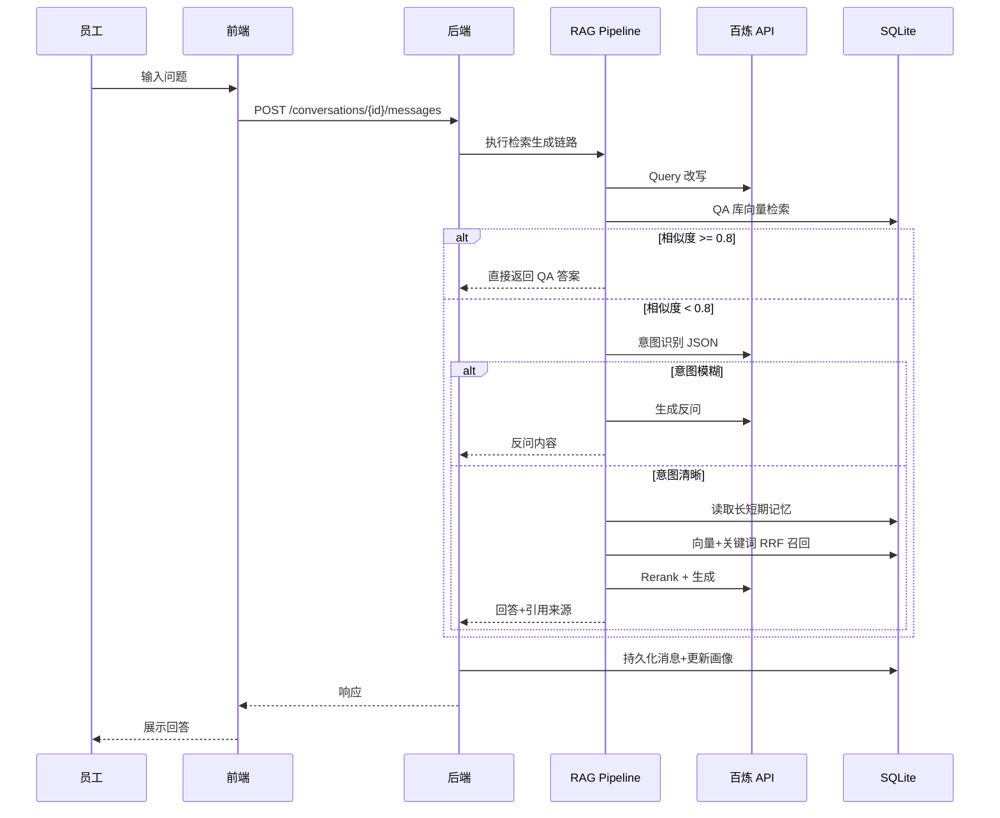
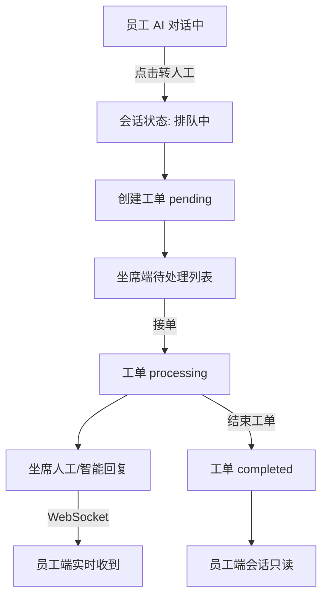
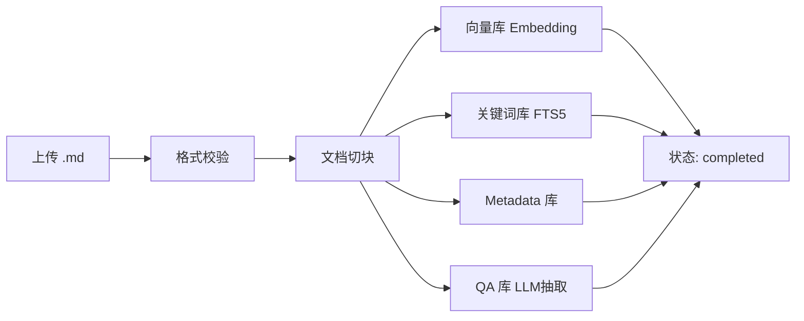

# 智能客服系统 PRD

> 版本：C 阶段定稿 | 项目：智能客服系统 | project_id: 1 | 定稿日期：2026-06-06

---

## 1. 背景与调研结论

### 1.1 项目背景

企业人工客服压力大，内部知识分散，员工遇到制度/流程/IT/HR 等问题时难以快速获得准确解答。本系统通过 AI 问答 + 知识库 RAG + 人工坐席兜底，实现内部智能客服闭环。

### 1.2 目标用户

| 角色 | 描述 | 核心诉求 |
|------|------|----------|
| 员工（咨询方） | 企业内部员工 | 快速获得准确答案，解决不了能转人工 |
| 坐席（应答方） | 企业内部客服人员 | 高效接单、借助 AI 辅助回复、管理工单 |
| 管理员（知识维护方） | 知识库内容维护人员（当前与坐席同账号） | 便捷上传知识文档，确保 AI 能检索到 |

### 1.3 竞品调研结论

| 竞品 | 可借鉴 | 不采用 |
|------|--------|--------|
| 钉钉 AI 客服助理 | RAG 执行链、非结构化文档智能学习 | 钉钉生态绑定 |
| 飞书知识问答 | 知识引用展示、引用溯源 | 飞书文档生态依赖 |
| Intercom Fin | 三栏对话布局、Agent Copilot | 按 resolution 计费 |

### 1.4 选定方案

**方案 C（融合方案）**：统一 Shell 顶部导航 + 各端独立页面；员工端对话式、坐席端工单双栏、知识库表格式管理。

---

## 2. 页面清单与跳转逻辑（A1）

### 2.1 页面清单

| 序号 | 页面名称 | 页面类型 | 可见角色 | 入口来源 | 跳转去向 |
|------|---------|---------|---------|---------|---------|
| P01 | 登录页 | 表单页 | 未登录用户 | 直接访问 / 会话过期 | P02 员工端 |
| P02 | 员工端 | 对话页 | 已登录用户 | 顶部导航 / 登录成功 | P03、P04 |
| P03 | 坐席端 | 工单+对话页 | 已登录用户 | 顶部导航 / P02 跳转 | P02、P04 |
| P04 | 知识库 | 列表+表单页 | 已登录用户 | 顶部导航 / P02·P03 跳转 | P02、P03 |

> 当前版本不做角色分隔，一个账号可访问全部页面。

### 2.2 全局布局

```text
┌─────────────────────────────────────────────────────────┐
│  Logo   [员工端]  [坐席端]  [知识库]          用户名 ▼  │
├─────────────────────────────────────────────────────────┤
│              各端独立全屏内容区                          │
└─────────────────────────────────────────────────────────┘
```

| 页面 | 布局 |
|------|------|
| P01 登录 | 居中卡片：账号 + 密码 + 登录按钮 |
| P02 员工端 | 左栏历史会话列表 \| 右栏对话流 + 输入框 + 转人工 |
| P03 坐席端 | 左栏工单列表 \| 右栏对话区 + 操作面板 |
| P04 知识库 | 上方上传区 \| 下方文件列表 + 入库状态 |

### 2.3 页面跳转规则

| 触发 | 从 | 到 | 行为 |
|------|----|----|------|
| 登录成功 | P01 | P02 | 默认进入员工端 |
| 顶部 Tab | 任意 | P02/P03/P04 | 切换页面 |
| 转人工 | P02 | P02 | 会话进入排队 |
| 坐席接单 | P03 | P03 | 工单变处理中 |
| 结束工单 | P03 | P03 | 工单变已完成，员工端只读 |
| 选择历史 | P02 | P02 | 未完成可继续；已完成只读 |

---

## 3. 主要功能定义与分析（A2）

### 3.1 P01 登录页

| 功能编号 | 功能名称 | 描述 | 完成标准 |
|---------|---------|------|----------|
| F-01-01 | 账号密码登录 | 输入账号密码进入系统 | 成功跳转员工端；失败显示错误 |
| F-01-02 | 登录态保持 | 已登录自动进入 | 未过期访问登录页自动跳转 |
| F-01-03 | 退出登录 | 清除登录态 | 需重新登录 |

**边界**：包含账号密码校验、JWT 签发；不包含第三方登录、注册、验证码。

### 3.2 P02 员工端

| 功能编号 | 功能名称 | 描述 | 完成标准 |
|---------|---------|------|----------|
| F-02-01 | AI 问答 | RAG 链路返回答案 | 看到 AI 回复（含引用或反问） |
| F-02-02 | 多轮对话 | 同会话连续提问 | 上下文连贯 |
| F-02-03 | 转人工 | 转给坐席处理 | 进入排队，坐席接单后双向对话 |
| F-02-04 | 历史会话列表 | 查看所有历史会话 | 左侧按时间展示 |
| F-02-05 | 继续历史会话 | 选择会话继续或只读 | 未完成可发消息；已完成只读 |
| F-02-06 | 新建会话 | 发起新对话 | 创建空白新会话 |
| F-02-07 | 页面跳转 | 跳转坐席端/知识库 | 顶部导航切换 |

**边界**：F-02-01 含完整 RAG 链路；不含语音/图片。F-02-03 须用户主动点击。F-02-05 已完成禁止发消息。

### 3.3 P03 坐席端

| 功能编号 | 功能名称 | 描述 | 完成标准 |
|---------|---------|------|----------|
| F-03-01 | 工单列表 | 展示所有工单及状态 | 待处理/处理中/已完成分组 |
| F-03-02 | 查看工单 | 查看对话历史 | 展示全部消息含 AI 阶段 |
| F-03-03 | 接单处理 | 标记为处理中 | 点击接单后可回复 |
| F-03-04 | 人工回复 | 文字回复员工 | 员工端实时收到 |
| F-03-05 | 智能回复 | AI 生成建议，坐席确认发送 | 3 条候选，选中编辑后发送 |
| F-03-06 | 工单归类 | 打分类标签 | 选择预设标签保存 |
| F-03-07 | 结束工单 | 标记已完成 | 员工端不可再发 |
| F-03-08 | 页面跳转 | 跳转员工端/知识库 | 顶部导航切换 |

**边界**：F-03-03 手动接单，不自动分配。F-03-05 走相同 RAG 链路，不自动发送。F-03-06 预设分类：IT/HR/财务/行政/其他。

### 3.4 P04 知识库

| 功能编号 | 功能名称 | 描述 | 完成标准 |
|---------|---------|------|----------|
| F-04-01 | 文件上传 | 上传 .md 文档 | 上传成功，列表出现记录 |
| F-04-02 | 文件列表 | 展示已上传文档 | 文件名、时间、入库状态 |
| F-04-03 | 知识入库 | 切块 + 四库写入 | 状态：待处理→处理中→已完成 |
| F-04-04 | 入库详情 | 查看入库结果 | 切块数、QA 数、四库状态 |
| F-04-05 | 删除文件 | 删除文档及索引 | 文件及四库数据一并清除 |
| F-04-06 | 页面跳转 | 跳转员工端/坐席端 | 顶部导航切换 |

**边界**：仅 .md 格式；单文件上传。四库均 SQLite。

---

## 4. Mission、Persona 与版本规划（A3）

### 4.1 Mission

为企业内部员工提供基于 AI 的智能问答服务，降低人工客服压力，集中管理分散知识；AI 无法解决时无缝转接人工坐席。

### 4.2 关键业务规则

| 编号 | 规则 |
|------|------|
| BR-01 | 工单状态：`AI对话中` → `排队中` → `处理中` → `已完成` |
| BR-02 | 已完成工单员工端只读 |
| BR-03 | QA 直答：向量相似度 ≥ 0.8 直接返回答案 |
| BR-04 | 意图模糊时模型反问，不进入检索 |
| BR-05 | 短期记忆窗口 3 轮 |
| BR-06 | 每轮对话规则提取用户画像写入 SQLite |
| BR-07 | 坐席智能回复须确认后才发送 |
| BR-08 | 知识库仅支持 .md |
| BR-09 | 文档切块后并行写入向量/关键词/Metadata/QA 四库 |
| BR-10 | 单账号可访问全部页面 |

### 4.3 V1 / MVP

**24 项功能全部纳入 V1**：P01(3) + P02(7) + P03(8) + P04(6)

| 能力 | MVP |
|------|-----|
| RAG 完整链路 | Query改写→QA直答→意图识别→槽位填充→RRF混合检索→重排→生成 |
| 长短期记忆 | 3 轮短期 + SQLite 长期画像 |
| 百炼模型 | qwen-plus + text-embedding-v3 + gte-rerank |
| 实时消息 | WebSocket / 轮询同步 |
| 数据存储 | SQLite |

### 4.4 V2+

| 功能 | 版本 | 理由 |
|------|------|------|
| 角色权限分隔 | V1.1 | 用户暂不做 |
| 多租户 | V2.0 | 单企业内部 |
| 第三方登录/SSO | V1.1 | 非 MVP 阻塞 |
| PDF/Word/TXT 知识库 | V1.2 | 需文档解析库 |
| 批量/拖拽上传 | V1.2 | 体验优化 |
| 工单自动分配 | V1.1 | MVP 手动接单够用 |
| 坐席在线状态 | V1.1 | 无自动分配时优先级低 |
| 历史搜索分页 | V1.2 | MVP 全量展示 |
| 满意度评价 | V1.2 | 体验增强 |
| 自定义工单分类 | V1.1 | MVP 预设分类 |
| QA 手动编辑 | V1.2 | MVP 自动抽取 |

---

## 5. 复杂功能业务链路与关键实现思路（A4）

### 5.1 检索生成 / 智能回答工作链路

**触发场景**：员工端 F-02-01 AI 问答、坐席端 F-03-05 智能回复（共用同一链路）

**实现思路**：

```text
Query 进入后端
  │
  ├─ Step 1: Query 改写（LLM 优化表述）
  │
  ├─ Step 2: QA 库检索
  │     ├─ 向量相似度 ≥ 0.8 → 直接返回 Answer（结束）
  │     └─ 相似度 < 0.8 → 继续
  │
  ├─ Step 3: 意图识别（LLM 输出 JSON）
  │     ├─ 意图模糊 → 模型反问（要求补充细节，结束）
  │     └─ 意图清晰 → 继续
  │
  ├─ Step 4: 槽位填充
  │     ├─ 长期记忆：规则提取用户画像字段（SQLite user_profile）
  │     └─ 短期记忆：最近 3 轮对话窗口
  │
  ├─ Step 5: 结合长短期记忆改写 Query
  │
  ├─ Step 6: RAG 检索生成
  │     ├─ 向量召回（text-embedding-v3）
  │     ├─ 关键词召回（BM25 / SQLite FTS）
  │     ├─ RRF 混合融合
  │     ├─ 重排（gte-rerank）
  │     └─ LLM 生成最终回答（附引用来源）
  │
  └─ 返回结果
```

**关键技术选型**：

| 环节 | 技术 | 模型/方案 |
|------|------|-----------|
| Query 改写 | LLM | qwen-plus |
| QA 匹配 | 向量相似度 | text-embedding-v3, 阈值 0.8 |
| 意图识别 | LLM + JSON 输出 | qwen-plus |
| 反问生成 | LLM | qwen-plus |
| 槽位填充 | 规则提取 + LLM | qwen-plus |
| 长期记忆 | SQLite | user_profile 表 |
| 短期记忆 | 内存/Redis | 3 轮窗口 |
| 向量召回 | SQLite 向量扩展 | text-embedding-v3 |
| 关键词召回 | SQLite FTS5 | BM25 |
| 混合检索 | RRF | k=60 |
| 重排 | API | gte-rerank |
| 最终生成 | LLM | qwen-plus |

### 5.2 知识库入库链路

**触发场景**：P04 F-04-03 知识入库

```text
上传 .md 文件
  │
  ├─ 格式校验（仅 .md）
  │
  ├─ 文档切块（按段落 / 固定 token 长度）
  │
  ├─ 并行写入四库（SQLite）：
  │     ├─ 向量库：切块 → Embedding → 存储向量
  │     ├─ 关键词库：切块 → FTS5 索引
  │     ├─ Metadata 库：切块 → 计算 metadata（来源文件、位置、时间等）
  │     └─ QA 库：LLM 自动抽取 Q-A 对 → 存储
  │
  └─ 更新文件入库状态
```

**关键技术选型**：

| 环节 | 技术 |
|------|------|
| 切块 | 按段落优先，超长段落按 ~500 token 切分 |
| Embedding | text-embedding-v3 |
| QA 抽取 | qwen-plus（从切块内容抽取问答对） |
| 存储 | SQLite（4 张表/库） |

### 5.3 转人工与消息同步

**触发场景**：P02 F-02-03 转人工 → P03 接单回复

```text
员工点击「转人工」
  → 会话状态 AI对话中 → 排队中
  → 创建工单（关联会话 ID、员工账号）
  → 坐席端 P03 待处理列表出现

坐席点击「接单」
  → 工单状态 排队中 → 处理中
  → 坐席可人工回复 / 智能回复
  → 消息通过 WebSocket 实时同步至员工端 P02

坐席点击「结束工单」
  → 工单状态 → 已完成
  → 员工端该会话变为只读
```

**关键技术选型**：WebSocket（FastAPI）或短轮询；消息持久化 SQLite messages 表。

### 5.4 长期记忆维护

**触发场景**：每轮对话结束后（F-02-01 / F-02-02）

```text
对话结束一轮
  → 规则 + LLM 提取用户画像字段
  → 写入 SQLite user_profile 表（按账号）
  → 字段示例：部门、常用问题类型、偏好等
  → 下次对话时作为长期记忆注入槽位填充
```

---

## 6. AI 功能配置

### 6.1 AI 参与功能

| 功能 | AI 职责 |
|------|---------|
| F-02-01 员工 AI 问答 | 完整 RAG 链路 |
| F-03-05 坐席智能回复 | 同 RAG 链路生成建议 |
| F-04-03 QA 抽取 | 从文档切块自动抽取 Q-A 对 |
| 长期记忆提取 | 每轮规则提取用户画像 |

### 6.2 AI 默认配置

| 配置项 | 值 |
|--------|-----|
| 供应商 | 阿里云百炼（DashScope） |
| base_url | `https://dashscope.aliyuncs.com/compatible-mode/v1` |
| LLM model | `qwen-plus` |
| Embedding model | `text-embedding-v3` |
| Rerank model | `gte-rerank` |
| QA 直答阈值 | 0.8 |
| 短期记忆窗口 | 3 轮 |
| API Key 来源 | 用户提供 |

### 6.3 智能边界

| 类型 | 场景 |
|------|------|
| 可自动执行 | AI 问答生成、回复建议生成、QA 自动抽取、画像提取 |
| 必须用户确认 | 坐席发送消息、知识库入库触发 |
| 必须反问 | 意图识别为模糊 |
| 必须转人工 | 用户主动点击转人工 |

### 6.4 默认意图分类

| 意图 | 说明 | 路径 |
|------|------|------|
| clear_query | 意图清晰，信息充足 | 槽位填充 → RAG |
| vague_query | 意图模糊，信息不足 | 模型反问 |
| qa_match | QA 库直接匹配 | 直接返回答案 |

---

## 7. 数据契约确认清单（A5）

### 7.1 业务数据契约

#### 用户（users）

- [x] id（int, PK）
- [x] username（string, unique）
- [x] password_hash（string）
- [x] created_at（datetime）

#### 用户画像（user_profile）

- [x] id（int, PK）
- [x] user_id（int, FK → users）
- [x] department（string, nullable）
- [x] common_topics（json, nullable）— 常用问题类型
- [x] preferences（json, nullable）— 其他画像字段
- [x] updated_at（datetime）

#### 会话（conversations）

- [x] id（int, PK）
- [x] user_id（int, FK → users）
- [x] title（string）— 自动生成或首条消息摘要
- [x] status（enum: `ai_chat` | `queuing` | `processing` | `completed`）
- [x] created_at（datetime）
- [x] updated_at（datetime）

#### 消息（messages）

- [x] id（int, PK）
- [x] conversation_id（int, FK → conversations）
- [x] role（enum: `user` | `assistant` | `agent` | `system`）
- [x] content（text）
- [x] metadata（json, nullable）— 引用来源、意图、QA匹配信息等
- [x] created_at（datetime）

#### 工单（tickets）

- [x] id（int, PK）
- [x] conversation_id（int, FK → conversations, unique）
- [x] user_id（int, FK → users）— 发起员工
- [x] agent_id（int, FK → users, nullable）— 接单坐席
- [x] category（enum: `it` | `hr` | `finance` | `admin` | `other`, nullable）
- [x] status（enum: `pending` | `processing` | `completed`）
- [x] created_at（datetime）
- [x] updated_at（datetime）

#### 知识库文件（kb_files）

- [x] id（int, PK）
- [x] filename（string）
- [x] file_path（string）
- [x] status（enum: `pending` | `processing` | `completed` | `failed`）
- [x] chunk_count（int, nullable）
- [x] qa_count（int, nullable）
- [x] error_message（text, nullable）
- [x] uploaded_by（int, FK → users）
- [x] created_at（datetime）
- [x] updated_at（datetime）

#### 向量库（kb_vectors）

- [x] id（int, PK）
- [x] file_id（int, FK → kb_files）
- [x] chunk_index（int）
- [x] content（text）
- [x] embedding（blob）— 向量二进制存储
- [x] metadata（json）— 来源文件、位置等

#### 关键词库（kb_keywords）

- [x] id（int, PK）
- [x] file_id（int, FK → kb_files）
- [x] chunk_index（int）
- [x] content（text）— FTS5 索引

#### Metadata 库（kb_metadata）

- [x] id（int, PK）
- [x] file_id（int, FK → kb_files）
- [x] chunk_index（int）
- [x] source_file（string）
- [x] chunk_position（int）
- [x] char_count（int）
- [x] created_at（datetime）

#### QA 库（kb_qa）

- [x] id（int, PK）
- [x] file_id（int, FK → kb_files）
- [x] question（text）
- [x] answer（text）
- [x] q_embedding（blob）— Q 的向量，用于直答匹配

#### 工单状态流转

- [x] `pending`（排队中）→ `processing`（处理中）→ `completed`（已完成）

#### 会话状态流转

- [x] `ai_chat`（AI 对话中）→ `queuing`（排队中）→ `processing`（人工处理中）→ `completed`（已完成）

#### 工单分类

- [x] IT、HR、财务、行政、其他（5 类预设）

### 7.2 接口响应格式契约

#### 统一响应格式

- [x] 成功：`{"code": 200, "message": "success", "data": { ... }}`
- [x] 错误：`{"code": <错误码>, "message": "<描述>", "data": null}`
- [x] 分页：`{"code": 200, "data": {"items": [...], "total": 100, "page": 1, "page_size": 20}}`

#### HTTP 状态码

- [x] 200：成功
- [x] 400：参数错误
- [x] 401：未认证
- [x] 403：无权限
- [x] 404：资源不存在
- [x] 500：服务器内部错误

#### 业务错误码

- [x] 1001：用户名或密码错误
- [x] 1002：Token 过期
- [x] 2001：会话不存在
- [x] 2002：会话已完成，不可发送消息
- [x] 3001：工单不存在
- [x] 3002：工单状态不允许此操作
- [x] 4001：文件格式不支持（仅 .md）
- [x] 4002：知识库入库失败

---

## 8. 外部依赖与配置草稿（A5-3）

| 依赖 | 用途 | 关键配置字段 | Key/账号来源 | 存放位置 | 缺失时策略 | 状态 |
|------|------|-------------|-------------|----------|-----------|------|
| LLM（百炼 qwen-plus） | Query改写、意图识别、反问、槽位填充、生成、QA抽取 | `DASHSCOPE_API_KEY` `LLM_BASE_URL` `LLM_MODEL` | 用户提供 | backend/.env | Mock（固定回复） | **已确认供应商，Key 开发前提供** |
| Embedding（text-embedding-v3） | 向量召回、QA匹配、文档入库 | `DASHSCOPE_API_KEY` `EMBEDDING_MODEL` | 用户提供（同源） | backend/.env | Mock（随机向量） | **已确认供应商，Key 开发前提供** |
| Rerank（gte-rerank） | RAG 重排 | `DASHSCOPE_API_KEY` `RERANK_MODEL` | 用户提供（同源） | backend/.env | 跳过重排，直接取 RRF Top-K | **已确认供应商，Key 开发前提供** |
| SQLite | 业务数据 + 四库存储 | `DATABASE_URL` | 本地文件 | backend/.env | 内置默认路径 | 已确认 |
| WebSocket | 员工端↔坐席端实时消息 | 无外部依赖 | — | — | 降级为轮询 | 已确认 |
| 第三方 API / 数据源 | 无 | — | — | — | — | 无 |
| 支付 / 结算 | 无 | — | — | — | — | 无 |
| 短信 / 邮件 / 推送 | 无 | — | — | — | — | 无 |
| 对象存储 | 无（.md 本地存储） | `UPLOAD_DIR` | 本地目录 | backend/.env | 默认 ./uploads | 已确认 |
| 第三方登录 / SSO | 无（V1 不做） | — | — | — | — | 无 |

### .env 配置模板（草稿）

```env
# 百炼 API（用户提供）
DASHSCOPE_API_KEY=sk-xxxxxxxx
LLM_BASE_URL=https://dashscope.aliyuncs.com/compatible-mode/v1
LLM_MODEL=qwen-plus
EMBEDDING_MODEL=text-embedding-v3
RERANK_MODEL=gte-rerank

# 数据库
DATABASE_URL=sqlite:///./data/app.db

# 文件上传
UPLOAD_DIR=./uploads

# JWT
JWT_SECRET=change-me-in-production
JWT_EXPIRE_HOURS=24
```

---

## 9. 技术栈

| 层 | 技术 |
|----|------|
| 前端 | React + TypeScript + Vite + Ant Design |
| 后端 | Python 3.11+ / FastAPI / PyCore |
| 数据库 | SQLite |
| AI | 阿里云百炼 DashScope API |
| 实时通信 | WebSocket（FastAPI） |
| 响应格式 | `code / message / data` |

---

## 10. 路线图（版本规划终版）

### 10.1 V1.0 MVP（当前交付目标）

| 里程碑 | 范围 | 验收标准 |
|--------|------|----------|
| M1 认证与 Shell | P01 登录 + 顶部导航 Shell | 登录成功，三 Tab 可切换 |
| M2 知识库 | P04 上传/入库/列表/删除 | .md 入库四库完成，状态可追踪 |
| M3 AI 问答 | P02 员工端 RAG 全链路 | QA直答/反问/RAG生成/引用来源 |
| M4 转人工闭环 | P02 转人工 + P03 坐席端 | 接单、回复、归类、结束、只读锁定 |
| M5 实时同步 | WebSocket 消息推送 | 坐席回复员工端实时可见 |

### 10.2 V1.1 ~ V2.0（延后）

见第 4.4 节 V2+ 功能表。角色权限、自动分配、多格式知识库、满意度等均在 MVP 之后迭代。

---

## 11. 技术架构蓝图

### 11.1 分层架构

```text
┌─────────────────────────────────────────────────────────┐
│  前端（React + TS + Vite + Ant Design）                  │
│  pages / components / services / stores / mocks         │
├─────────────────────────────────────────────────────────┤
│  API 层（REST + WebSocket）                              │
│  /api/auth  /api/conversations  /api/tickets  /api/kb   │
│  /ws/messages                                           │
├─────────────────────────────────────────────────────────┤
│  业务服务层（FastAPI + PyCore）                          │
│  AuthService / ChatService / RagPipeline / TicketService│
│  KbIngestService / MemoryService / WsManager           │
├─────────────────────────────────────────────────────────┤
│  AI 层（DashScope SDK，httpx trust_env=False）           │
│  LLM / Embedding / Rerank                               │
├─────────────────────────────────────────────────────────┤
│  数据层（SQLite）                                        │
│  业务表 + kb_vectors + kb_keywords + kb_metadata + kb_qa │
│  文件存储（本地 uploads/）                               │
└─────────────────────────────────────────────────────────┘
```

### 11.2 部署方案（MVP）

| 组件 | 方案 |
|------|------|
| 前端 | Vite build → 静态文件，Nginx 或 FastAPI StaticFiles |
| 后端 | Uvicorn 单进程，PyCore APIServer |
| 数据库 | SQLite 单文件 `data/app.db` |
| 知识库文件 | 本地 `uploads/` 目录 |
| AI | 百炼 DashScope 云端 API |
| 环境 | 内网单机部署，`.env` 管理密钥 |

### 11.3 目录结构（规划）

```text
Projects_Repo/1/
├── frontend/          # React 前端
├── backend/           # FastAPI 后端
│   ├── api/routes/
│   ├── services/
│   │   ├── rag/       # RAG 六步链路
│   │   ├── kb/        # 知识库入库
│   │   └── memory/    # 长短期记忆
│   ├── models/
│   └── .env.example
├── docs/
├── pycore/            # 框架脚手架（已复制）
└── .sdd/
```

---

## 12. 原型说明

### 12.1 原型文件路径

| PRD 页面 | 原型文件 | 说明 |
|----------|----------|------|
| P01 登录页 | `docs/prototypes/01-login.html` | 居中登录卡片 |
| P02 员工端 | `docs/prototypes/02-employee.html` | 双栏对话 + 引用卡片 |
| P03 坐席端 | `docs/prototypes/03-agent.html` | 工单分组 + 智能回复 |
| P04 知识库 | `docs/prototypes/04-knowledge.html` | 上传区 + 四库状态表 |
| 总览 | `docs/prototypes/index.html` | 原型入口 |

预览方式：双击 `docs/prototypes/打开原型.bat` 或访问 `http://127.0.0.1:8766/`。

### 12.2 原型与生产差异

| 项 | 原型 | 生产 |
|----|------|------|
| AI 回复 | 静态文案 | SSE 流式 + 真实 RAG |
| 上传入库 | 2 秒模拟 | 异步任务 + 状态轮询 |
| 弹窗 | alert/confirm | Ant Design Modal/Message |
| 数据 | 前端 JS 硬编码 | api-contracts.md 对齐 API |

交接详情见 `docs/prototypes/README.md`。

---

## 13. 核心流程图

### 13.1 RAG 问答主流程



### 13.2 转人工闭环



### 13.3 知识库入库



### 13.4 异常分支

| 场景 | 处理 |
|------|------|
| 百炼 API 超时/失败 | 返回友好错误，记录日志，前端提示重试 |
| QA 无匹配且意图清晰但检索无结果 | LLM 生成「未找到相关知识」+ 建议转人工 |
| 已完成会话发消息 | 返回错误码 2002 |
| 非 .md 文件上传 | 返回错误码 4001 |
| 入库失败 | 状态 failed，保留 error_message，支持重试 |

---

## 14. 组件交互说明

### 14.1 前端模块

| 模块 | 职责 | 依赖 |
|------|------|------|
| `layouts/AppShell` | 顶部导航、用户下拉 | auth store |
| `pages/Login` | 登录表单 | authService |
| `pages/Employee` | 会话列表、对话、转人工 | conversationService, ws |
| `pages/Agent` | 工单列表、回复、智能回复 | ticketService, ws |
| `pages/Knowledge` | 上传、文件表 | kbService |
| `components/ChatBubble` | 三色气泡 + 引用卡片 | — |
| `components/CitationCard` | RAG 引用来源展示 | — |
| `stores/authStore` | JWT、用户信息 | — |
| `services/api` | Axios 实例、拦截器 | — |

### 14.2 后端模块

| 模块 | 职责 | 调用关系 |
|------|------|----------|
| `routes/auth` | 登录/登出 | → AuthService |
| `routes/conversations` | 会话 CRUD、发消息 | → ChatService → RagPipeline |
| `routes/tickets` | 工单操作 | → TicketService |
| `routes/kb` | 知识库管理 | → KbIngestService → RagPipeline(embedding) |
| `routes/ws` | WebSocket | → WsManager |
| `services/rag/pipeline` | 六步 RAG 链路 | → DashScopeClient, MemoryService, KbStore |
| `services/memory` | 长短期记忆 | → user_profile, messages |
| `services/kb/ingest` | 四库入库 | → DashScopeClient |

### 14.3 调用关系图

```text
前端 EmployeePage
  → POST /api/conversations/{id}/messages
    → ChatService.send_message()
      → RagPipeline.run()
        → MemoryService.get_context()
        → KbStore.qa_search() / vector_search() / keyword_search()
        → DashScopeClient.chat() / embed() / rerank()
      → MemoryService.update_profile()
      → WsManager (如转人工后)
```

---

## 15. 技术选型与风险

### 15.1 关键选型确认

| 领域 | 选型 | 理由 |
|------|------|------|
| 向量存储 | SQLite + blob 存储向量 | MVP 轻量，无额外依赖 |
| 关键词检索 | SQLite FTS5 | 内置，BM25 语义足够 MVP |
| 混合检索 | RRF (k=60) | 简单有效，无需训练 |
| 实时通信 | FastAPI WebSocket | 与后端同栈，部署简单 |
| 认证 | JWT | 单账号无 RBAC，够用 |
| HTTP 客户端 | httpx (trust_env=False) | 规范要求，避免代理污染 |

### 15.2 风险与缓解

| 风险 | 影响 | 缓解 |
|------|------|------|
| 百炼 API Key 未配置 | AI 功能不可用 | Mock 降级开发；用户提供 Key 后切换 |
| SQLite 向量检索性能 | 知识库量大时变慢 | MVP 规模可控；V2 可迁 pgvector |
| sqlite-vec 兼容性 | 向量索引方案 | 先用 numpy 余弦相似度暴力检索，文档量 <1万可接受 |
| WebSocket 断连 | 消息延迟 | 前端自动重连 + 轮询兜底 |
| 单账号无权限 | 误操作风险 | V1.1 加 RBAC；MVP 接受 |
